# 2026-09-06 주요 변경 이력 조사

Git 이력에서 제품의 방향이나 사용 방식이 크게 달라진 여덟 지점을 선정했다. 모든 이미지는 표시된 커밋을 `/private/tmp`의 별도 폴더에 추출해 실행한 실제 재현 화면이다. 현재 작업 트리의 코드를 과거 화면에 섞지 않았다.

## 재현 조건

- 캡처일: 2026-09-06
- 화면: 390×844 CSS px
- 배율과 파일: 2배, 780×1688 px PNG
- 브라우저: Google Chrome Headless
- 대기: 앱 로드 후 8.5초
- 게임 비교: 같은 모드 버튼을 누른 뒤 0.9초 후 캡처
- 무작위 보드: 글자 배열은 실행마다 달라질 수 있으므로 구조·색·기능 비교에 사용

## 1. TAPtoTALK 한글 게임 부트스트랩

- 적용 커밋: `ccdbd1a` (2026-08-31)
- 비교 커밋: 없음
- 재현 상태: 적용 후 화면만 재현

### 문제·개선 요구

TAPtoTEN의 모바일 게임 감각은 유지하되 원본 숫자 게임을 수정하지 않고, 천지인 자소로 한글을 만드는 별도 게임 저장소가 필요했다.

### 수정 내용과 이유

TAPtoTALK 전용 진입점과 한글 조합 코어, 문장·단어 콘텐츠, 9×9 자소 보드, 웹·Android 빌드 틀을 한 번에 분리했다. 이후 디자인 변경이 한글 규칙과 뒤엉키지 않도록 `core/hangul`, `content`, `ui`, `config` 경계를 만들었다.

### 수정 결과

목표 한글 문장을 보고 81개 자소 블록을 탭해 입력하는 최초 플레이 화면이 만들어졌다.

### 모바일 화면

| 수정 전 | 수정 후 — `ccdbd1a` 재현 |
| --- | --- |
| 재현 불가: `ccdbd1a`는 TAPtoTALK Git 이력의 부모가 없는 루트 커밋이므로 저장소 안에 수정 전 상태가 없다. | 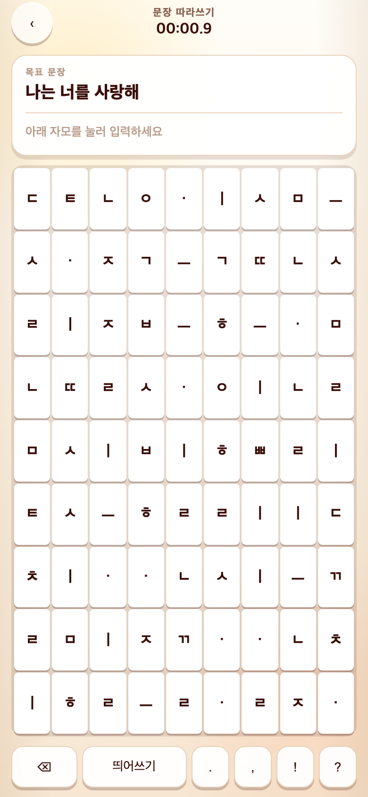 |

## 2. 노란 기운 제거와 중립 회색 스킨

- 적용 커밋: `eac788f` (2026-08-31)
- 비교 커밋: `8027b45`
- 비교 조건: Sentence Copy를 누른 직후

### 문제·개선 요구

초기 종이색 배경과 갈색 글자가 지나치게 노랗고 따뜻해 보여 더 중립적인 화면이 필요했다.

### 수정 내용과 이유

배경·패널·테두리·그림자·본문 색 토큰의 황색 성분을 줄이고 회색 계열로 옮겼다. 정보 구조는 유지해 색 변화만 비교할 수 있게 했다.

### 수정 결과

따뜻한 베이지 화면이 차가운 밝은 회색 화면으로 바뀌고, 자음과 모음도 갈색 대신 회청색 명도 차이로 구분됐다.

### 모바일 화면

| 수정 전 — `8027b45` 재현 | 수정 후 — `eac788f` 재현 |
| --- | --- |
| 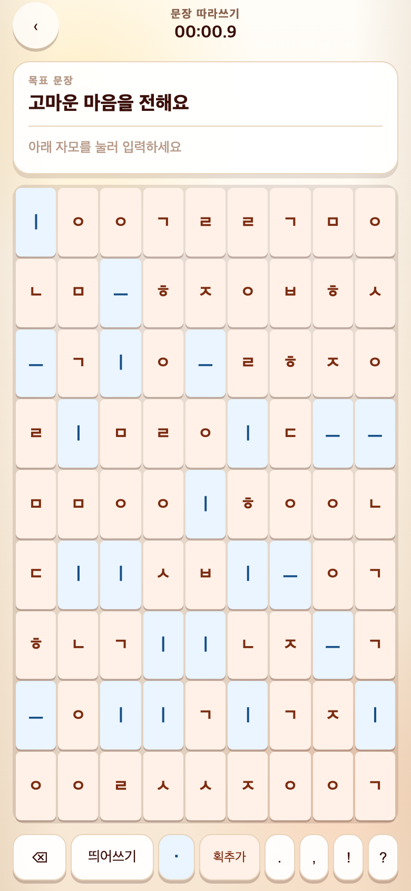 | 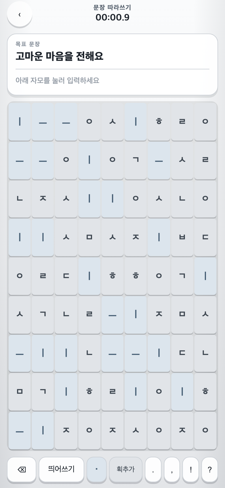 |

## 3. 오방색 중심 시각 체계

- 적용 커밋: `e475942` (2026-08-31)
- 비교 커밋: `f4f7eac`
- 비교 조건: Sentence Copy를 누른 직후

### 문제·개선 요구

전체 회색화로 게임의 생동감과 한글 문화의 인상이 약해졌다. 청·적을 주색, 황을 포인트로 쓰는 오방색 방향이 요구됐다.

### 수정 내용과 이유

지정된 오방색을 디자인 토큰으로 정리하고 목표 카드, 자판, 강조 상태에 청·적을 배치했다. 황색은 핵심 강조에만 제한해 화면 전체가 노래지지 않게 했다.

### 수정 결과

무채색 UI에서 청·적 대비가 분명한 게임 UI로 바뀌었고, 목표와 입력 블록의 위계가 색으로 드러났다.

### 모바일 화면

| 수정 전 — `f4f7eac` 재현 | 수정 후 — `e475942` 재현 |
| --- | --- |
| 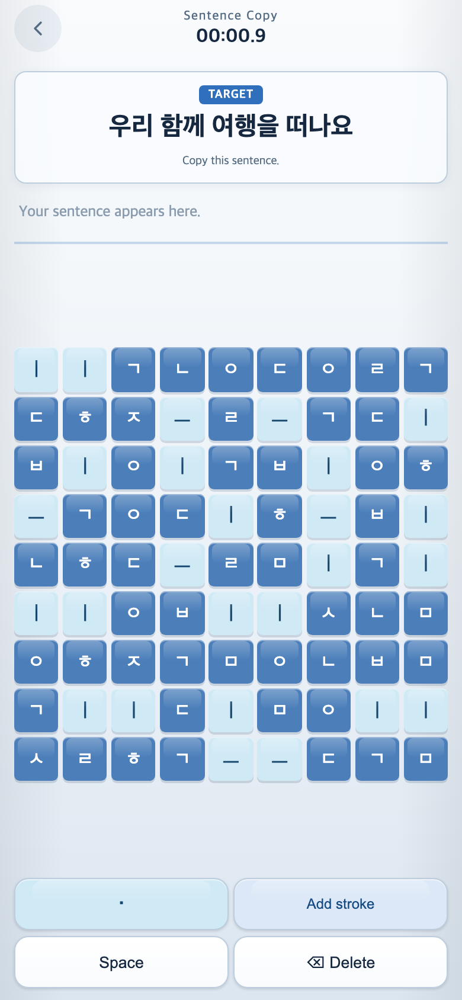 | 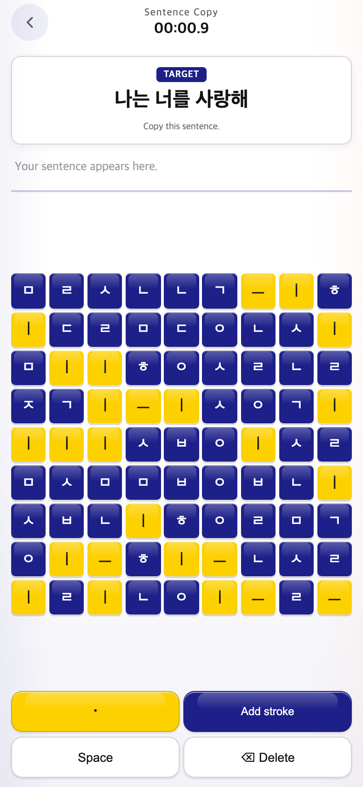 |

## 4. 묶음 자판에서 81개 독립 자소 블록으로

- 적용 커밋: `77d4ecf` (2026-09-01)
- 비교 커밋: `4bd630f`
- 비교 조건: Sentence Copy → 첫 레벨을 누른 직후

### 문제·개선 요구

갤럭시 자판을 모방한 한 버튼 속 여러 자소 표기가 복잡했고, 게임의 핵심인 “블록을 골라 조합한다”는 감각이 약했다.

### 수정 내용과 이유

자음·쌍자음·격음을 각각 독립 블록으로 나누고 보드를 9×9의 81개 타일로 정리했다. 하단 고정 기능은 Space와 Delete 중심으로 단순화하고 TAPtoTEN의 보드 비율과 버튼 위치에 맞췄다.

### 수정 결과

한 칸에 여러 후보가 들어간 자판에서 한 칸에 한 자소만 들어가는 직접 선택형 보드로 바뀌었다.

### 모바일 화면

| 수정 전 — `4bd630f` 재현 | 수정 후 — `77d4ecf` 재현 |
| --- | --- |
| 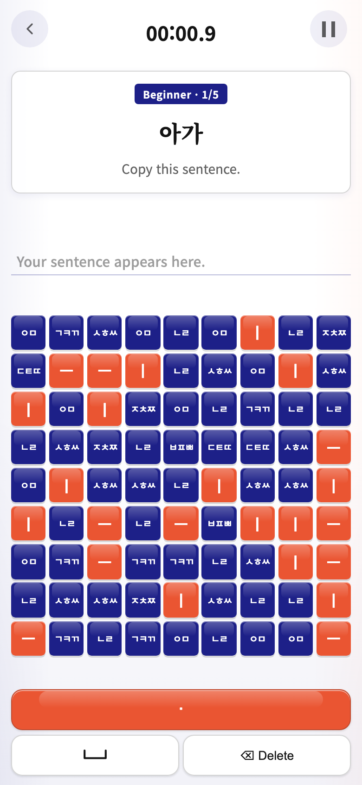 | 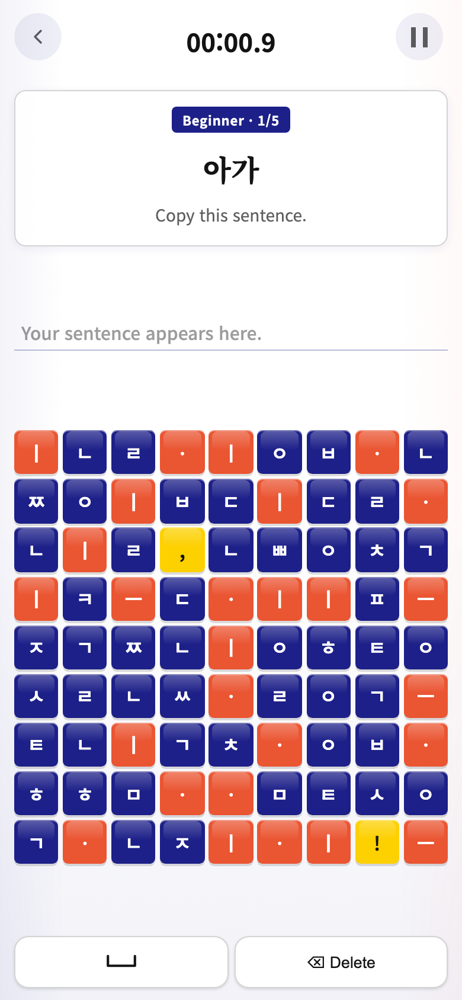 |

## 5. 자소 고정색에서 9색 혼합 블록으로

- 적용 커밋: `374d316` (2026-09-01)
- 비교 커밋: `108d8b9`
- 비교 조건: Sentence Copy → 첫 레벨을 누른 직후

### 문제·개선 요구

같은 자소에 같은 색을 고정하거나 지나치게 많은 색을 쓰자 중복과 편중이 생겼다. 참고 이미지의 분홍·빨강·주황·노랑·초록·하늘·파랑·보라 계열 아홉 색만 섞어 쓰는 요구가 있었다.

### 수정 내용과 이유

자소 종류와 색의 고정 연결을 제거하고, TAPtoTEN식 입체 효과를 유지한 아홉 색 팔레트를 보드 위치에 따라 순환·혼합했다.

### 수정 결과

같은 글자도 위치에 따라 다른 색을 가지며, 화면 전체가 제한된 아홉 색 안에서 고르게 알록달록해졌다.

### 모바일 화면

| 수정 전 — `108d8b9` 재현 | 수정 후 — `374d316` 재현 |
| --- | --- |
| 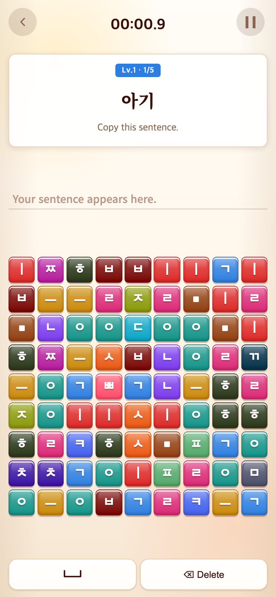 | 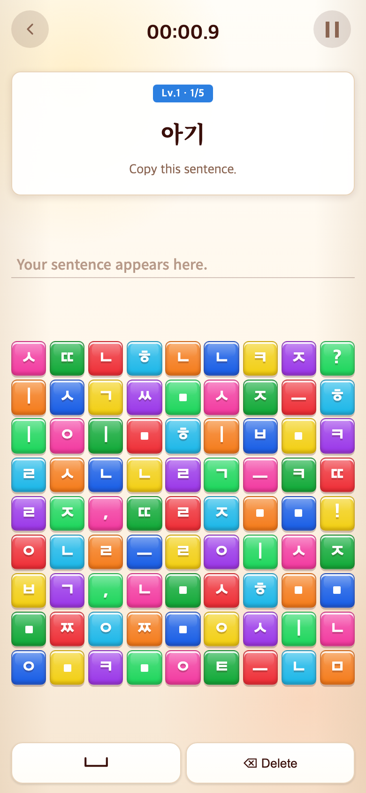 |

## 6. Korean Alphabet 게임 추가

- 적용 커밋: `a58304e` (2026-09-02)
- 비교 커밋: `0b0b276`
- 비교 조건: 로딩 후 게임 선택 화면

### 문제·개선 요구

단어와 문장을 쓰기 전에 외국인이 자음·모음과 입력 순서를 먼저 익힐 수 있는 기초 게임이 필요했다.

### 수정 내용과 이유

주어진 자소를 순서대로 찾는 Korean Alphabet 모드를 추가하고 게임 선택을 두 개에서 세 개로 확장했다. 단어·문장 전에 기초 자소 학습이 오도록 첫 번째 카드에 배치했다.

### 수정 결과

메인 화면이 Word Challenge와 Sentence Copy만 제공하던 구조에서 Korean Alphabet을 포함한 3게임 구조로 바뀌었다.

### 모바일 화면

| 수정 전 — `0b0b276` 재현 | 수정 후 — `a58304e` 재현 |
| --- | --- |
| 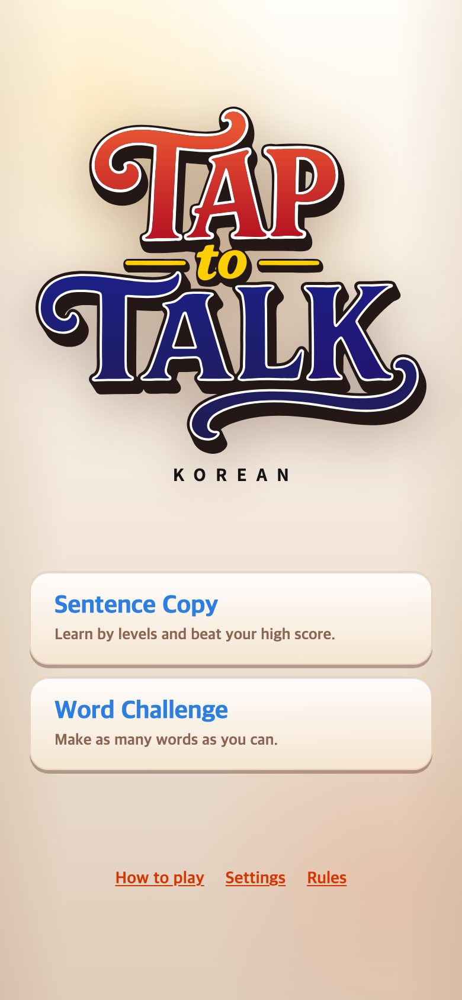 | 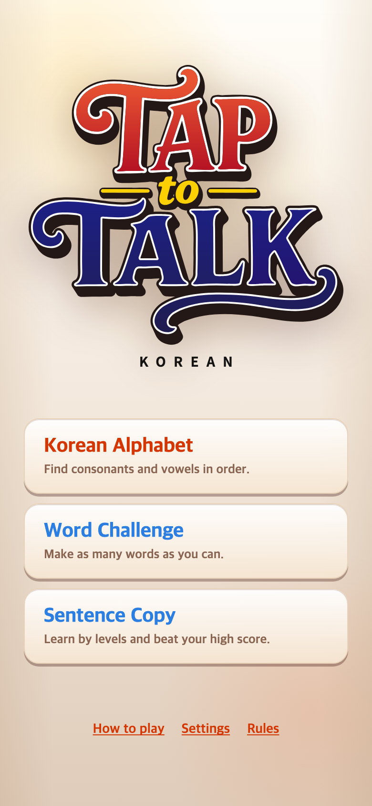 |

## 7. 진행 피드백과 단계형 단어 학습

- 적용 커밋: `07ac6e1` (2026-09-02)
- 비교 커밋: `d2647c6`
- 비교 조건: Word Challenge를 누른 직후

### 문제·개선 요구

사용자가 어디까지 맞았고 어디서 틀렸는지 알기 어려웠으며, Word Challenge에는 학습 단계 구분이 없었다. 받침·감탄사·의성어·복모음을 의도적으로 학습시키는 과정도 필요했다.

### 수정 내용과 이유

현재·완료·오류 상태를 목표에 표시하고, 현재 문제 단위 재시도 흐름을 마련했다. Word Challenge를 받침 없음, 받침 있음, 생활 감탄사, 의성·의태어, 복모음의 다섯 단계로 나누고 각 단계에서 세 단어를 학습하도록 구성했다.

### 수정 결과

이전에는 Word Challenge를 누르면 곧바로 임의 단어 게임이 시작됐지만, 이후에는 학습 목적과 제한 시간을 확인하고 단계를 고르는 화면이 먼저 열린다. 흐름 자체가 달라졌기 때문에 아래 이미지는 동일한 “Word Challenge 버튼을 누른 직후”를 비교한다.

### 모바일 화면

| 수정 전 — `d2647c6` 재현 | 수정 후 — `07ac6e1` 재현 |
| --- | --- |
| 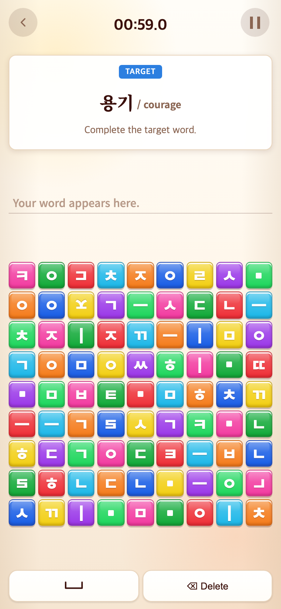 | 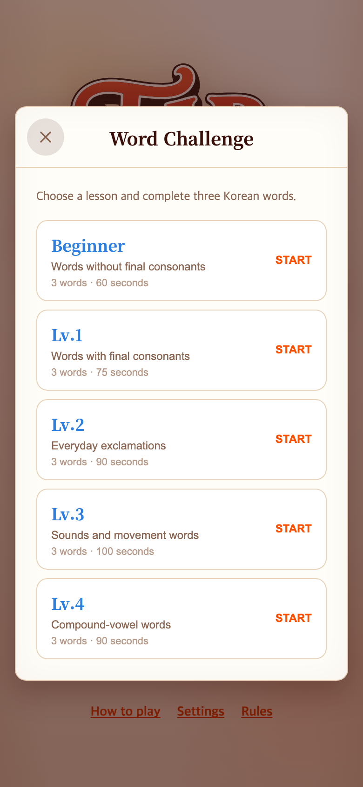 |

## 8. 설명형 팝업에서 시각·체험형 How to Play로

- 적용 커밋: `360cada` (2026-09-06)
- 비교 커밋: `ed9e239`
- 비교 조건: How to play를 누른 직후

### 문제·개선 요구

기존 튜토리얼은 긴 영어 설명과 작은 팝업에 의존해 읽어야만 이해할 수 있었다. TAPtoTEN처럼 Skip이 오른쪽 위에 있고 이미지와 직접 조작만으로 이해되는 흐름이 필요했다.

### 수정 내용과 이유

튜토리얼을 전체 화면으로 확장하고 진행점을 왼쪽 위, Skip을 오른쪽 위에 배치했다. 설명 문단을 제거하고 큰 목표와 실제 입력 블록, 다음에 누를 블록의 빛나는 상태만 남겼다.

### 수정 결과

첫 단계부터 목표 `ㄱㄴㄷㄹ`과 네 블록이 한 화면에 직접 대응하며, 사용자는 글을 읽지 않고 순서대로 눌러 진행할 수 있다.

### 모바일 화면

| 수정 전 — `ed9e239` 재현 | 수정 후 — `360cada` 재현 |
| --- | --- |
| 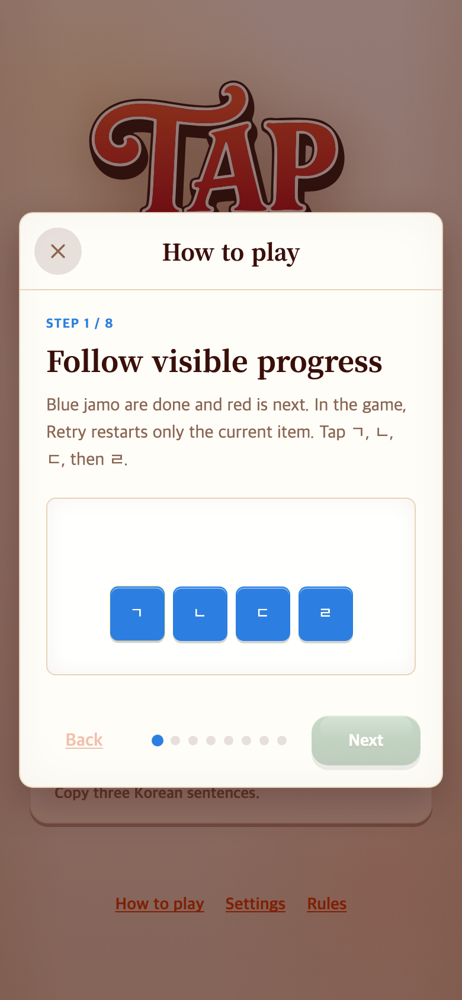 | 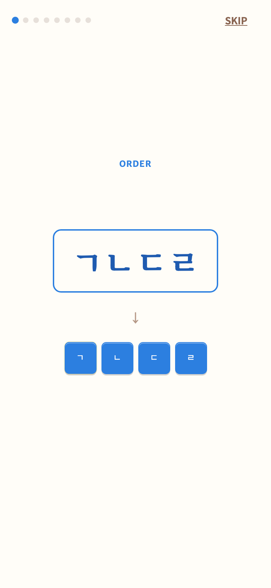 |

## 재현 한계

- `ccdbd1a` 이전: 부모가 없는 루트 커밋이라 저장소 내부에서 수정 전 화면을 얻을 수 없다.
- 무작위 보드: 동일 커밋도 자소 배열은 달라질 수 있다. 색상 체계와 레이아웃은 해당 커밋의 실제 코드다.
- 과거 외부 폰트·미디어: 로컬 커밋에 포함된 자산만 사용했으며 네트워크 자산을 새 파일로 대체하지 않았다.
- 화면 흐름 변경: `07ac6e1`처럼 동일 화면이 더는 존재하지 않는 경우 같은 버튼을 누른 직후의 실제 결과를 비교했다.
