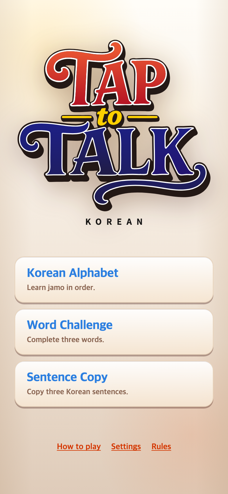
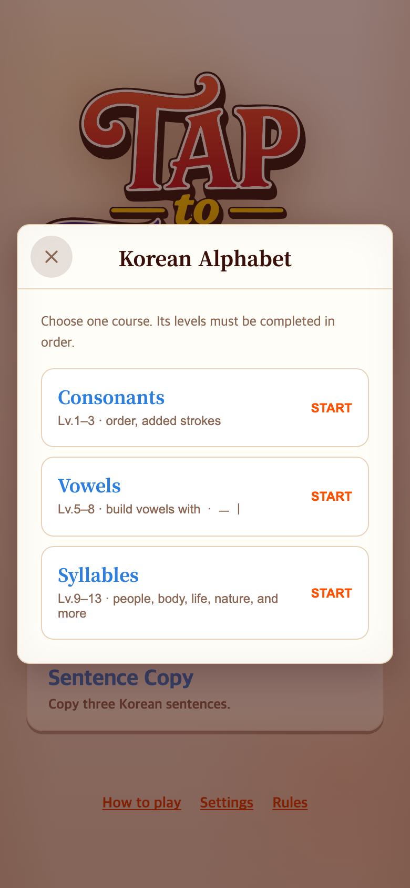
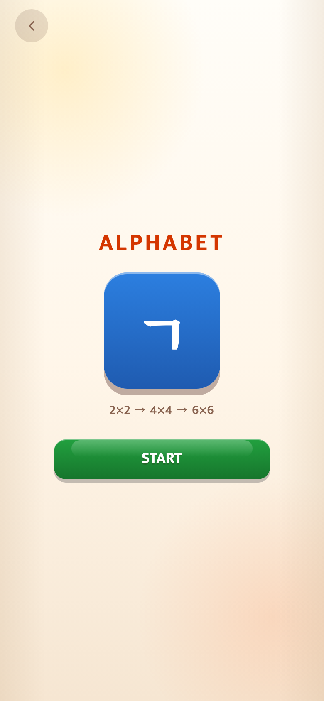
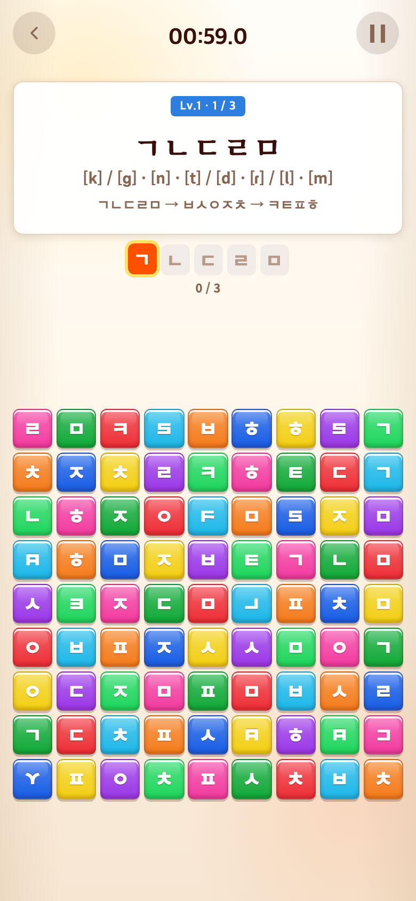
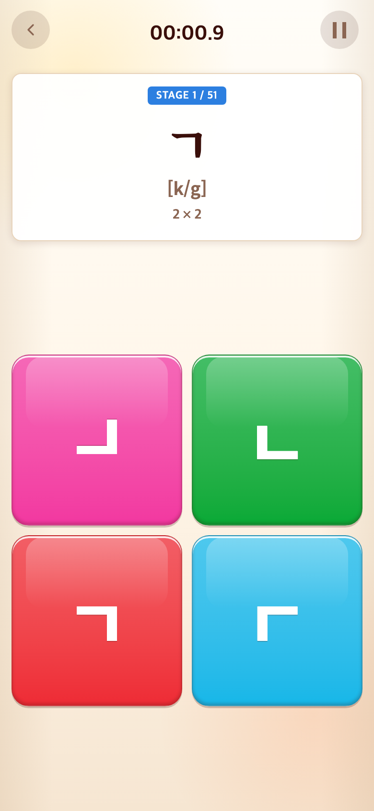
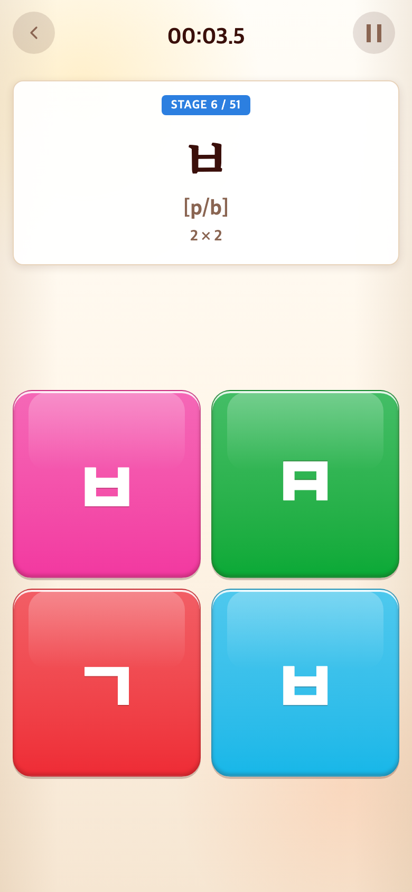
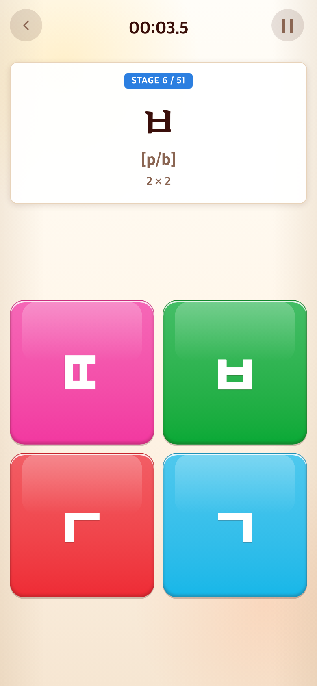
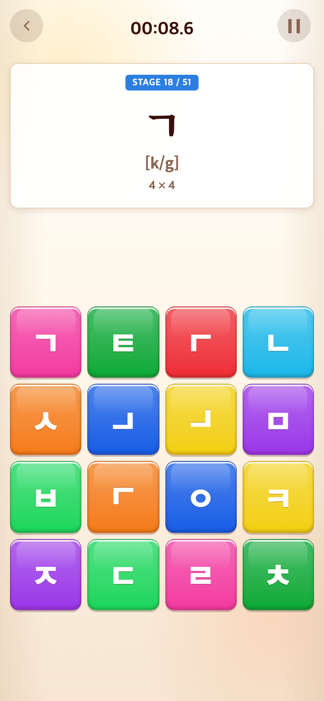
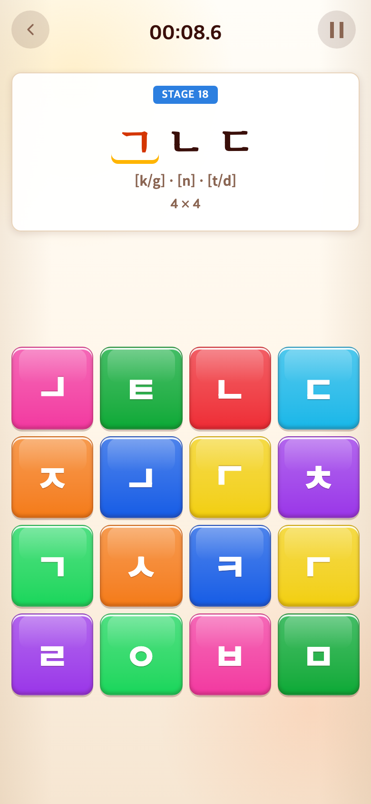

# 2026-09-08 Alphabet 장기 스테이지 전환

- 적용 커밋: `f531e49`
- 비교 커밋: `3b3f3a9`
- 재현 여부: 성공
- 비교 조건: 390×844 CSS px, 기기 배율 2, Google Chrome Headless, 각 커밋을 별도 임시 폴더에서 실행

## 문제·개선 요구

기존에는 메인 화면의 별도 `How to play`와 Alphabet 내부의 Consonants, Vowels, Syllables 코스 선택 화면을 먼저 이해해야 했다. 실제 게임도 처음부터 9×9 보드와 묶음 목표를 제시해, 처음 한글 자소를 접하는 사용자가 규칙과 글자 모양을 게임 진행 안에서 자연스럽게 익히기 어려웠다.

## 수정 내용과 이유

- 메인의 `How to play`를 제거하고 게임 이름을 Alphabet, Word, Sentence로 줄였다.
- Alphabet 선택 뒤 TAP to TEN과 같은 별도 START 화면을 추가했다. 간단한 `ㄱ` 아이콘과 보드 성장 순서만 보여 주어 설명 없이도 시작 흐름을 이해하게 했다.
- Alphabet을 51개 연속 스테이지로 재구성했다. `ㄱ`부터 `ㅎ`, `ㅣ`, `ㅡ`, `ㆍ`까지 17개 자소를 2×2, 4×4, 6×6에서 차례로 반복한다.
- 첫 2×2 보드는 정답 하나, 일반 오답 하나, 좌우·상하 반전 함정 두 개로 구성했다. 정답 모양을 비교하며 배우고, 보드가 커질수록 탐색 난도가 자연스럽게 증가한다.
- 발음 표기를 `[k] / [g]`처럼 나누지 않고 `[k/g]`처럼 하나의 괄호로 통일했다.
- Alphabet은 제한 시간 실패 방식 대신 전체 진행 시간을 누적해 긴 학습 흐름을 방해하지 않도록 했다.

## 수정 결과

사용자는 별도 설명서를 읽거나 코스를 고르지 않고 Alphabet 버튼, START 순서로 즉시 학습을 시작한다. 첫 화면에서는 큰 2×2 타일로 한 자소만 찾고, 같은 자소를 더 큰 보드에서 다시 만나므로 모양 인식과 탐색 난도가 단계적으로 이어진다. 반전 함정은 정답과 동일한 입력으로 처리되지 않으며 접근성 이름에서도 함정으로 구분된다.

## 모바일 화면

### 메인 화면

| 수정 전 — `3b3f3a9` 재현 | 수정 후 — `f531e49` 재현 |
| --- | --- |
|  |  |

### Alphabet 진입

화면 흐름이 바뀌었기 때문에 같은 행동인 메인 Alphabet 버튼 1회 탭 직후를 비교했다.

| 수정 전 — `3b3f3a9` 재현 | 수정 후 — `f531e49` 재현 |
| --- | --- |
|  |  |

### 첫 게임판

기존 화면은 Alphabet 진입 후 Consonants START, 새 화면은 Alphabet 진입 후 START를 탭해 각 버전의 첫 게임판을 재현했다.

| 수정 전 — `3b3f3a9` 재현 | 수정 후 — `f531e49` 재현 |
| --- | --- |
|  |  |

모든 PNG는 780×1688px이며, 과거처럼 보이도록 현재 화면을 편집하거나 합성하지 않았다.

---

## 대칭 자소 함정 정리와 회전 도입

- 적용 커밋: `62b55aa`
- 비교 커밋: `f531e49`
- 재현 여부: 성공
- 비교 조건: Alphabet 2×2의 `ㅂ` 스테이지, 390×844 CSS px, 기기 배율 2, 각 커밋을 별도 임시 폴더에서 실행

### 문제·개선 요구

`ㅂ`, `ㅁ`, `ㅅ`, `ㅈ`처럼 한 축으로 반전해도 원래 모양과 같거나 거의 같아 보이는 자소가 함정으로 등장했다. 사용자는 형태를 올바르게 구분해도 오답이 될 수 있어 학습용 함정으로 공정하지 않았다.

### 수정 내용과 이유

- 자소별로 원형과 확실히 달라지는 변형만 허용하는 목록을 만들었다.
- `ㅁ`과 `ㅇ`처럼 반전·회전 후에도 동일한 자소는 자기 자신을 변형한 함정에서 제외했다.
- `ㅂ`은 좌우·상하 반전 대신 90° 회전을 사용한다.
- `ㅅ`, `ㅈ`은 좌우반전을 제외하고 상하반전, 90°·270° 회전을 사용한다.
- 한 자소에서 서로 다른 변형이 충분하지 않으면 다른 자소의 명확한 변형을 채워, 2×2에 똑같아 보이는 함정이 반복되지 않게 했다.
- Word 보드의 함정도 같은 변형 규칙을 공유하게 해 게임마다 판정 기준이 달라지지 않도록 했다.

### 수정 결과

정답과 시각적으로 같은 칸이 오답으로 처리되는 경우를 제거했다. 회전 함정이 추가되어 변형의 종류는 다양해졌지만, 정답 자소와 구분 가능한 모양만 제시된다.

### 모바일 화면

두 화면 모두 첫 스테이지부터 정답을 순서대로 눌러 `STAGE 6 / 51`의 `ㅂ` 화면을 재현했다.

| 수정 전 — `f531e49` 재현 | 수정 후 — `62b55aa` 재현 |
| --- | --- |
|  |  |

두 PNG 모두 780×1688px이며 합성하거나 임의 수정하지 않았다.

---

## 단일 자소에서 3개·5개 순서 학습으로 확장

- 적용 커밋: `705da4f`
- 비교 커밋: `62b55aa`
- 재현 여부: 성공
- 비교 조건: Alphabet 시작 후 첫 17개 자소를 순서대로 완료한 18번째 단계, 390×844 CSS px, 기기 배율 2, 각 커밋을 별도 임시 폴더에서 실행

### 문제·개선 요구

기존 여정은 모든 자소를 2×2, 4×4, 6×6에서 한 글자씩 반복했다. 보드는 커졌지만 사용자가 기억하고 수행해야 하는 목표는 계속 한 글자였으며, 화면에 `STAGE 18 / 51`처럼 긴 전체 분량이 노출되어 부담을 줄 수 있었다.

### 수정 내용과 이유

- 첫 구간은 기존처럼 `ㄱ~ㅎ`, `ㅣ`, `ㅡ`, `ㆍ`를 2×2에서 한 글자씩 익힌다.
- 다음 구간은 `ㄱㄴㄷ`, `ㄹㅁㅂ`처럼 세 자소씩 묶어 4×4에서 제시하고 순서대로 누르게 했다.
- 마지막 구간은 `ㄱㄴㄷㄹㅁ`, `ㅂㅅㅇㅈㅊ`처럼 다섯 자소씩 묶어 6×6에서 제시한다.
- 끝에 남는 `ㅡㆍ`는 억지로 다른 자소를 반복하지 않고 두 자소 묶음으로 마무리한다.
- 단계 표시는 현재 번호만 남기고 전체 개수는 숨겼다. 결과 화면에서도 전체 스테이지 수를 노출하지 않는다.
- 묶음 목표에서 완료한 자소는 파란 바탕과 흰 글씨, 다음 자소는 노란 밑줄로 표시해 순서를 바로 확인하게 했다.

### 수정 결과

사용자는 먼저 개별 글자 모양을 충분히 익힌 뒤, 3개와 5개의 짧은 순서를 기억하며 더 큰 보드에서 찾는다. 보드 크기와 기억해야 할 자소 수가 함께 증가해 난도가 명확하게 올라가며, 남은 전체 분량을 숫자로 의식하지 않고 현재 단계에 집중할 수 있다.

### 모바일 화면

| 수정 전 — `62b55aa` 재현 | 수정 후 — `705da4f` 재현 |
| --- | --- |
|  |  |

두 PNG 모두 780×1688px이며 합성하거나 임의 수정하지 않았다.
