# 2026-09-09 자소 종류별 Alphabet 보기 체계

- 적용 커밋: `80f10e6`
- 비교 커밋: `705da4f`
- 재현 여부: 성공
- 비교 조건: Alphabet 2×2의 `ㄱ`, `ㅁ`, `ㆍ` 단계, 390×844 CSS px, 기기 배율 2, Google Chrome Headless, 각 커밋을 별도 임시 폴더에서 실행

## 문제·개선 요구

기존 2×2 보드는 자음과 모음 모두 다른 자음이나 변형 자음을 공통 오답으로 사용했다. 모음 단계에서도 자음이 나타나 학습 범주가 흐려졌고, `ㅁ`처럼 반전·회전으로 차이를 만들기 어려운 자소는 보기가 해당 글자의 조형적 특징을 설명하지 못했다.

## 수정 내용과 이유

- 자음 단계는 정답 한 칸과 좌우반전, 상하반전, 90° 회전으로 만든 세 보기만 사용한다.
- 원래 글자를 변형해도 같은 모양이면 다른 자음의 명확한 변형으로 해당 변형 종류를 채운다.
- 270° 회전은 제거해 변형 규칙을 세 종류로 단순화했다.
- `ㅁ`은 예외적으로 정답과 조형적으로 비교할 수 있는 `○`, `△`, `ㅇ`을 제시한다.
- `ㅣ`, `ㅡ` 단계는 자음을 제외하고 두 사선과 물결만 제시한다.
- `ㆍ` 단계는 별, 하트, 쉼표를 제시한다.
- 4×4·6×6의 모음 전용 묶음도 자음을 섞지 않고 같은 선·기호 보기만 반복한다.

## 수정 결과

각 단계의 오답이 해당 자소의 형태적 특징에 집중한다. 자음은 방향 변화, 선 모음은 선의 방향과 굴곡, 아래아는 작은 점과 다른 기호의 차이를 비교하며 찾을 수 있다. `ㅁ`도 구별되지 않는 반전 대신 닫힌 도형끼리 비교하게 되어 정답 기준이 명확해졌다.

## 모바일 화면

### 기본 자음 `ㄱ`

| 수정 전 — `705da4f` 재현 | 수정 후 — `80f10e6` 재현 |
| --- | --- |
| 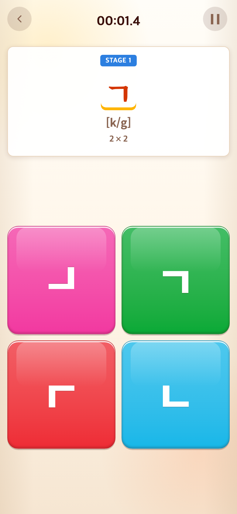 | 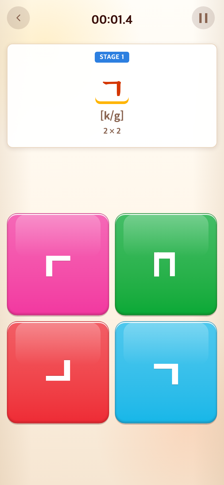 |

### 대칭 자음 `ㅁ`

| 수정 전 — `705da4f` 재현 | 수정 후 — `80f10e6` 재현 |
| --- | --- |
| 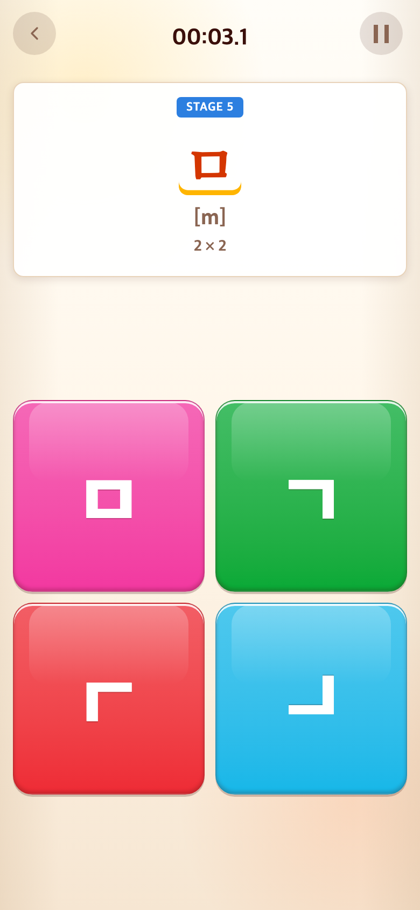 | 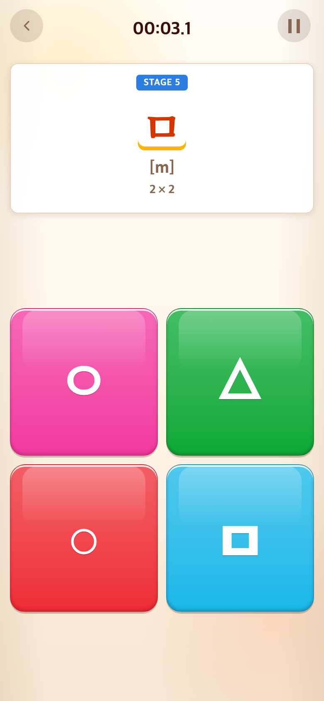 |

### 아래아 `ㆍ`

| 수정 전 — `705da4f` 재현 | 수정 후 — `80f10e6` 재현 |
| --- | --- |
| 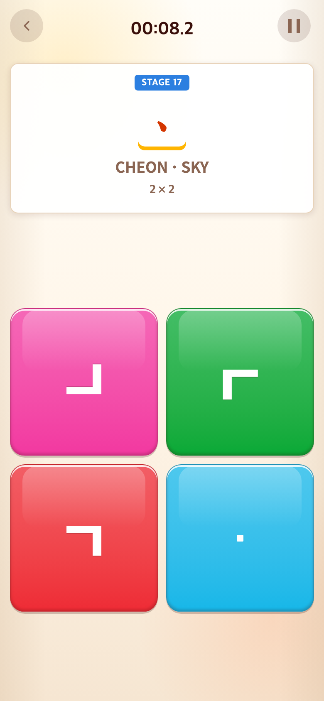 | 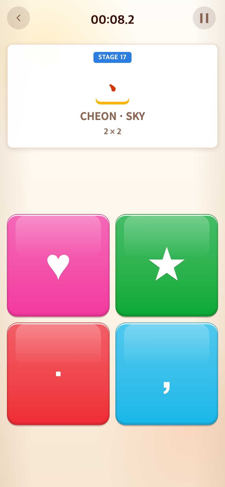 |

모든 PNG는 780×1688px이며 합성하거나 임의 수정하지 않았다.

---

# 2026-09-09 `ㅇ`·`ㅁ` 고문자 보기 적용

- 적용 커밋: `a332c5e`
- 비교 커밋: `e9b6ee8`
- 재현 여부: 성공
- 비교 조건: Alphabet 2×2의 `ㅁ`·`ㅇ` 단계, 390×844 CSS px, 기기 배율 2, Google Chrome Headless, 각 커밋을 별도 임시 폴더에서 실행

## 문제·개선 요구

`ㅁ`은 원·삼각형·현대 자모 `ㅇ`과 비교하고 있었고, `ㅇ`은 다른 자음을 반전·회전한 보기와 섞여 있었다. 닫힌 형태만 비교하는 데서 한 걸음 더 나아가, 현대 자소와 연관된 옛한글 형태를 자연스럽게 접하게 하되 화면에 별도의 설명 문구는 넣지 않는 구성이 필요했다.

## 수정 내용과 이유

- `ㅇ`의 세 보기를 꼭지이응 `ㆁ`, 여린히읗 `ㆆ`, 쌍이응 `ㆀ`으로 고정했다.
- `ㅁ`의 세 보기를 순경음미음 `ㅱ`, 삼각형 `△`, 원 `○`으로 고정했다.
- 한 자소 2×2뿐 아니라 해당 자소가 포함된 4×4·6×6 묶음에도 같은 보기 풀이 이어지게 했다.
- 고문자가 iPhone과 데스크톱 브라우저에서 빠짐없이 표시되도록 도형 보기의 글꼴 폴백에 Apple 한국어 시스템 글꼴을 추가했다.
- 안내 배너나 해설 문구는 추가하지 않았다.

## 수정 결과

`ㅇ` 단계는 현대 이응과 역사적 자형 세 개를 직접 비교하고, `ㅁ` 단계는 순경음미음과 기본 도형을 함께 비교한다. 플레이 흐름과 2×2 배치는 그대로이며 화면에 추가로 읽어야 할 문장은 생기지 않았다.

## 모바일 화면

### 미음 `ㅁ`

| 수정 전 — `e9b6ee8` 재현 | 수정 후 — `a332c5e` 재현 |
| --- | --- |
| 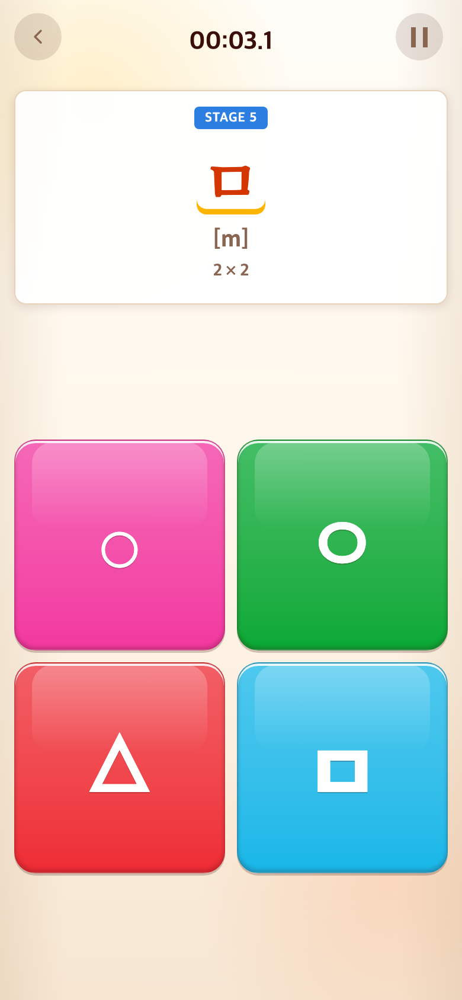 | 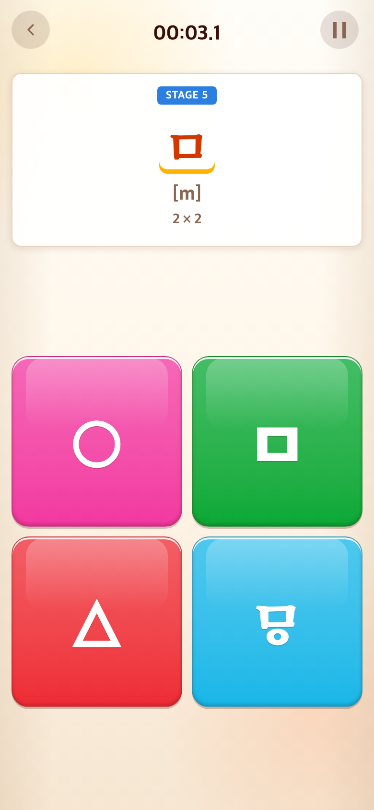 |

### 이응 `ㅇ`

| 수정 전 — `e9b6ee8` 재현 | 수정 후 — `a332c5e` 재현 |
| --- | --- |
| 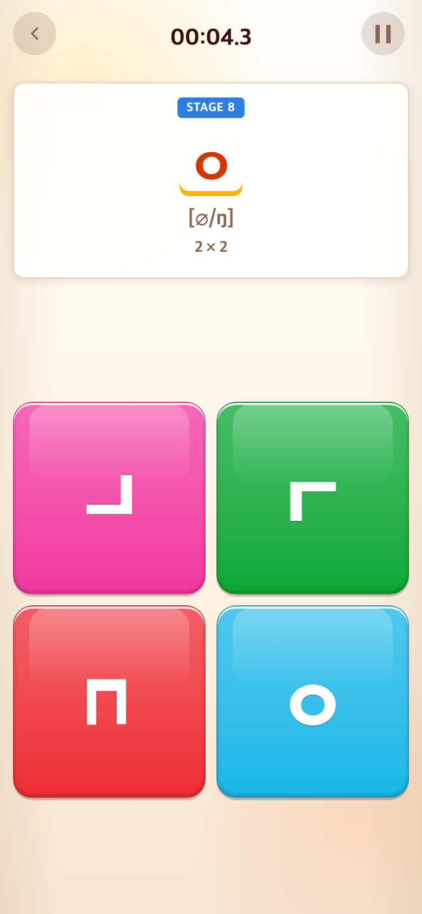 | 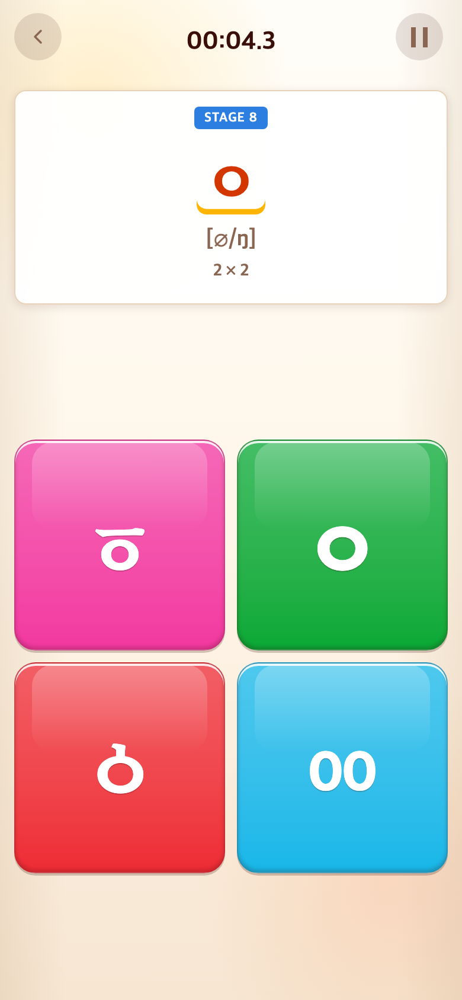 |

네 PNG 모두 780×1688px이며 합성하거나 임의 수정하지 않았다.

---

# 2026-09-09 메인 Rules 제거

- 적용 커밋: `a130f19`
- 비교 커밋: `1f2b2b7`
- 재현 여부: 성공
- 비교 조건: 시작 애니메이션이 끝난 메인 게임 선택 화면, 390×844 CSS px, 기기 배율 2, Google Chrome Headless, 각 커밋을 별도 임시 폴더에서 실행

## 문제·개선 요구

게임을 플레이하면서 규칙을 익히는 Alphabet 여정이 생긴 뒤 메인 하단의 `Rules`는 따로 열어 볼 가능성이 낮고, 설정과 나란히 놓여 시선을 분산했다.

## 수정 내용과 이유

- 메인 화면의 `Rules` 버튼을 제거했다.
- 활성 TAPtoTALK 진입점에서 Rules 클릭 처리와 전용 패널 생성 코드를 제거했다.
- 더 이상 사용하지 않는 규칙 목록 전용 CSS도 함께 제거했다.
- TAPtoTEN에서 복사된 비활성 참조 모듈의 Rules 코드는 원본 참조 경계를 지키기 위해 수정하지 않았다.

## 수정 결과

메인 하단에는 실제로 사용하는 `Settings`만 중앙에 남는다. 게임 선택 카드와 설정 동작에는 변화가 없으며, 제거된 DOM을 찾는 런타임 코드도 남지 않았다.

## 모바일 화면

| 수정 전 — `1f2b2b7` 재현 | 수정 후 — `a130f19` 재현 |
| --- | --- |
| 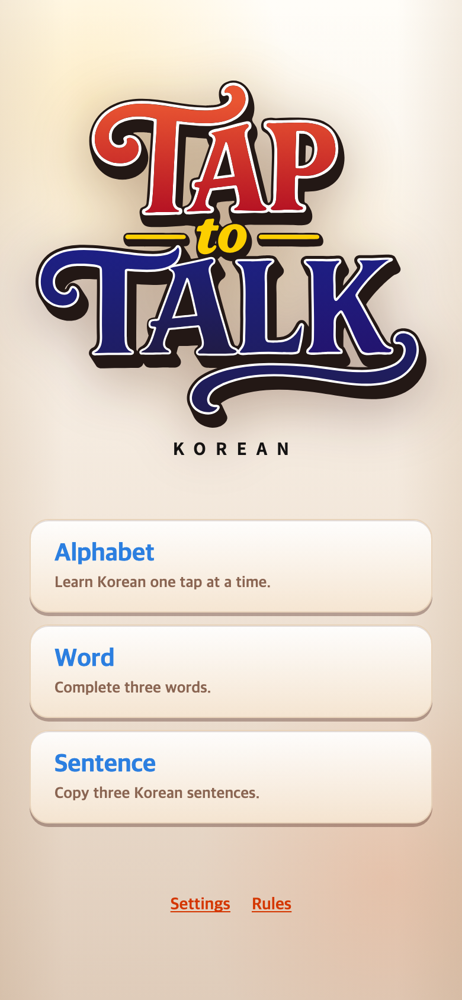 | 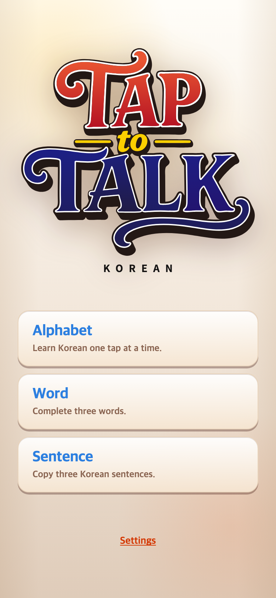 |

두 PNG 모두 780×1688px이며 합성하거나 임의 수정하지 않았다.
