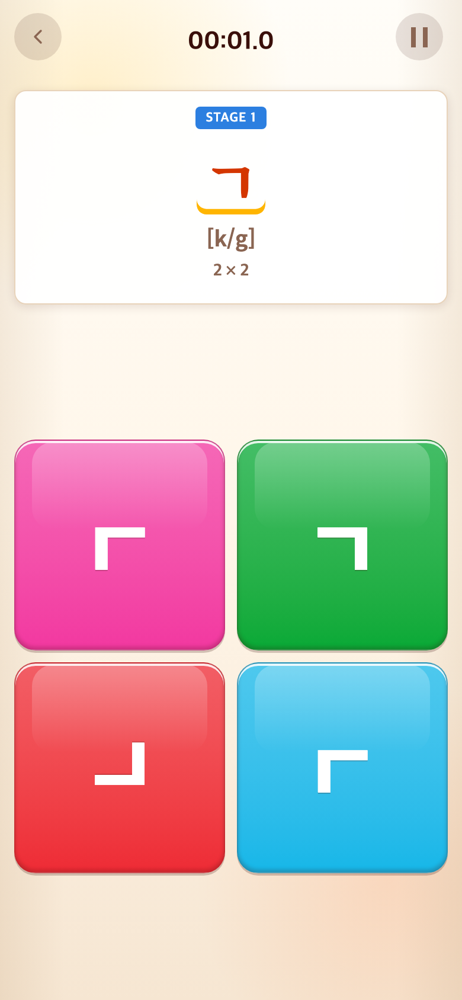
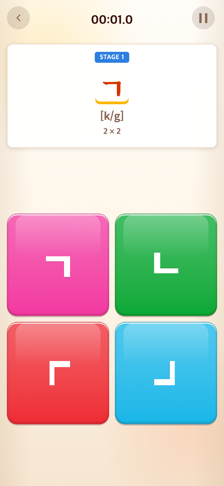

# 2026-09-09 서로 다른 자음 방향 보기

- 적용 커밋: `5fa1241`
- 비교 커밋: `7242845`
- 재현 여부: 성공
- 비교 조건: Alphabet START 직후 ㄱ 단계. 각 커밋을 별도 임시 폴더에 git archive로 추출해 실행. Chrome Headless, 390×844 CSS px, 배율 2.

## 문제·개선 요구

자기 자음만 사용하도록 수정하면서 유효한 반전이 두 종류뿐인 ㄱ·ㄴ은 동일한 오답이 반복되었다. 사용자는 네 칸이 모두 서로 다른 모양이기를 요청했다.

## 수정 내용과 이유

Alphabet 전용 회전에 180°·270°를 추가했다. 일반 자음은 정답과 90°·180°·270° 회전으로 구성한다. 반 바퀴 대칭인 ㄹ·ㅍ은 45°·90°·135°로 비교한다. ㅇ·ㅁ의 고문자·도형 보기와 Word·Sentence의 기존 함정 규칙은 유지한다. 묶음 단계도 같은 회전 목록을 사용한다.

## 수정 결과

ㄱ·ㄴ은 네 모서리 방향을 각각 한 번씩 제시하며 같은 방향의 오답이 반복되지 않는다. 기본 자음 각각의 오답 변형 중복 검사, ㄱ·ㄴ의 실제 회전 좌표 검사 및 기존 예외 검사 등 Alphabet 테스트 13개와 프로덕션 빌드가 통과했다.

## 모바일 화면

| 수정 전 — `7242845` 재현 | 수정 후 — `5fa1241` 재현 |
| --- | --- |
|  |  |

두 파일 모두 780×1688px PNG다. 타일은 게임에서 무작위 배치되므로 위치는 다를 수 있다. 합성하지 않은 해당 커밋 재현 화면이다.
