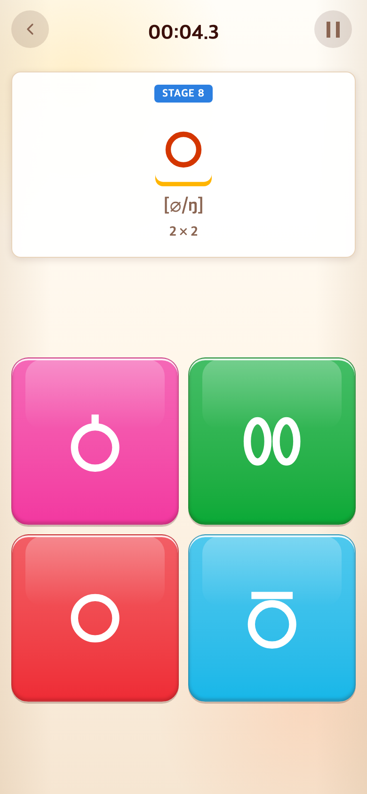
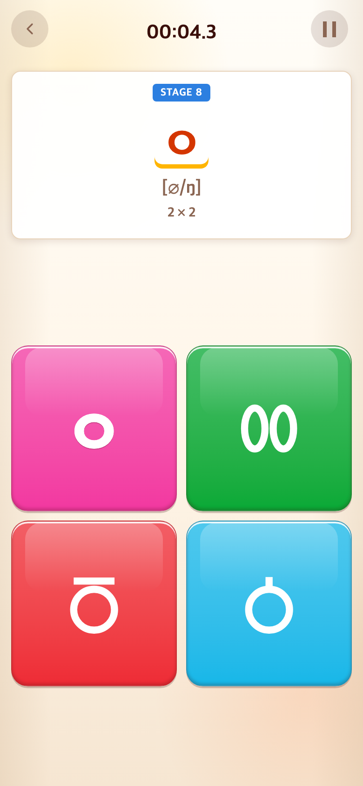
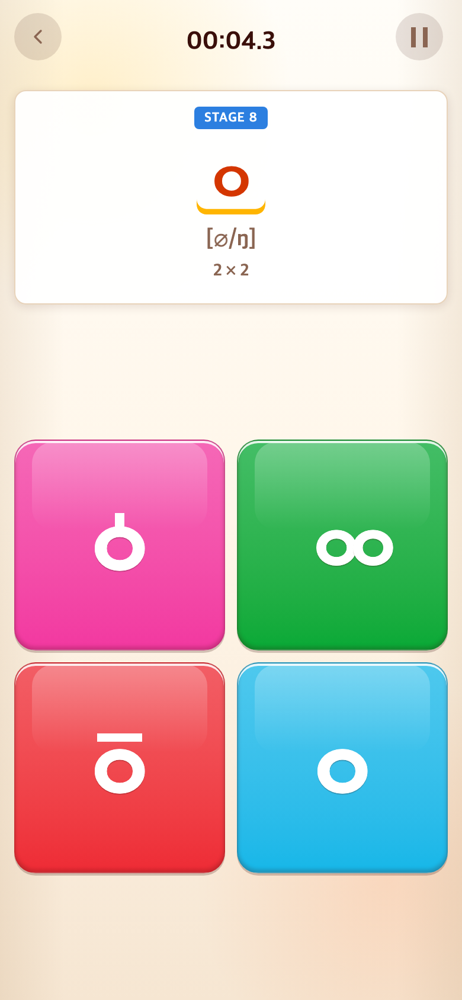
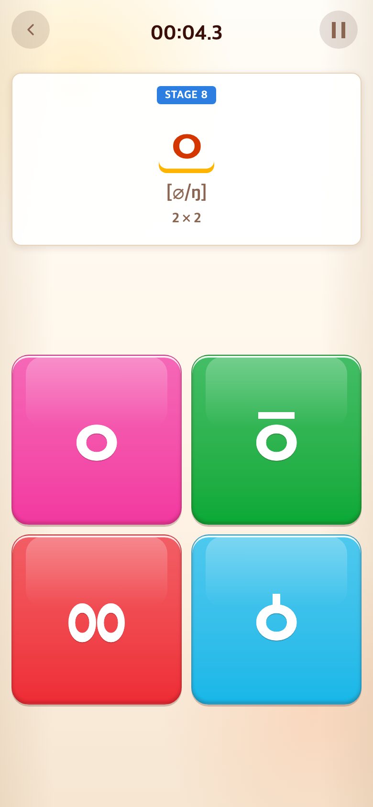

# 2026-09-09 이응 계열 고딕 도형 통일

- 적용 커밋: `0912c9c`
- 비교 커밋: `64b5593`
- 재현 여부: 성공
- 비교 조건: Alphabet에서 ㄱ부터 ㅅ까지 정답을 누른 뒤 ㅇ 단계. 각각의 커밋을 별도 임시 폴더에 추출해 Chrome Headless로 실행했다.

## 문제·개선 요구

정답 ㅇ은 고딕, 고문자 ㆁ·ㆆ는 명조로 표시되어 자형의 차이보다 서체 차이가 눈에 띄었다. 사용자는 같은 고딕 스타일을 요청했고 도형 제작도 허용했다.

## 수정 내용과 이유

ㅇ·ㆁ·ㆆ·ㆀ를 동일한 SVG 좌표계와 7단위 획으로 그렸다. ㅇ·ㆁ·ㆆ의 원 크기를 통일하고 꼭지와 가로획은 장식 없는 직선으로 만들었다. 쌍이응도 같은 획을 사용한다. 보드와 상단 목표가 같은 렌더러를 공유하고, 기기의 고문자 대체 글꼴에 영향을 받지 않는다. 기존 문자 값과 접근성 레이블 및 정답 판정은 유지했다.

## 수정 결과

이응 계열 네 보기가 동일한 고딕 인상으로 표시된다. 타입 검사와 프로덕션 빌드가 통과했고 모바일 캡처에서 원·꼭지·가로획을 확인했다.

## 모바일 화면

| 수정 전 — `64b5593` 재현 | 수정 후 — `0912c9c` 재현 |
| --- | --- |
|  |  |

390×844 CSS px, 배율 2의 780×1688px PNG. 타일 위치는 무작위이며 이미지는 합성하지 않았다.

## 후속 조정 — 현대 자음 ㅇ은 서체로 복원

사용자가 ㅇ의 정원 도형 대신 다른 자음과 같은 서체를 요청했다. `alphabetGlyph.ts`에서 ㅇ만 도형 매핑을 제거하여 제시어와 블록이 각각 주변 자음의 서체를 상속하도록 했다. `ㆁ·ㆆ·ㆀ` 도형은 그대로 유지한다. 빌드 통과, 실제로 ㅇ 단계까지 탭해 ㅇ에는 SVG가 없고 옛한글 세 보기에는 SVG가 유지됨을 확인했다.

아래는 후속 수정 작업 트리의 실제 화면(390×844 CSS px, DPR 2)이며 과거 커밋 재현 화면이 아니다. 변경과 캡처를 함께 커밋한다.

## 후속 조정 — 옛한글 보기도 같은 ㅇ 글자로 구성

ㅇ과 옛한글 보기가 비슷한 서체 인상을 가지되 구별되도록 요청받았다. SVG 원·타원을 제거하고 동일한 TAP Sans KR 800의 ㅇ을 사용한다. ㆁ은 위쪽 꼭지, ㆆ은 분리된 가로획, ㆀ은 조금 작은 ㅇ 두 개로 구성했다. 현대 ㅇ과 게임 판정은 변경하지 않았다.

빌드와 타입 검사 통과. 실제 ㅇ 단계까지 진행하여 세 변형을 확인했다. 아래는 해당 수정 작업 트리의 실제 모바일 캡처(390×844 CSS px, DPR 2, 780×1688 PNG)이며 과거 화면 재현이 아니다. 직전 수정 화면은 위 `ieung-font-after.png`에 보존되어 있다.

## 쌍이응 정렬·비율 보정

쌍이응 글자를 담는 상자가 실제 한 글자 폭보다 좁아서 글자 위치가 어긋나 보였다. 각 글자를 온전한 1em 상자에 넣고 중심을 좌우 28%·72%에 대칭 배치했다. 세로는 이전 대비 135%, 가로는 85%로 조정하여 조금 더 길쭉하게 만들었다. 나머지 보기는 변경하지 않았다. 빌드 통과. 아래는 수정 작업 트리에서 실제 ㅇ 단계로 진행한 780×1688 PNG 캡처다.

