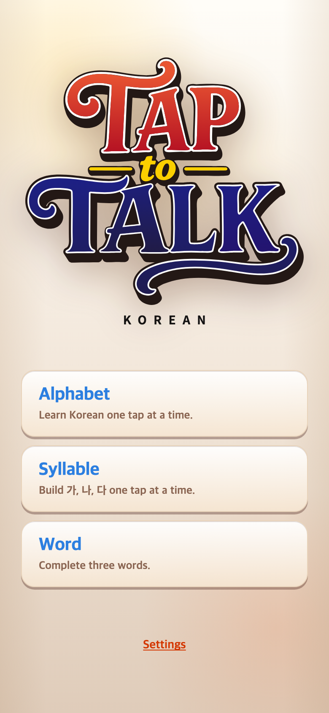
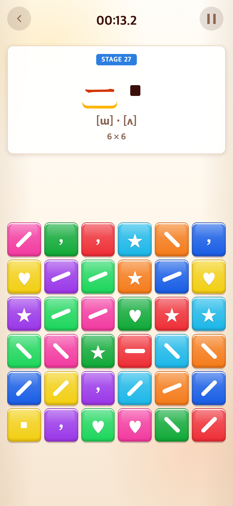
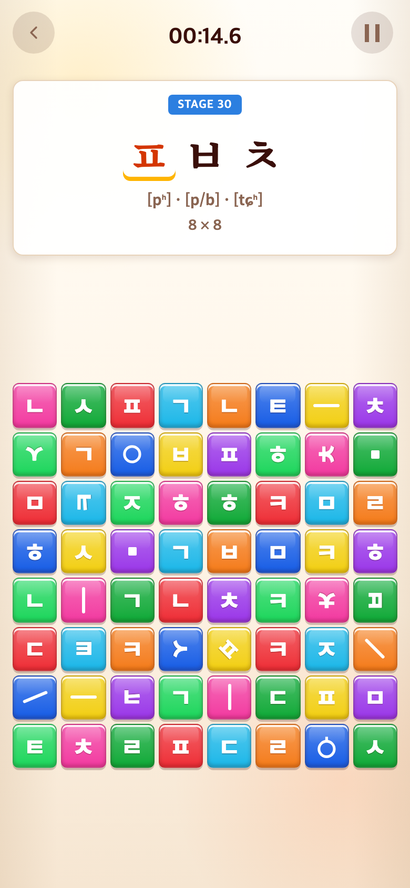
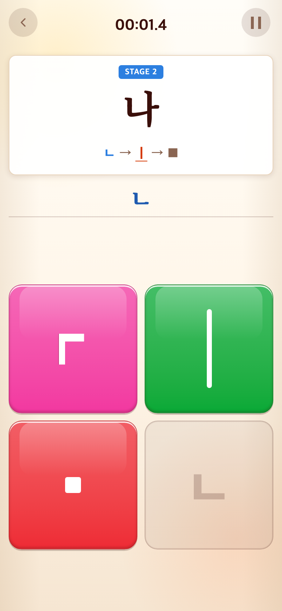

# 2026-09-09 연속 학습과 세 게임 재구성

- 적용 커밋: `00b42bf`
- 비교 커밋: `b44c0c0`
- 재현 여부: 성공. 두 커밋을 각각 `git archive`로 독립 임시 폴더에 풀어 Vite로 실행했다. 현재 작업 파일로 과거 화면을 흉내 내지 않았다.
- 공통 조건: Chrome Headless, 390×844 CSS px, DPR 2, PNG 780×1688 px. 스플래시 종료 후 같은 메뉴 진입 동작을 사용했다. 보드는 무작위 배치이므로 위치·제시어는 실행마다 다르다.

## 문제·개선 요구

Alphabet은 6×6까지 정해진 학습을 마치면 종료되어 반복 연습이 부족했다. 사용자는 무작위 세 자소와 일반 자소·함정이 함께 등장하는 8×8 무한 구간을 요청했다. 긴 문장 대신 한 음절부터 직접 조합하고 단어로 넘어가는 구성을 원했다.

## 수정 내용과 이유

- 메뉴를 Alphabet → Syllable → Word로 재구성하고 Sentence 진입과 활성 실행 경로를 제거했다. 과거 문장 데이터와 테스트는 보존하되 게임에서 사용하지 않는다.
- Alphabet 고정 2×2·4×4·6×6 순서는 유지했다. 이후에는 세 자소를 무작위로 제시하는 8×8 판을 계속 새로 생성한다. 정답 입력 분량을 먼저 확보하고 일반 자소 17종을 모두 포함하며 함정 13칸(64칸의 약 20%)을 섞는다.
- Syllable은 가 → 나 → 다…부터 한 음절씩, `ㄱ → ㅣ → ■`처럼 실제 천지인 입력으로 완성한다. 같은 자소도 필요한 횟수만큼 독립 블록으로 확보한다. 모음을 넓혀 가며 2×2 → 4×4 → 6×6, 이후 무작위 8×8로 이어진다.
- Alphabet/Syllable은 기존 누적 시간 표시를 유지하며 제한시간 없이 연습하고 메뉴로 나갈 수 있다. Word는 기존 레벨과 세 단어 결과 방식을 유지했다.
- 완료 직후 예약된 다음 단계 전환도 일시정지·메뉴 이동 시 멈추도록 했다.

## 수정 결과와 검증

- Vitest 156개 통과, 타입 검사 및 프로덕션 빌드 통과.
- 실제 버튼 클릭으로 Alphabet 고정 구간을 모두 통과하고 무작위 구간 두 판을 추가 완료해 STAGE 30의 8×8 판까지 확인했다.
- Syllable에서 가를 조합한 뒤 나로 넘어가 ㄴ 입력 상태를 확인했다.
- 단위 테스트에서 모든 고정 음절의 토큰 조합 결과, 중복 입력 블록 확보, 매우 큰 단계 번호의 8×8 생성, 일반 자소와 함정 수를 확인했다.

## 모바일 화면

| 수정 전 — `b44c0c0` 재현 | 수정 후 — `00b42bf` 재현 |
| --- | --- |
|  |  |
|  |  |

두 번째 행은 동일 스테이지 비교가 아니라 기존 마지막 고정 판과 그 이후 신설된 반복 구간 비교다. 이전 버전에는 8×8 연속 구간이 없어 동일 상태의 수정 전 이미지는 만들지 않았다.

### 신설 Syllable

Syllable 독립 게임은 새로 만들어진 화면이므로 이에 대응하는 과거 화면은 없다. 위 화면은 `00b42bf`에서 가를 실제로 완성한 뒤 나에 ㄴ을 입력해 캡처했다.
