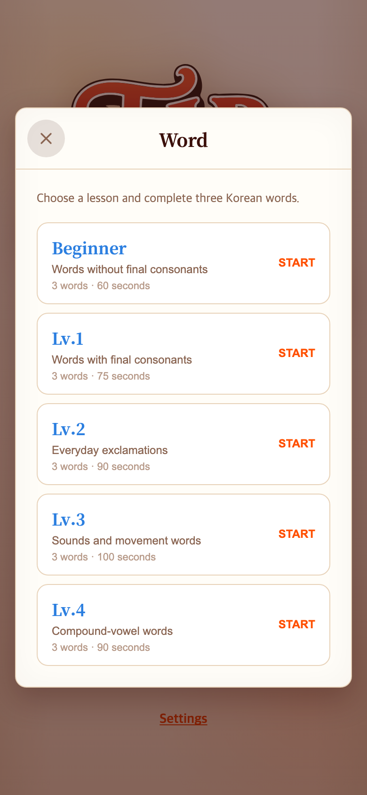
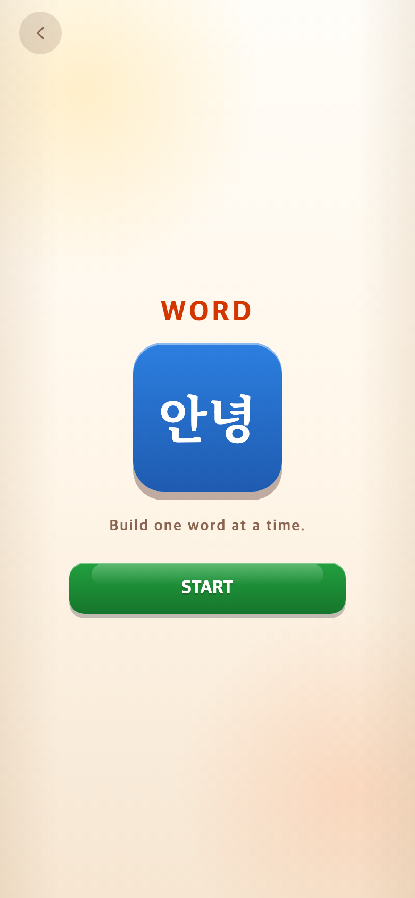
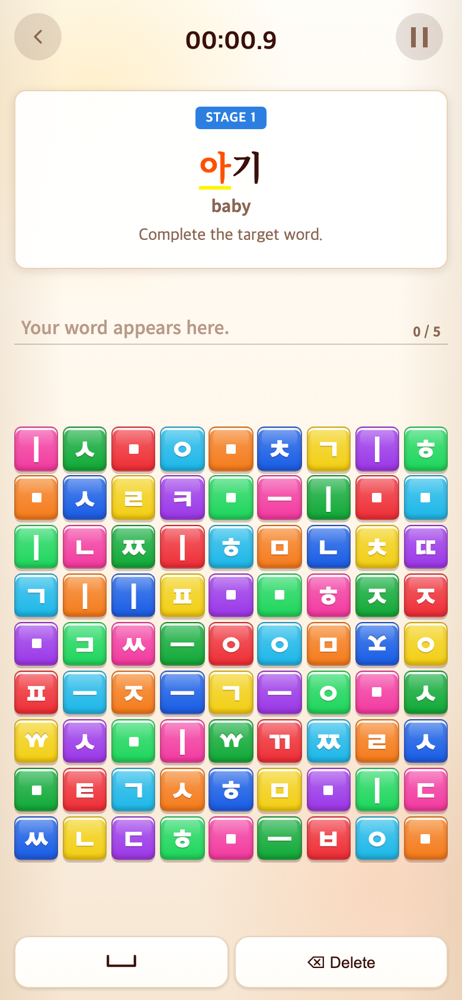

# 2026-09-10 Word 통합 코스와 공통 시작 화면

- 변경 커밋: `702bb99`, 정답 조합 보정 `50efe4c`
- 비교 커밋: `bd5a28f`
- 재현: 두 버전을 각각 독립 임시 폴더에 `git archive`로 추출해 실행. 현재 작업 파일은 과거 화면 재현에 사용하지 않았다.
- 캡처 조건: Chrome Headless, 390×844 CSS px, DPR 2, 780×1688 PNG. 스플래시 종료 후 메인 Word 버튼을 클릭.

## 문제·개선 요구

Word만 레벨 선택창으로 들어가 다른 게임과 흐름이 달랐다. 사용자는 안녕 아이콘과 START 화면, 기존 Beginner부터 모든 단어 그룹을 하나의 코스로 통합하고 세 게임의 아이콘을 조금 올리기를 요청했다.

## 수정 내용과 이유

- 세 게임이 같은 START 화면을 사용한다. 아이콘은 ㄱ·가·안녕이며 모두 기존보다 6 CSS px 위로 이동했다. 두 글자인 안녕은 48px로 상자 안에 맞췄다.
- Word 레벨 선택과 세 단어 무작위 추출을 제거했다. 기존 단어를 순서 그대로 한 단어 한 스테이지로 연결했다: 받침 없음 6 + 받침 있음 6 + 감탄사 7 + 의성·의태어 6 + 복모음 8 = 33개.
- 짧은 묶음용 시간 제한은 없애고 누적 시간을 표시한다. 33단어 전체를 마치면 결과가 나온다. 결과 점수 기준 시간은 기존 그룹별 3단어 기준을 전체 단어 수에 비례해 합산했다. 기존 81블록, 번역, 입력·삭제·함정은 유지했다.
- 실제 전체 코스 검증에서 오빠의 기본 자소 입력이 다른 음절 경계로 조합되어 막히는 문제를 발견했다. 제시어의 전체 정답 토큰과 정확히 일치할 때는 제시어가 음절 경계를 결정하도록 보정했다. 불완전하거나 틀린 입력은 기존 조합을 유지한다.

## 스테이지 수

| 게임 | 고정 스테이지 | 이후 |
| --- | ---: | --- |
| Alphabet | 27 | 무작위 8×8 반복 |
| Syllable | 82 | 무작위 8×8 반복 |
| Word | 33 | 전체 완료 결과 |

고정 스테이지 합계는 142개다. Alphabet/Syllable의 무작위 반복은 이 수에 포함하지 않으며 게임 안에 전체 개수는 표시하지 않는다.

## 검증

- Vitest 157개, 타입 검사, 프로덕션 빌드 통과.
- 단위 테스트에서 고정 스테이지 수, Word 중복·순서·전체 단어의 정답 토큰 조합을 검증했다.
- 브라우저에서 33단어를 실제 정답 블록 클릭으로 모두 완료하고 마지막 `Word complete!` 결과 표시를 확인했다.

## 모바일 비교

| 수정 전 `bd5a28f` 재현 | 수정 후 `702bb99` 재현 |
| --- | --- |
|  |  |

### 통합 코스 첫 스테이지 — `50efe4c` 재현

기존 버전은 무작위 세 단어 선택이며 새 버전은 아기부터 순서대로 진행하므로 동일 타겟 조건의 비교는 아니다.
