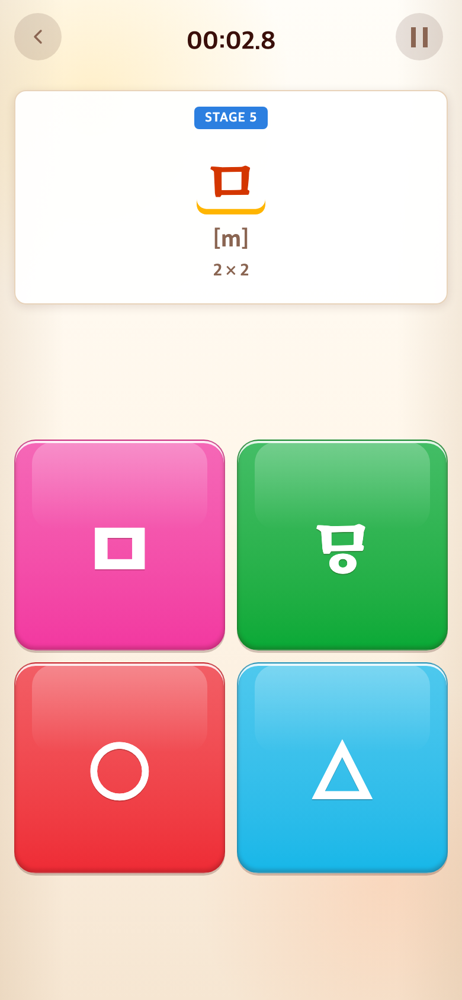
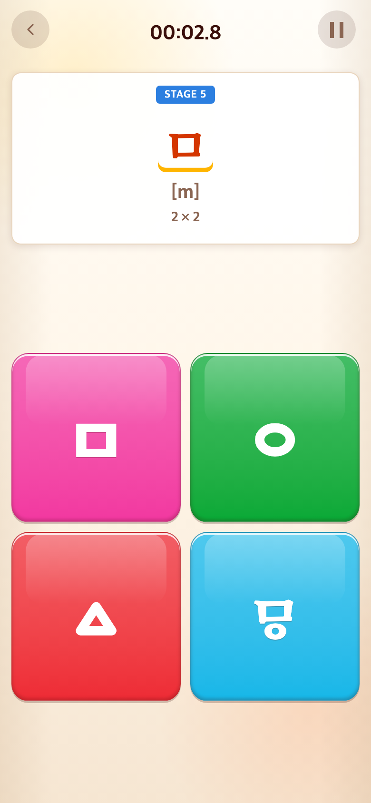
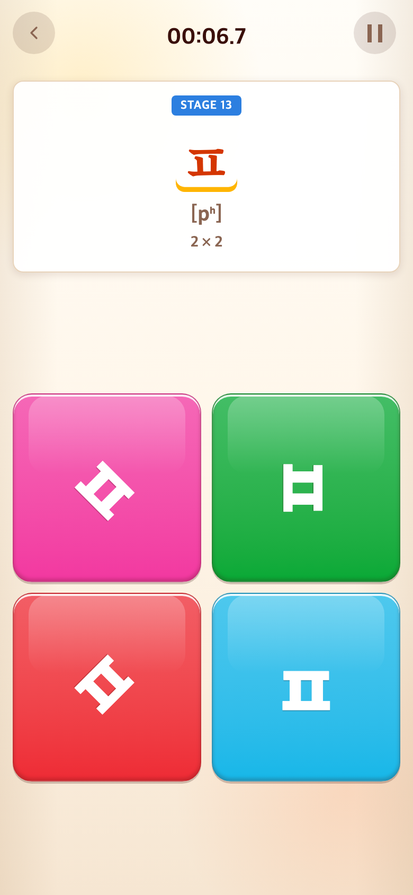
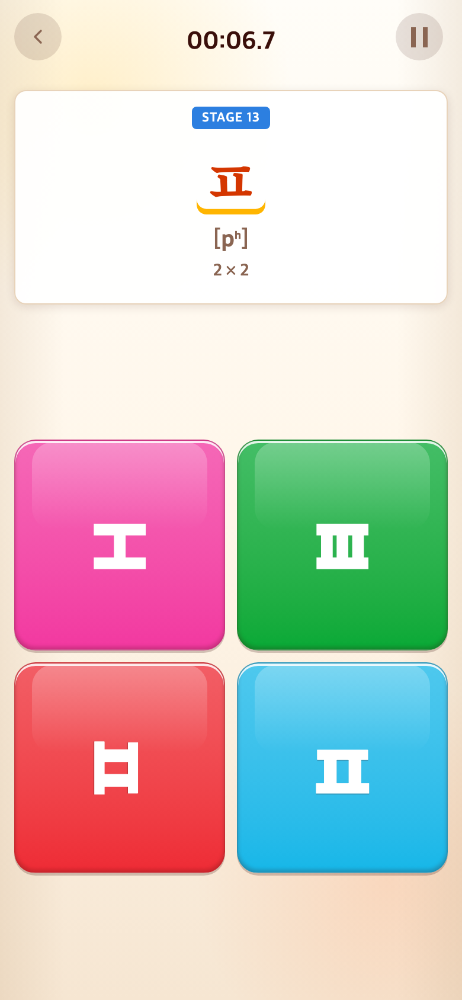
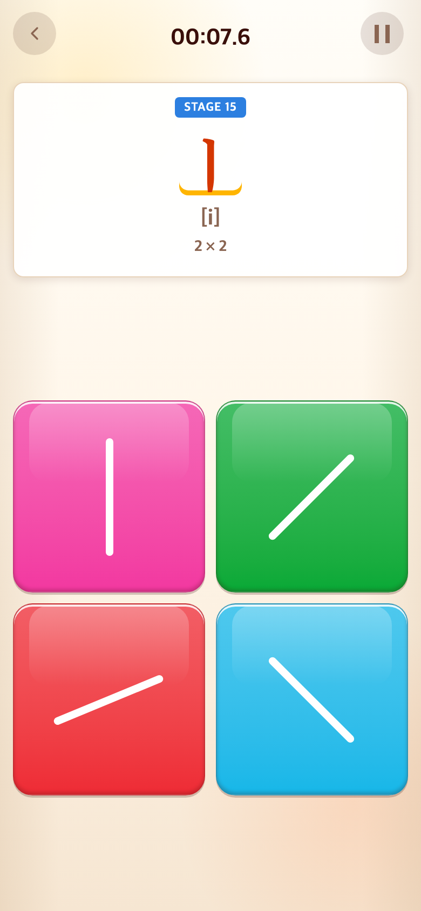
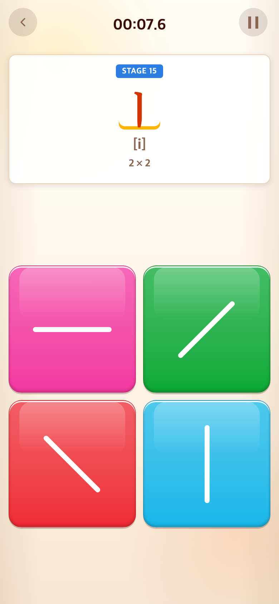
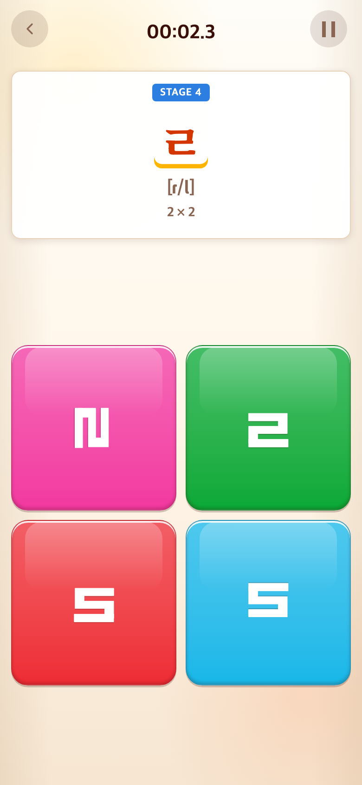
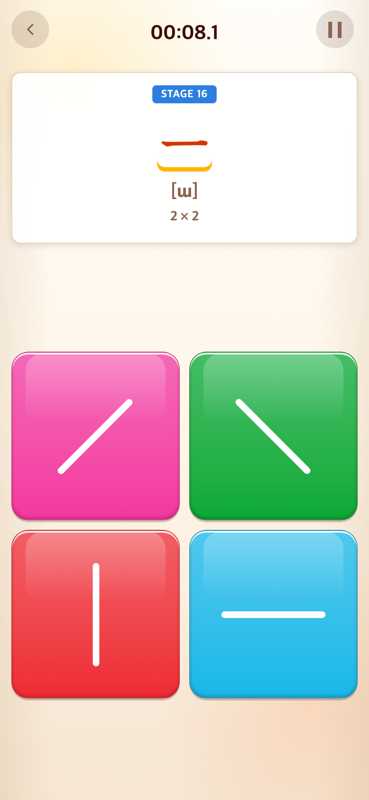
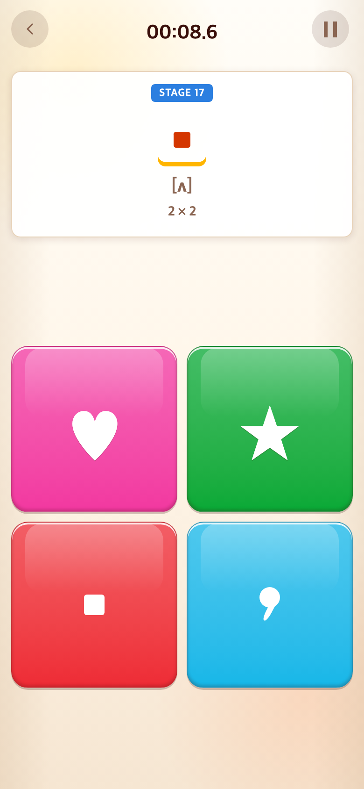

# 2026-09-10 자소별 보기 형태 정리

- 비교 커밋: `394a3ee`
- 적용 커밋: `30c724d`, 도형 크기·굵기 보정 `94ba233`
- 재현: 성공. 전후 커밋을 각각 별도 임시 폴더에 `git archive`로 추출해 실행했다.
- 조건: Chrome Headless, 390×844 CSS px, DPR 2, 780×1688 PNG. Alphabet START 후 같은 정답을 순서대로 눌러 해당 단계에 진입. 타일 위치는 무작위다.

## 문제·개선 요구

ㄹ·ㅍ의 대각선 보기가 부자연스럽고 모음의 얕은 사선이 애매했다. ㅁ의 원·세모는 글자와 크기·굵기가 달랐으며 아래아와 비교할 쉼표 머리는 너무 작았다.

## 무엇을 왜 수정했는가

- ㄹ은 좌우반전·상하반전과 기존 90° 회전으로 교체했다. 글꼴 특성상 두 반전의 실루엣은 서로 유사할 수 있지만 요청한 반전 방식 그대로다.
- ㅁ의 원·세모를 SVG로 만들어 실제 ㅁ 블록의 외곽 크기와 획 두께에 가깝게 맞췄다. 순경음미음은 변경하지 않았다.
- ㅍ은 세로획 1개·3개인 도형과 기존 90° 회전 보기로 구성했다. 정답 ㅍ은 기존 서체를 유지한다.
- ㅣ는 ㅡ·−45°·+45°, ㅡ는 ㅣ·−45°·+45°를 보기로 구성했다. 선은 같은 길이와 굵기로 그리고 22.5° 사선은 더 이상 생성하지 않는다.
- 쉼표 머리를 보드별 아래아 네모점과 같은 너비·높이로 만들었다. 머리는 원형, 아래아는 기존 사각형이며 꼬리를 더해 구분한다.
- 도형 보기는 정상 자소와 같은 내부 값이더라도 항상 오답으로 처리하도록 했다. 판정과 필수 정답 타일 확보는 유지한다.

## 검증

테스트 161개, 타입 검사, 빌드 통과. 실제 UI에서 ㄹ·ㅁ·ㅍ·ㅣ·ㅡ·아래아 단계에 진입해 크기·정렬·방향을 확인했다.

## 전후 모바일 화면

| 대상 | 수정 전 `394a3ee` 재현 | 수정 후 재현 |
| --- | --- | --- |
| ㅁ |  |  |
| ㅍ |  |  |
| ㅣ |  |  |

### 나머지 수정 화면 — `30c724d` 재현

| ㄹ | ㅡ | 아래아 |
| --- | --- | --- |
|  |  |  |

모든 화면은 실제 게임 캡처이며 합성하지 않았다. `94ba233`은 ㅁ·ㅍ 도형 치수만 보정했으므로 나머지 화면은 최종 코드에서도 동일하다.

## 후속 버그 수정: ㄹ 보기 중복

좌우반전과 상하반전이 서로 같은 윤곽으로 보여 중복되었다. 상하반전을 **좌우반전 후 90° 회전**으로 바꿔 정답·좌우반전·90° 회전·반전 후 90° 회전의 네 윤곽이 모두 다르게 했다. 대각선은 다시 사용하지 않았다. 변환 이름만 비교하던 테스트에 실제 ㄹ 획 좌표의 변환 결과를 비교하는 회귀 테스트를 추가했다. 테스트 162개 및 빌드 통과.

아래는 후속 수정 작업 트리에서 ㄱ·ㄴ·ㄷ을 실제로 완료한 뒤 캡처한 780×1688 PNG다. 이전 화면은 위 `shapes-rieul-after.png`에 보존되어 있다.

