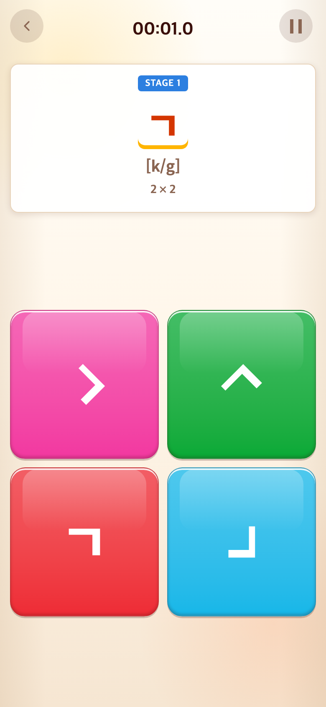
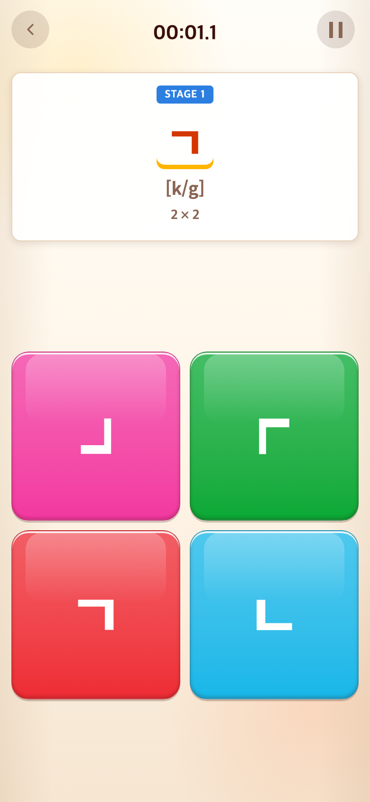

# 2026-09-10 SVG 표시 대기 제거·자음 90도 회전

- 적용 커밋: `9bf6d20`
- 비교 커밋: `350ac12`
- 재현 여부: 성공

## 문제·개선 요구

새 도형 적용 이후 표시가 늦고 자음까지 45도로 기울어졌다. 사용자는 사선 함정을 ㅣ·ㅡ에만 사용하고 자음은 90도 단위로 돌리도록 요청했다.

## 수정 내용과 이유

- 이전에는 블록 생성 시 `/assets/glyphs/talk-type/*.svg`를 개별 HTTP 요청했다. 31개 원본 도형을 코드에 data URL로 포함해 이 추가 네트워크 대기를 제거했다. 게임이 시작된 후 새 자소가 나타나도 별도 SVG 요청이 없다.
- 실제 사용 기기의 네트워크 지연 자체를 측정한 것은 아니므로 절대 시간 개선 수치는 주장하지 않는다. 로컬 브라우저에서 전체 SVG decode 성공과 외부 glyph 요청 0건을 확인했다.
- 일반 자음은 90°·180°·270° 회전으로 복원했다. ㄹ은 180도 대칭으로 중복되므로 반전·90도 회전을 조합하고, ㅍ은 전용 획 개수 함정 및 90도 회전을 유지한다. ㅣ·ㅡ의 사선 도형만 ±45도를 유지한다.
- 로고 3초+커버 4초 연출은 기존 요청대로 유지한다. 이번 로딩 변경은 블록의 추가 파일 다운로드에 대한 것이다.
- 수정 가능한 개별 SVG는 보존한다. 개별 수정 후에는 추출 스크립트의 `--pack-only`로 연결표만 갱신한다.

## 결과·검증

- Vitest 168개, TypeScript 및 프로덕션 빌드 통과.
- 인라인 SVG가 편집용 파일과 동일한지 검사하며, 브라우저에서 모든 SVG decode 및 외부 SVG 요청 0건을 확인했다.
- 자음 회전·ㄹ 중복 방지·모음 사선 테스트 통과.
- 압축 JS는 이전 약 15.42KB에서 약 20.09KB로 증가하는 대신 개별 자소 요청을 제거했다.
- 두 PNG는 390×844 CSS px, DPR 2, 780×1688px이다. 동일 Alphabet START 진입이며 무작위 블록 배치는 다를 수 있다.
- 수정 전은 `350ac12`를 `/private/tmp/talk-fast-before.ot6j43`에 별도 추출해 실행한 과거 버전 재현이다. 수정 후는 `9bf6d20` 구현 화면이며 합성하지 않았다.

## 모바일 화면

| 수정 전 — `350ac12` 재현 | 수정 후 — `9bf6d20` |
| --- | --- |
|  |  |
