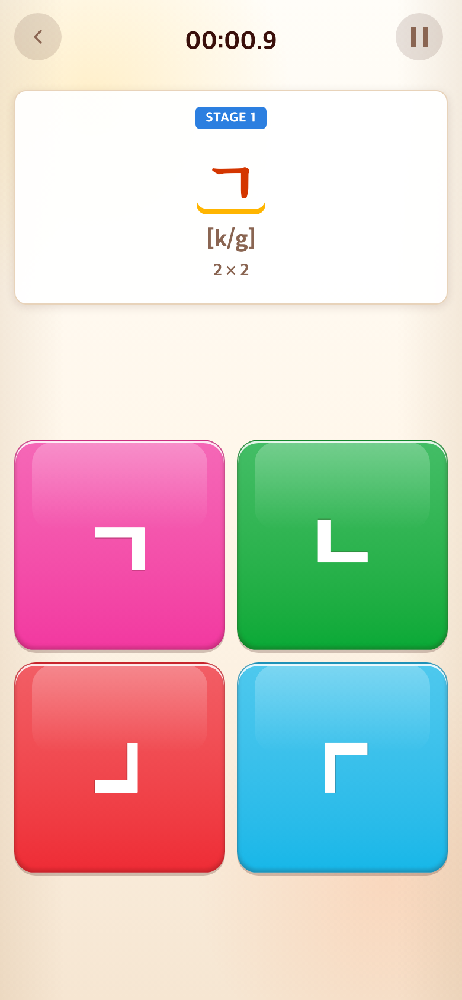
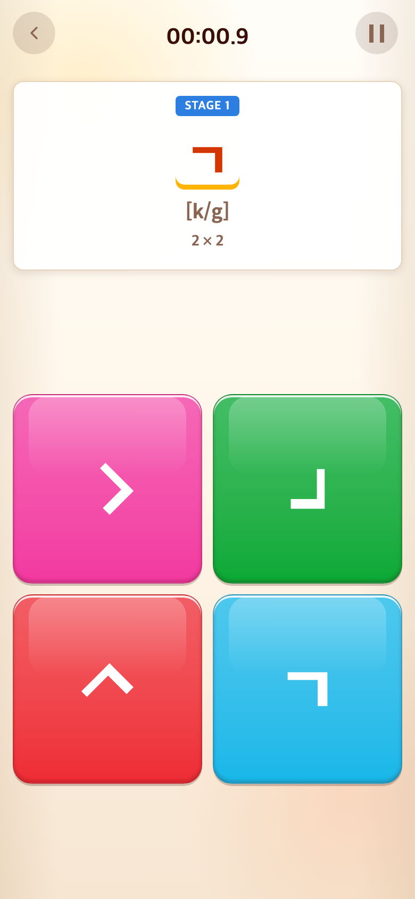
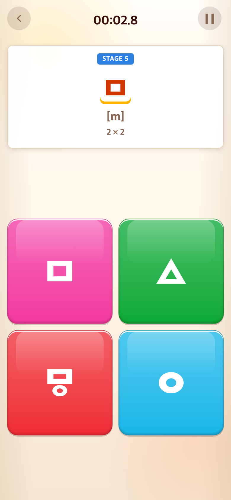
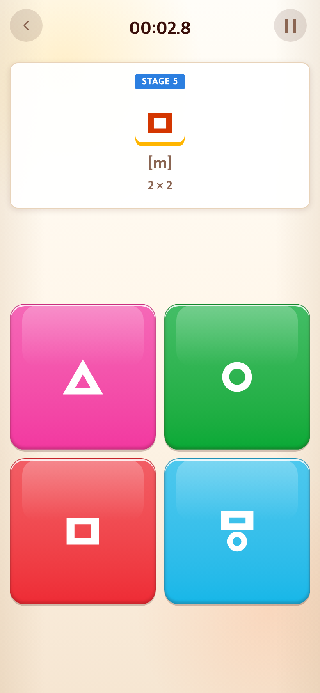
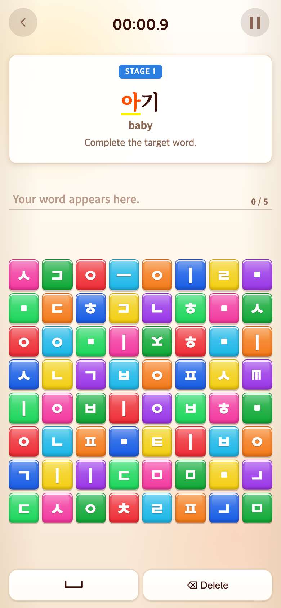
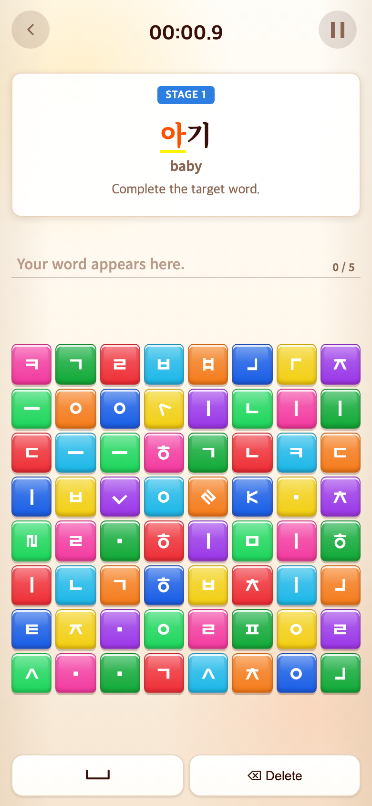

# 2026-09-10 탭투톡체와 중심 회전 함정

- 적용 커밋: `6b8c363`
- 비교 커밋: `08566ad` (사용자 탭투톡체.svg 업로드)
- 재현 여부: 성공

## 문제·개선 요구

사용자가 직접 편집한 탭투톡체를 블록 자소·함정·기호에 적용하고, 기본 도형의 중심을 기준으로 45°·90°·−45°·−90° 회전한 함정을 요청했다. 별도 원형 도형이 없는 ㅁ의 동그라미 함정은 사용자 확인을 거쳐 새 ㅇ 도형을 공유한다.

## 수정 내용과 이유

- Illustrator 시트의 아트보드 밖에 있는 도형 31개를 추출했다. 회색 배경과 라벨은 제외하고 원본 획·크기 비율은 보존한다. 원본 SVG 파일은 변경하지 않는다.
- 각 도형의 bounding box 중심을 공통 100×100 viewBox 중앙에 맞추고 CSS transform-origin 50% 50%로 회전한다. 마스크로 표시하므로 폰트 설치와 무관하며 흰색·사용 후 회색을 따른다.
- Alphabet 일반 자음은 +45°·+90°·−45° 세 함정, Word는 ±45°·±90° 중 무작위 회전을 사용한다. ㅇ·ㅁ은 전용 모양 함정, ㅍ은 획 1개·3개와 회전 함정을 유지한다. 모음 직선·사선·별·하트·쉼표도 새 시트 도형이다.
- `○`는 `ㅇ` SVG 파일에 연결하지만 판정용 값은 따로 유지하므로 ㅁ 단계에서 정답이 되지 않는다.
- 개별 파일은 `public/assets/glyphs/talk-type/`, 연결표는 `src/config/glyphAssets.ts`, 재추출 도구는 `scripts/extract-talk-type.py`다.
- 완성된 음절·단어 및 입력 텍스트의 기존 명조체, Word 8×8와 10단계 보너스 동작은 유지한다.

## 결과·검증

- Vitest 168개 및 TypeScript/프로덕션 빌드 통과.
- 전체 SVG 이미지 decode 성공, 블록과 회전 도형 중심 오차 1px 이내 확인.
- 실제 브라우저에서 회전 함정은 단계 진행 없이 거절되고 정답은 다음 단계로 진행함을 확인했다.
- 전후 모두 390×844 CSS px / DPR 2 / 780×1688 PNG. 같은 모드 진입 및 정답 선택 순서를 사용했다. 보드 위치는 무작위여서 달라질 수 있다.
- 수정 전은 `08566ad`를 `/private/tmp/talk-type-before.dxCLxw`에 별도 추출해 실행한 과거 버전 재현이다. 수정 후는 `6b8c363` 구현을 실행했다. 화면을 합성하지 않았다.

## 모바일 화면

| 수정 전 — `08566ad` 재현 | 수정 후 — `6b8c363` |
| --- | --- |
|  |  |
|  |  |
|  |  |
