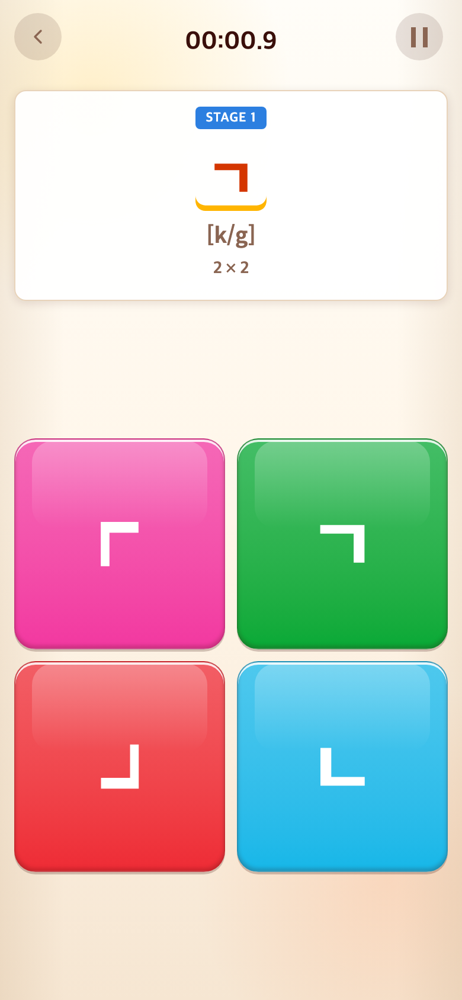
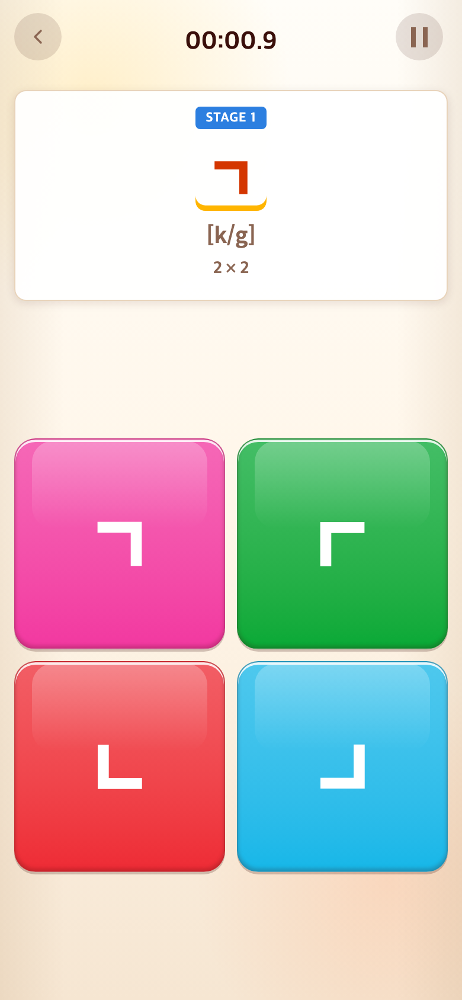

# 2026-09-10 탭투톡체2 적용

- 적용 커밋: `d416908`
- 비교 커밋: `fe36023` (새 원본 업로드만 된 상태, 게임은 이전 자소)
- 재현 여부: 성공. 비교 커밋은 `/private/tmp/talk-type2-before.5D6Rrp`에 별도 추출해 실행.
- 비교 조건: Alphabet → START → Stage 1, Chrome, 390×844 CSS px, DPR 2. PNG 780×1688 px. 보기는 무작위 배치이므로 위치는 다를 수 있다.

## 문제·개선 요구

사용자가 자소를 정사각형에 가까운 비율로 다시 디자인한 `탭투톡체2.svg` 적용 요청.

## 수정 내용과 이유

추출 원본을 새 시트로 변경하고 31개 자소·기호를 다시 추출했다. 원본 획과 비율을 유지하며 도형 중심만 100×100 viewBox 중앙에 정렬했다. 게임 연결표의 인라인 SVG도 갱신했다.

## 수정 결과

공통 자소 표시가 새 디자인으로 바뀌었다. 회전 규칙, 정답과 겹치는 함정 제외, 제시어창 고정 높이, 별·하트·쉼표 110% 크기, ㅁ의 원형 함정에 ㅇ 공유는 유지했다. 이전 원본은 삭제하지 않았다. 테스트 171개와 빌드 통과.

## 모바일 화면

| 수정 전 — `fe36023` 재현 | 수정 후 — `d416908` |
| --- | --- |
|  |  |
