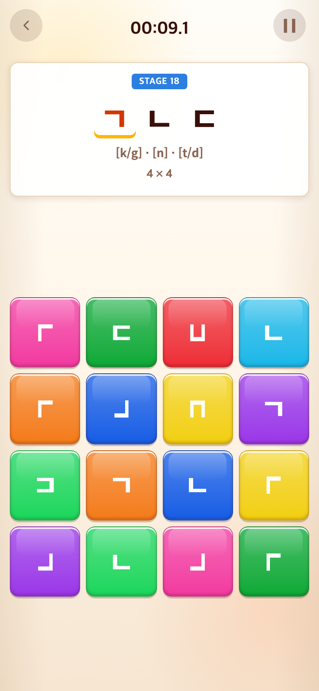
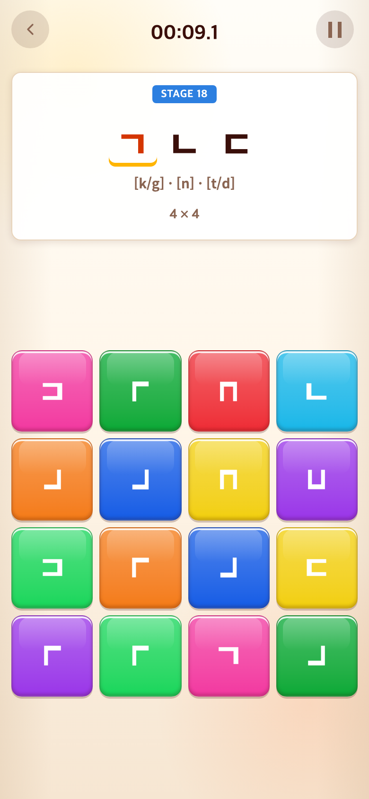

# 2026-09-10 정답과 겹치는 함정 제외·제시어창 고정

- 적용 커밋: `d168bde`
- 비교 커밋: `cfd57d7`
- 재현 여부: 성공

## 문제·개선 요구

ㄱ·ㄴ을 함께 찾는 판에서 ㄱ을 180° 돌린 함정이 ㄴ과 같은 모양인데도 오답으로 처리됐다. 또한 자소 개수에 따라 제시어창의 높이가 바뀌었다.

## 수정 내용과 이유

- 판을 만들 때 현재 제시 자소와 모양이 겹치는 함정을 제외한다. ㄱ↔ㄴ의 180° 회전, ㅇ과 같은 원형 함정, 회전한 ㅣ·ㅡ 등의 명시적 시각 대응을 DOM과 분리된 규칙으로 관리한다.
- 고정 학습, 무작위 혼합 판, Word 입력 보드에도 같은 충돌 검사를 적용했다. 제시하지 않은 다른 자소와 닮은 일반 함정은 유지한다.
- 제시어의 정답 판정이나 필요한 자소는 바꾸지 않고, 혼동을 만드는 함정 후보만 제거한다.
- Alphabet/Syllable의 제시어창은 178px 고정 높이와 동일 너비를 유지한다. 자소 개수별 글자 크기 조절은 유지하지만 창과 게임판 위치가 들쭉날쭉 바뀌지 않게 한다.

## 결과·검증

- Vitest 171개 및 TypeScript/프로덕션 빌드 통과.
- 전체 고정 Alphabet 단계와 ㄱ·ㄴ·ㄷ/ㅁ·ㅇ·ㅣ 혼합 판의 정답 보존 및 충돌 함정 제외를 테스트했다. Word에서도 충돌 검사를 검증했다.
- 브라우저에서 첫 단계부터 5자소 단계까지 실제 버튼을 눌러 진행하고, 각 단계의 제시어창 너비·높이 차이가 0.1px 이하임을 확인했다.
- 아래는 동일 ㄱ·ㄴ·ㄷ 단계(17개 단일 자소 완료 후) 비교이다. 보드 배치는 무작위라 다를 수 있다.
- 수정 전 `cfd57d7`은 `/private/tmp/target-conflict-before.9ht1VZ`에 별도 추출해 실행한 과거 화면이다. 수정 후는 `d168bde` 구현을 실행한 화면이다. 합성하지 않았다.
- PNG는 390×844 CSS px, DPR 2, 780×1688px이다.

## 모바일 화면

| 수정 전 — `cfd57d7` 재현 | 수정 후 — `d168bde` |
| --- | --- |
|  |  |
