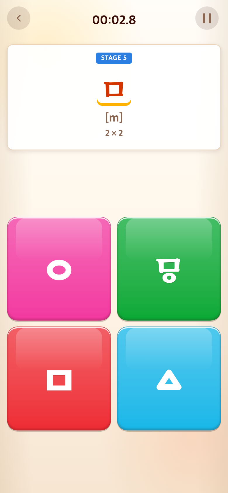
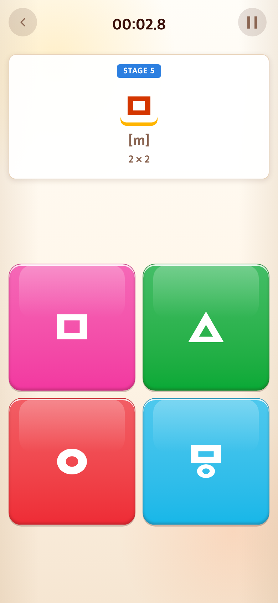
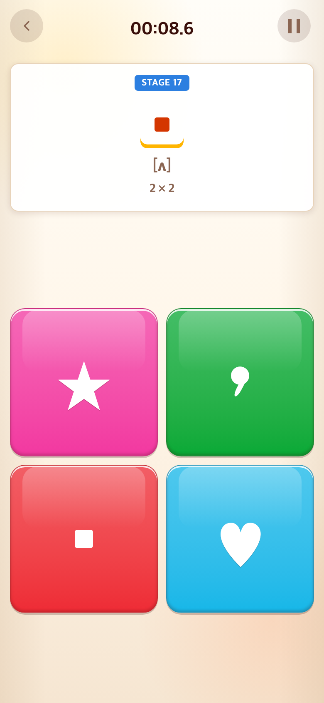
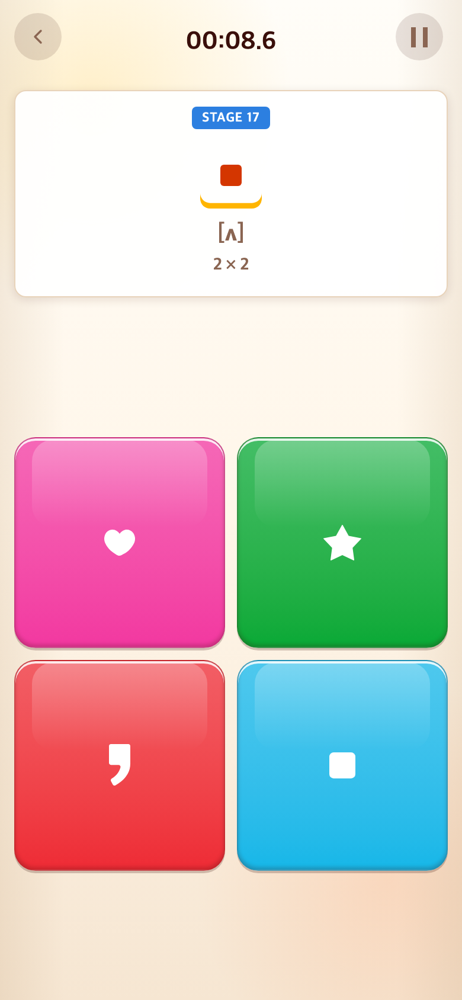

# 2026-09-10 업로드 SVG로 ㅁ·모음 천 보기 교체

- 적용 커밋: `0637194`
- 비교 커밋: `bce2246` (사용자 SVG 업로드 직후)
- 재현 여부: 성공
- 비교 조건: Alphabet START → 앞선 정답을 차례로 선택 → Stage 5(ㅁ), Stage 17(모음 천). 같은 진입 방식이며 무작위 블록 위치와 경과 시간은 다를 수 있다.

## 문제·개선 요구

사용자가 직접 만든 ㅁ·모음 천 관련 SVG 각 4개를 게임의 정답과 함정 보기에 사용하도록 요청했다. 기존 폰트 및 코드로 그린 도형 대신 원본 디자인을 그대로 보존해야 한다.

## 수정 내용과 이유

| 원본 파일 | 연결한 보기 | 판정 |
| --- | --- | --- |
| ㅁ-01.svg | ㅱ | 함정 |
| ㅁ-02.svg | ㅁ | 정답 |
| ㅁ-03.svg | ○ | 함정 |
| ㅁ-04.svg | △ | 함정 |
| 모음천소스-01.svg | ★ | 함정 |
| 모음천소스-02.svg | 쉼표 | 함정 |
| 모음천소스-03.svg | ㆍ | 정답 |
| 모음천소스-04.svg | ♥ | 함정 |

원본 SVG를 다시 그리거나 자르지 않고 CSS 마스크로 사용한다. 원본 비율과 그룹 내 상대 크기를 유지하면서 기존 블록의 흰색 및 사용 후 색상을 따르게 했다. 자산 경로·치수는 `src/config/glyphAssets.ts`에 모았다. Alphabet/Syllable 및 Word 블록에 동일한 자산을 사용하며 Alphabet의 해당 제시 자소도 일치시켰다. 다른 자음과 게임 판정은 변경하지 않았다.

## 수정 결과·검증

- 직접 제공한 네모·원·삼각형·순경음 미음과 별·쉼표·네모점·하트를 표시한다.
- 기존 폰트 또는 가상 요소가 SVG 위에 겹치지 않도록 처리했다.
- 8개 자산 연결 및 각 보드의 정답 1개/함정 3개 판정을 테스트했다.
- Vitest 164개 통과, TypeScript 검사 및 프로덕션 빌드 통과.
- 아래 PNG는 모두 390×844 CSS px, DPR 2, 780×1688 px이다.
- 수정 전은 `bce2246`을 `/private/tmp/taptotalk-svg-before.eHZAn2`에 별도 추출해 실행한 과거 버전 재현 화면이다. 수정 후는 `0637194`와 동일한 구현을 현재 개발 서버에서 실행해 캡처했다. 화면 합성이나 과거 화면 임의 재구성은 하지 않았다.

## 모바일 화면

| 수정 전 — `bce2246` 재현 | 수정 후 — `0637194` |
| --- | --- |
|  |  |
|  |  |
