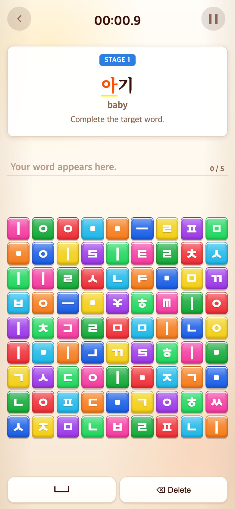
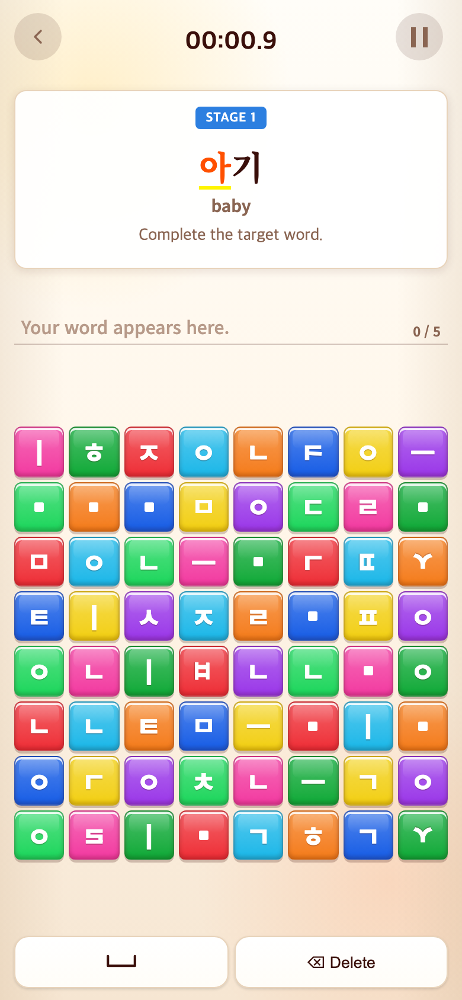
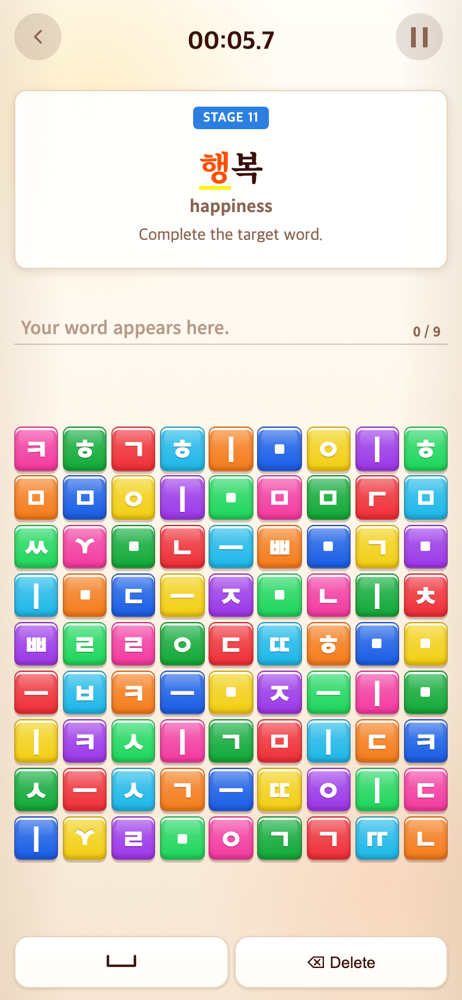
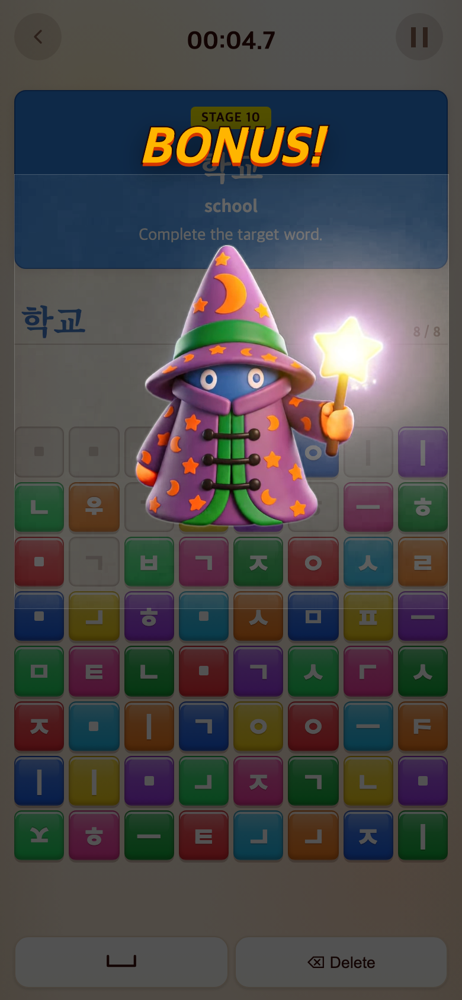

# 2026-09-10 Word 8×8·기본 자음·10스테이지 보너스

- 적용 커밋: `060dd3c`
- 비교 커밋: `a37786e`
- 재현 여부: 성공
- 범위: Word. Alphabet/Syllable의 기존 진행은 유지한다.

## 문제·개선 요구

천지인과 기본 자음으로 조합하는 방식에 맞춰 Word의 독립 쌍자음 블록을 없애고 9×9를 8×8로 줄인다. 긴 연속 플레이에 10스테이지마다 춤 보너스를 제공한다.

## 수정 내용과 이유

- Word 전용 보드 생성기를 추가해 64칸, 기본 자음 14개와 천지인으로 구성한다. 목표의 쌍자음·겹받침 분해와 필요한 자소 1.5배 보장은 유지한다. 이전 문장 테스트의 81칸 생성기는 호환용으로 남기되 활성 Word는 사용하지 않는다.
- 10·20·30…개 완료 시 `BONUS!`와 기존 성공 캐릭터 6종 중 무작위 영상을 재생한다. 실패 캐릭터 티피는 선택하지 않는다.
- 점수 결과 카드 없이 바로 보너스 문구와 영상을 표시한다. 시청 시간은 누적 플레이 시간에 포함하지 않는다.
- 영상 중 블록·편집 입력을 잠그고, 끝나면 다음 단어로 자동 이동한다. 재생 실패 시에도 진행하며 15초 상한으로 정체를 방지한다.

## 결과·검증

- 현재 Word 고정 33단어 및 추가 60단어 모두 64칸에서 필요한 자소가 충분하고 독립 쌍자음이 없음을 테스트했다.
- `꾀 = ㄱ ㄱ ㆍ ㅡ ㅣ`, 아빠, 읽 조합 및 10개 단위 보너스 조건을 검증했다.
- Vitest 167개, TypeScript 및 프로덕션 빌드 통과.
- 브라우저에서 실제 버튼을 눌러 첫 10단어를 완료했다. 보너스 문구·영상, 입력/삭제/스페이스/일시정지 차단, 타이머 정지와 영상 종료 후 STAGE 11 자동 이동을 확인했다.
- 수정 전은 `a37786e`를 `/private/tmp/word-bonus-before.PYUTz2`에 추출해 실행한 과거 재현 화면이다. 수정 후는 `060dd3c` 구현을 실행한 화면이다. 무작위 보드·영상과 경과 시간은 달라질 수 있다.
- 모두 390×844 CSS px, DPR 2, 780×1688 PNG. 전후 동일 START 진입 및 같은 10단어 완료 조작을 사용했고 화면을 합성하지 않았다.

## 모바일 화면

| 수정 전 — `a37786e` 재현 | 수정 후 — `060dd3c` |
| --- | --- |
|  |  |
|  |  |
