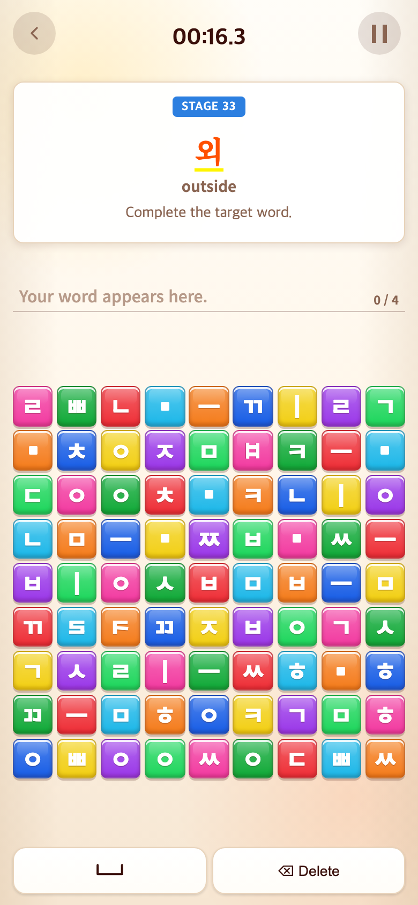
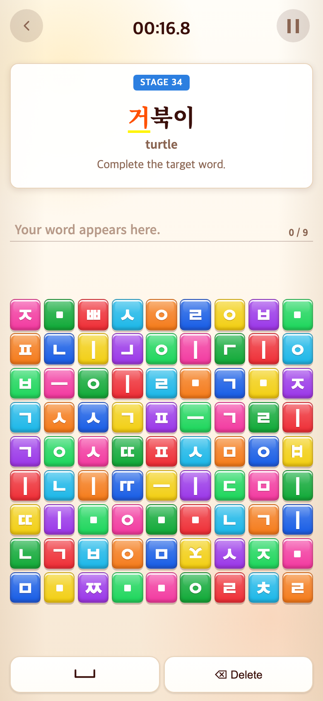
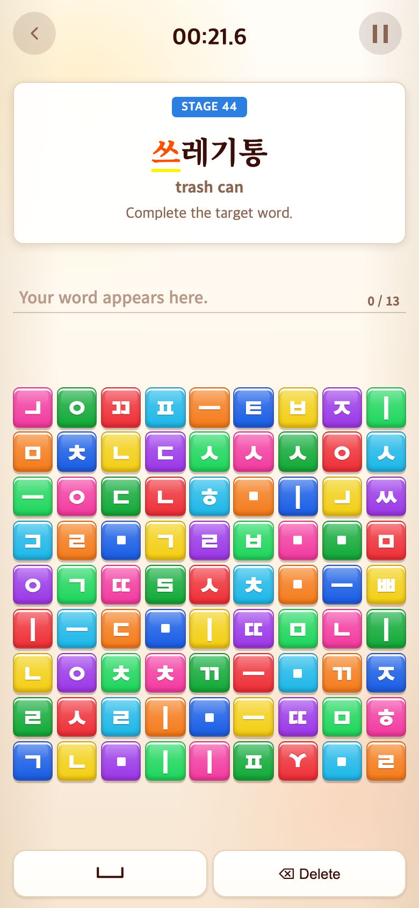
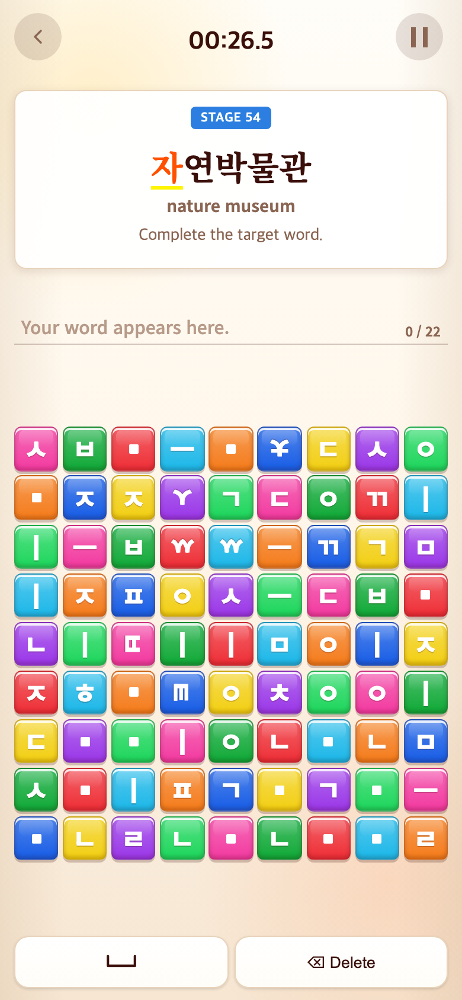

# 2026-09-10 Word 신규 어휘와 무작위 반복

- 적용 커밋: `9433f5f`
- 비교 커밋: `be89de8`
- 재현: 성공. 두 커밋을 각각 별도 임시 폴더에 `git archive`로 추출해 실행했다.
- 공통 조건: Chrome Headless, 390×844 CSS px, DPR 2, PNG 780×1688 px. 메인 Word → START 후 실제 정답 블록을 순서대로 클릭했다. 단어와 보드 배치는 무작위여서 실행마다 달라진다.

## 문제·개선 요구

사용자는 고정 33단어 이후에도 계속 진행하되, 기존 단어를 재사용하지 않고 3·4·5글자 새 단어로 난도가 올라가기를 요청했다.

## 수정 내용과 이유

- 고정 1–33 스테이지는 유지했다. 34–43은 새로운 3글자, 44–53은 새로운 4글자, 54부터는 새로운 5글자 단어가 나온다.
- 각 길이별 20개씩 총 60개 어휘와 영어 뜻을 `src/content/wordJourney.ts`에 추가했다. 기존 33개와 겹치는 단어는 없으며, 문장이 아닌 단어·합성어·의태어로 구성했다. 글자 수는 한글 음절 블록 기준이다. 길이로 난도를 올리는 게임용 구성이지 공인 교육기관의 어휘 등급은 아니다.
- 각 길이별로 단어를 섞어 하나씩 사용한다. 3·4글자는 각각 20개 중 10개를 경험한 뒤 다음 난도로 넘어간다. 5글자는 20개를 모두 사용한 뒤 다시 섞어 무한 반복한다. 다시 섞을 때 직전 단어가 바로 재등장하지 않게 한다. 재시작하면 고정 첫 단어부터 시작한다.
- 33단어 완료 결과를 제거하여 34번째로 자연스럽게 연결했다. 누적 시계, 영어 뜻, 기존 81블록과 오입력·삭제 방식을 유지했다. 시간 제한은 없으며 메뉴로 종료한다.
- 정답 완료 직후에도 Word 전환 예약을 일시정지하거나 메뉴 복귀로 취소할 수 있게 공통 단계 전환 경로로 통합했다.

## 수정 결과와 검증

- 테스트 160개, 타입 검사, 빌드 통과.
- 신규 60개 단어의 길이·번역 존재·중복·기존 어휘 제외를 검사했다.
- 모든 새 단어의 정답 조합과 81칸 보드에서 필요한 자소 수 보장을 여러 무작위 배치로 검증했다.
- 5글자 100회 순환(2,000판)에서도 매 묶음 20개가 중복되지 않고, 묶음 경계에서 직전 단어가 나오지 않는지 검사했다.
- 실제 UI에서 34·44·54번째 단계까지 정상 진행했으며, 완료 직후 일시정지→재개와 메뉴 복귀 후 새 게임이 아기부터 다시 시작하는 것을 확인했다.

## 모바일 화면

| 수정 전 `be89de8` 재현: 마지막 고정 단계 | 수정 후 `9433f5f` 재현: 다음 새 단계 |
| --- | --- |
|  |  |

기존에는 34번째 스테이지가 없으므로 동일 스테이지의 과거 화면을 임의로 만들지 않았다. 위 비교는 기존 마지막 고정 단계와 새로 추가된 다음 단계다.

### 4글자와 5글자로 진행

| STAGE 44: 4글자 | STAGE 54: 5글자 |
| --- | --- |
|  |  |

모두 커밋 `9433f5f`에서 실제 이전 스테이지를 완료하여 진입한 화면이다. 과거에는 없는 구간이므로 과거 대응 화면은 없다.
