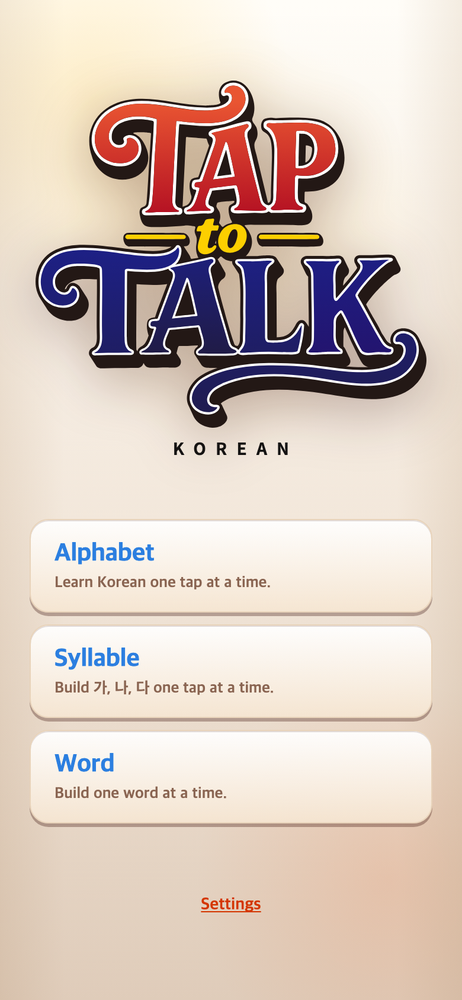
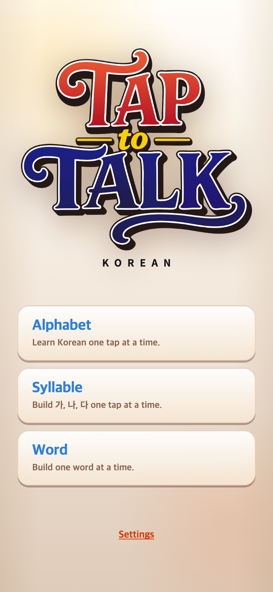
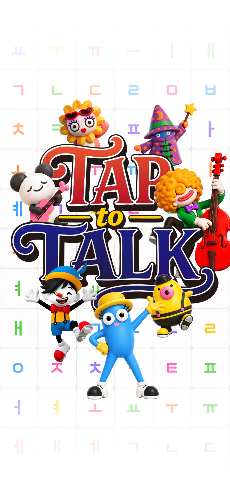
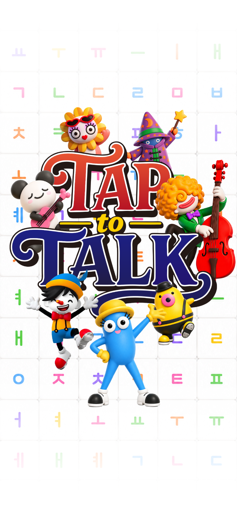

# 2026-09-11 메인 로고·커버 교체

- 적용 커밋: `74fdc4b`
- 비교 커밋: `c7c9bcb`
- 재현: 이전 커밋을 `/private/tmp/talk-brand-before-078Ztd`에서 별도로 실행.

## 요청과 수정

사용자가 제공한 새 메인 로고와 커버 PNG를 원본 그대로 복사했다. 자르기·재색칠·재인코딩은 하지 않았다. 초기 HTML과 앱 미디어 설정을 함께 갱신했다. 새 경로를 사용해 이전 이미지 캐시와 구분하고 기존 파일은 보존했다.

- 로고: `public/assets/brand/taptotalk-logo-0911.png`
- 커버: `public/assets/brand/taptotalk-cover-0911-v2.png`
- 태피티피 스플래시, 3초+4초 표시 시간, 메인 레이아웃·CSS 크기·위치 및 게임 규칙은 변경하지 않았다.

## 결과와 검증

빌드 통과. 실제 모바일 브라우저 화면에서 새 로고의 투명 배경과 커버 표시 확인. 두 원본의 SHA256:

- 로고: `ddb3c443622dbbf1672da2c2d18b3ca1ef6dd1982c2300325693487f41272cce`
- 커버: `ac7d877962e54e53c1e0a2629f548f9c97ffbe37488d81280a9342768b1fdba0`

## 전후 화면

390×844 CSS px, DPR2, PNG780×1688. 메인은 기본8500ms 대기, 커버는4500ms 대기 후 기존 캡처 도구로 촬영했다. 이전 화면은 해당 커밋 재현이다.

| 이전 `c7c9bcb` | 이후 `74fdc4b` |
| --- | --- |
|  |  |
|  |  |
