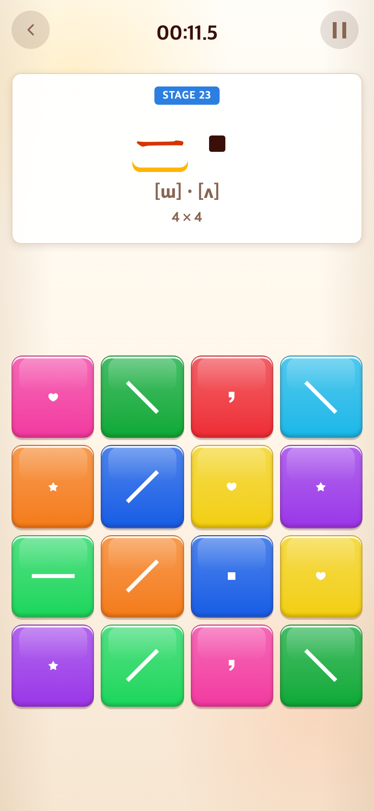
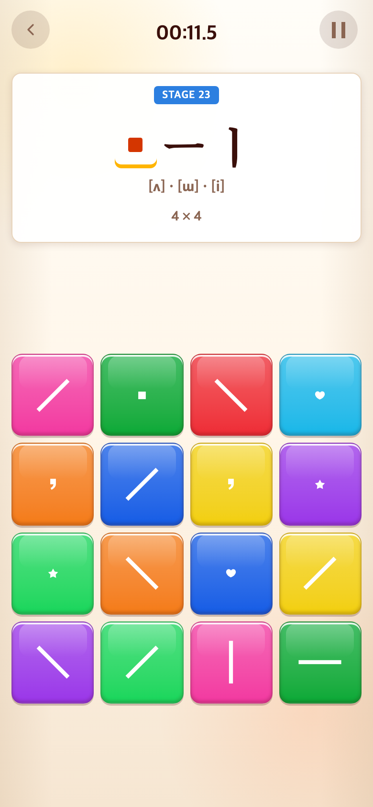

# 자음 묶음과 천지인 분리

- 적용 커밋: `ce89a31`
- 비교 커밋: `909f9c8`, `/private/tmp/talk-group-before.1YvmYR`에서 별도 실행.
- 요구: ㅍㅎ 옆의 ㅣ를 다음 모음 스테이지로 옮기고 ㆍㅡㅣ 순서로 제시.
- 원인: 자음 14개와 모음 3개를 한 배열에서 3개/5개씩 잘라 경계에서 혼합됨.
- 변경: 자음만 먼저 묶고 마지막에 천지인 3개를 추가. 단일 모음도 ㆍ→ㅡ→ㅣ로 정렬.
- 결과: 4×4는 ㅍㅎ 다음 ㆍㅡㅣ, 6×6은 ㅋㅌㅍㅎ 다음 ㆍㅡㅣ. 고정 스테이지 27개와 이후 무작위 진행은 유지. 테스트 174개 및 빌드 통과.

## 모바일 비교

동일한 Alphabet Stage 23 진입. 390×844 CSS px, DPR 2, 780×1688 PNG. 이전 커밋 실제 재현이며 무작위 보기 위치는 다름.

| 이전 `909f9c8` 재현 | 이후 `ce89a31` |
| --- | --- |
|  |  |
