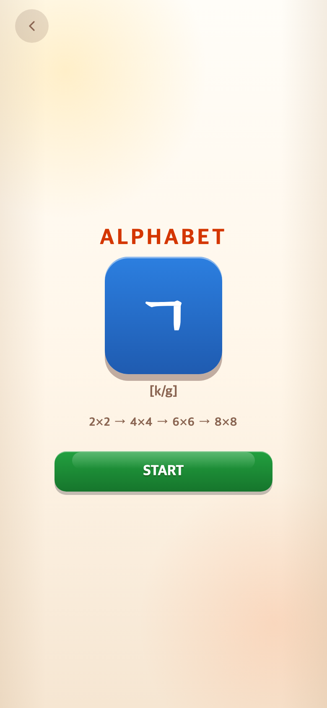
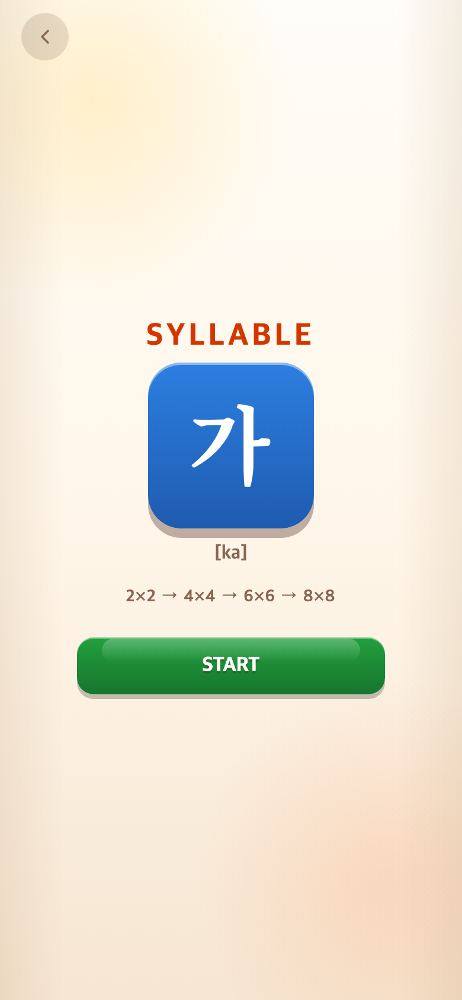
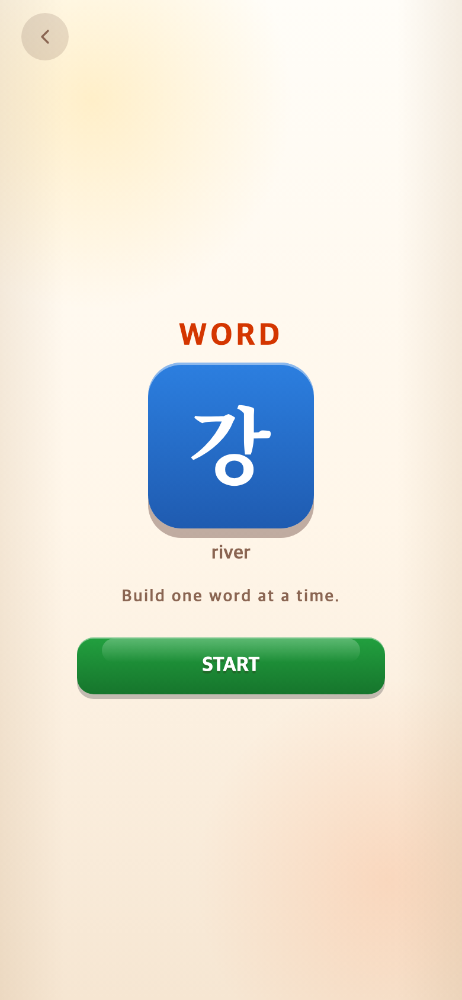
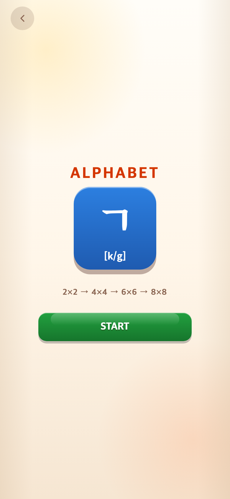
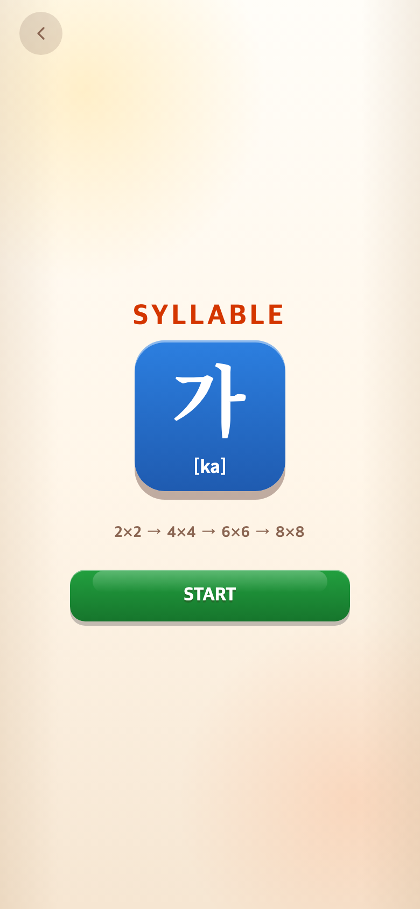
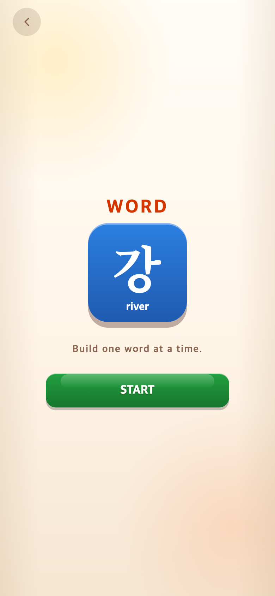

# 시작 아이콘 ㄱ·가·강과 설명

- 적용 커밋: `9c55055`
- 요구: 안녕을 강으로 교체하고 ㄱ·가는 음가, 강은 뜻을 작게 표시.
- 변경: 명조체 벡터 아이콘을 ㄱ·가·강으로 구성했다. 강은 한 글자이므로 가와 같은 72px 기준으로 생성했다. 바로 아래 16px 설명은 [k/g], [ka], river이다. 접근성 이름도 갱신했다.
- 결과: 서체 로딩 전환 없이 아이콘과 의미를 함께 확인할 수 있다. 게임 규칙은 변경하지 않았다. 테스트 174개 및 빌드 통과.
- 소규모 아이콘·문구 변경으로 이후 화면을 기록한다. 각 PNG는 390×844 CSS px / DPR 2 / 780×1688이다.

| Alphabet | Syllable | Word |
| --- | --- | --- |
|  |  |  |

## 후속: 설명을 박스 안으로 이동

사용자 요청에 따라 [k/g]·[ka]·river를 파란 아이콘 박스 내부, 글자 아래로 이동했다. 설명은 기존 16px을 유지하고 흰색으로 변경했다. 글자 윤곽은 크기를 유지한 채 박스 안에서 14px 위로 조정해 설명과 겹치지 않게 했다. 테스트 174개와 빌드 통과. 동일한 모바일 캡처 규격이다.

| Alphabet | Syllable | Word |
| --- | --- | --- |
|  |  |  |

## 후속: 아이콘 글자 위치 복원

사용자 요청에 따라 글자 윤곽에만 적용했던 translateY(-14px)를 제거했다. ㄱ·가·강은 기존 박스 중앙 위치로 복원하고, 설명의 박스 내부 위치·16px·흰색은 유지한다. 빌드 통과.

같이 문의한 CI 실패는 실행 `34547031199`에서 확인했다. 테스트·웹 빌드·APK 빌드는 성공했고, 마지막 APK 업로드만 `Artifact storage quota has been hit`로 실패했다. CI 설정 및 저장파일 삭제는 이 요청에서 수행하지 않았다.

## 후속: 미세 위치·크기와 APK 수동 저장

ㄱ·가·강만 중앙에서 5px 위로 조정하고, 흰색 설명은 하단 위치를 유지하면서 16px에서 14px로 축소했다.

CI는 push/PR에서 테스트·웹 및 Android 빌드를 유지하되 APK 저장은 생략한다. GitHub Actions → CI → Run workflow에서 `Save the debug APK for download`를 선택해 수동 실행할 때만 저장하며 보관기간은 7일이다. 기존 artifact는 삭제하지 않았으므로 저장공간이 여전히 부족하면 수동 저장은 실패할 수 있다.

