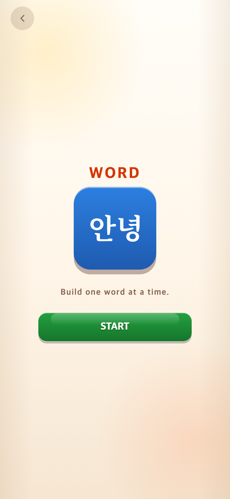

# 2026-09-11 시작 아이콘 명조 고정

- 비교 커밋: `9268ae2`
- 적용 커밋: `1863d3a`
- 재현: 이전 커밋을 `/private/tmp/talk-intro-before.liBc57`에서 독립 실행.
- 조건: Word 선택 후 START 전, Chrome 390×844 CSS px / DPR 2 / PNG 780×1688.

## 문제·개선 요구

ㄱ·가·안녕 시작 아이콘이 처음에는 고딕으로 나타난 뒤 명조로 바뀌고, 위치가 낮게 느껴진다는 요청.

## 수정 내용과 이유

아이콘은 `TAP Serif KR` 웹폰트를 사용했고 `font-display: swap`으로 로드 전 대체 서체가 표시될 수 있었다. 내장 Noto Serif KR 700의 세 글자 모양을 SVG path로 추출하여 JS에 포함했다. 폰트·이미지 추가 요청 없이 첫 아이콘 렌더부터 명조 윤곽이 표시된다. 접근성 이름은 ㄱ·가·안녕으로 유지한다.

아이콘 전체 위치는 translateY(-6px)에서 -12px로 6px 더 올렸다. SVG 글자 윤곽은 아이콘 중앙에 맞췄고 기존 글자 크기 72px/48px을 유지했다. 게임 제시어·입력 글자와 게임 규칙은 변경하지 않았다.

## 결과·검증

테스트 173개 및 빌드 통과. 세 시작 화면에 인라인 path가 존재하는 것을 확인했다. 아래 비교는 폰트 로딩이 끝난 정상 화면 비교이며, 순간적인 대체 서체는 이 캡처에서 재현되지 않았다. 고딕 화면을 임의로 만들지 않았다.

| 이전 — `9268ae2` 재현 | 수정 후 — `1863d3a` |
| --- | --- |
|  |  |

추가 확인: [Alphabet](screenshots/intro-alphabet.png), [Syllable](screenshots/intro-syllable.png).
