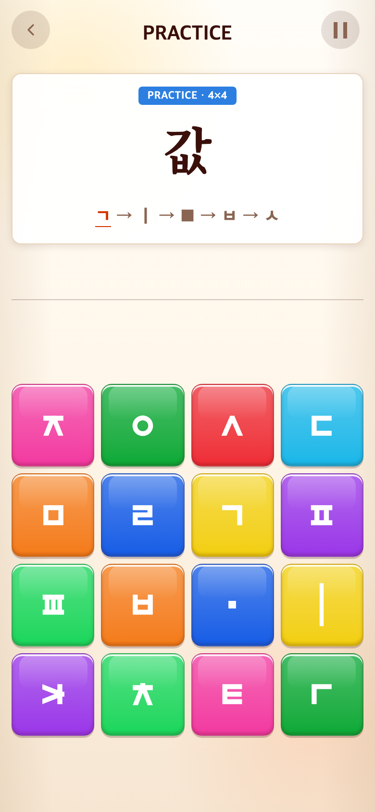
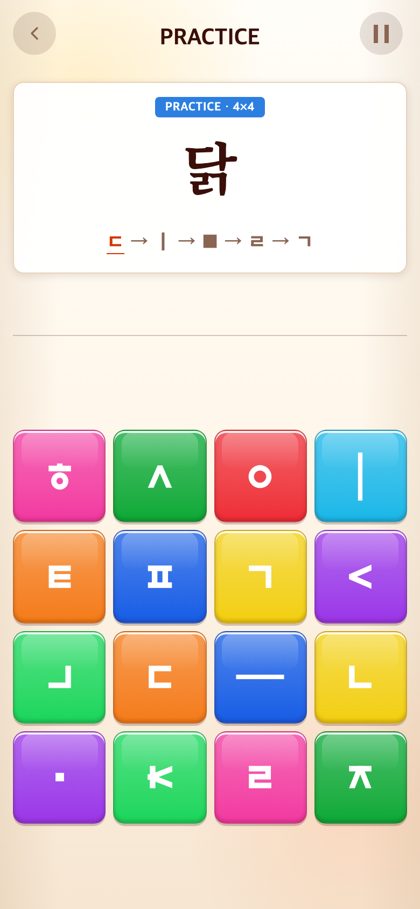

# 2026-09-11 받침을 익숙한 명사로 학습

- 적용 커밋: `46b4a14`
- 비교 커밋: `ab25f3c`
- 재현 여부: 성공. 이전 코드를 `/private/tmp/talk-nouns-before-4l6Ccq`에 git archive로 풀어 별도로 실행했다.
- 비교 조건: Syllable START → 25문제 정답 입력 → 26번째(겹받침 첫 문제), 입력 전. 무작위 추첨과 보드 배치는 각 실행의 실제 결과이며 동일 난수는 사용하지 않았다.

## 문제·개선 요구

쌍자음은 한 번씩만 보여주고, 받침은 ‘닭’처럼 일반 명사로 학습하고 싶다는 요청. 기존 풀에는 갇·갗·앉·읽처럼 독립 명사로 쓰기 어려운 음절/용언 어간이 있었다.

## 수정 내용과 이유

- 쌍자음 까·따·빠·싸·짜는 기존 5개 비복원 추첨을 유지하고, 세션마다 각각 정확히 한 번 등장하는 회귀 검증을 추가했다. 이 제한은 튜토리얼에 적용하며 무한 본게임의 재등장은 허용한다.
- 기본받침 후보: 산·강·물·불·눈·손·발·집·밥·옷·달·별·입·몸 중 5개 추첨.
- 겹받침 후보: 닭·흙·값·삶·몫. 다섯 명사가 각각 한 번씩 나오고 순서만 섞인다.
- 모든 받침 철자를 빠짐없이 나열하는 대신 실제 단어 경험을 우선했다. 본게임도 바뀐 전체 후보 59개를 사용하므로 제외한 어간은 다시 나오지 않는다.

## 수정 결과·검증

6유형 × 5문제 = 총30판, 처음5판2×2·나머지25판4×4, 이후6×6→8×8 본게임 흐름은 그대로다. 점수·시간·다른 게임은 변경하지 않았다.

Vitest187개, 빌드 통과. 브라우저에서 Syllable30판 완주, 무제한 연습, 6×6 제한시간 본게임 및 이후8×8 전환 검증 통과. 모든 후보의 기본 자음 분해·한글 조합·필요 블록 확보 테스트도 통과했다.

## 모바일 화면

두 화면 모두390×844 CSS px, DPR2, PNG780×1688이다. 이전 화면도 당시 무작위로 명사 ‘값’이 나왔으므로 화면만으로 전체 후보 교체를 보여주지는 않는다. 후보 차이는 위 목록과 커밋에 기록했다.

| 수정 전 — `ab25f3c` 재현 | 수정 후 — `46b4a14` |
| --- | --- |
|  |  |
