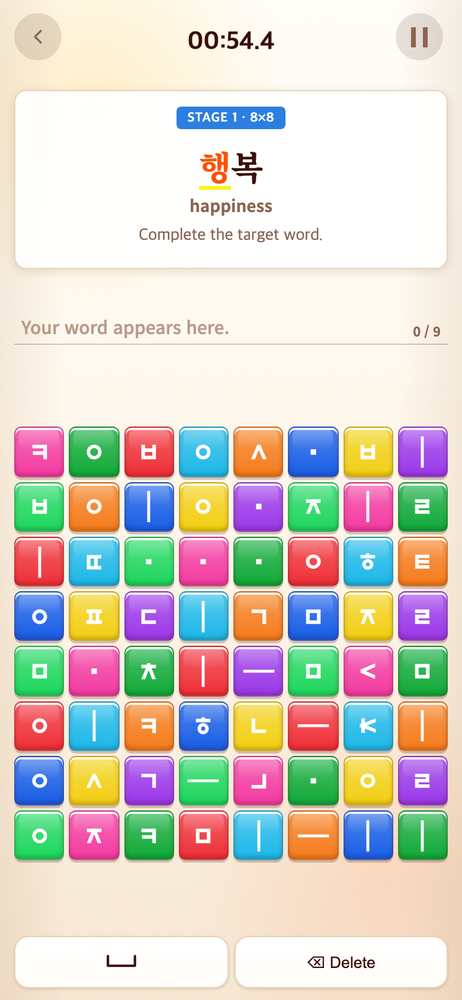
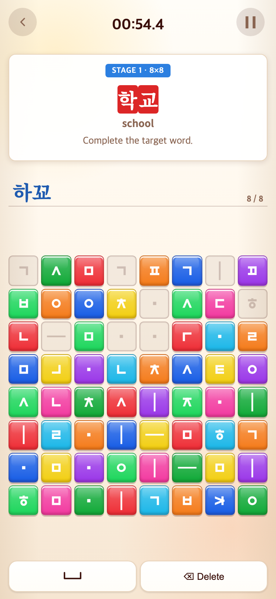

# 2026-09-11 공백 삭제 후 글자 확정 유지

- 적용 커밋: `e04578a`
- 비교 커밋: `756d88c`
- 재현: 성공. 과거 버전은 `git archive 756d88c`로 `/private/tmp/talk-commit-before-VvN3X7`에 추출해 별도 서버에서 실행했다.
- 캡처 조건: Chrome390×844 CSS px / DPR2 / PNG780×1688. Word 첫 문제부터 학교까지 진행해 학교의 자소를 연속 입력.

## 문제·요구

사용자는 제시어에 맞춘 자동 음절 보정이 아니라, Space로 확정한 뒤 Delete로 공백만 지우는 휴대폰식 입력 이력을 원했다. 이전 구현은 공백을 지우면 경계를 잃었고, 제시어가 결과를 자동 보정했다.

## 변경 내용·이유

- 일반 조합에서 연속 같은 자음2개 뒤 모음은 쌍자음 초성이 된다. 걷도의 자소를 연속 입력하면 거또, 학교는 하꾜가 된다.
- Space는 제시어와 관계없이 입력을 확정하고 보이는 공백을 넣는다. Delete가 공백을 지우면 보이지 않는 COMMIT_BOUNDARY를 남겨 확정된 글자를 보존한다.
- 걷→Space→Delete→도는 걷도. 학→Space→Delete→교는 학교. 아뿔사·오빠의 쌍자음과 읽·닭의 겹받침은 계속 조합 가능.
- 추가 Delete는 경계를 건너 실제 입력 토큰을 지우고 해당 블록을 돌려준다. 다음 문제/라운드의 입력 초기화 때 경계도 함께 초기화.
- 제시어 자동 보정 제거. target.ts의 composeTargetInput은 일반 조합 호출로만 남겼다. 진행 색상도 실제 조합 결과를 따라 걷도/거또처럼 토큰이 같지만 결과가 다른 경우를 구분.
- 공백을 그대로 남긴 걷 도는 걷도 정답이 아니다. 공백을 삭제해야 한다. 공백/확정 경계는 자소 입력 한도와 점수에서 제외.
- 점수·학습 콘텐츠·다른 게임 저장소는 변경하지 않음.

## 검증

- Vitest183개, TypeScript/Vite 빌드 통과.
- 직접 거또와 확정 걷도, 제시어 비의존성, 쌍자음/겹받침, 공백삭제·연속삭제·블록ID 반환 테스트.
- 모든 Word 콘텐츠는 음절 사이 Space/Delete를 활용해 구성할 수 있음을 검사.
- 실제 Word 학교에서 직접 하꾜 입력은 진행하지 않음 확인. 삭제로 비운 뒤 학→Space→Delete→교는 학교로 정답/다음 문제 진행 확인.
- Word 타이머·점수·일시정지·영상 회귀 검사 통과.
- 브라우저 스크립트: tests/browser/commit-input.mjs 및 timed-rounds.mjs.

## 모바일 비교

| 이전 — `756d88c` 재현 | 수정 — `e04578a` |
| --- | --- |
|  |  |

같은 연속 입력 후 이전 버전은 학교로 자동 보정해 다음 문제로 넘어가지만, 새 버전은 실제 하꾜를 표시하고 학교에서 기다린다. 화면 전환 차이는 실제 동작이며 합성하지 않았다. 게임판 위치는 무작위다.
