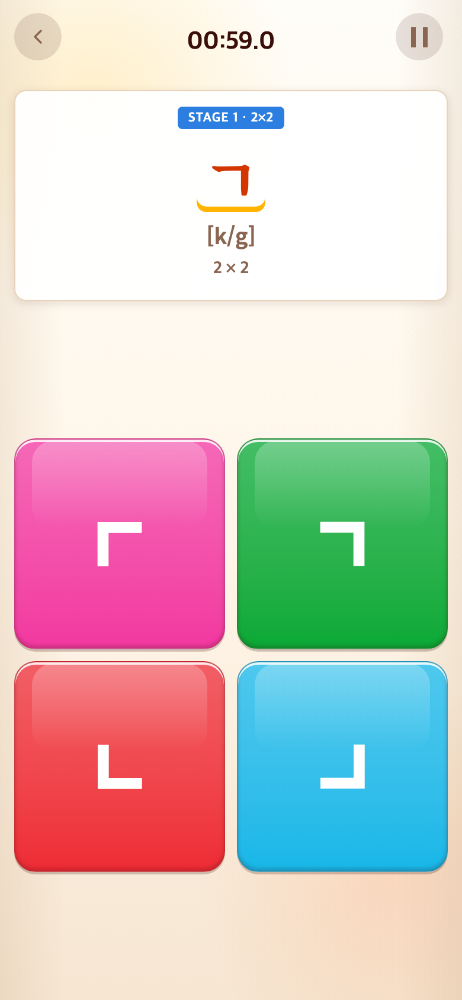
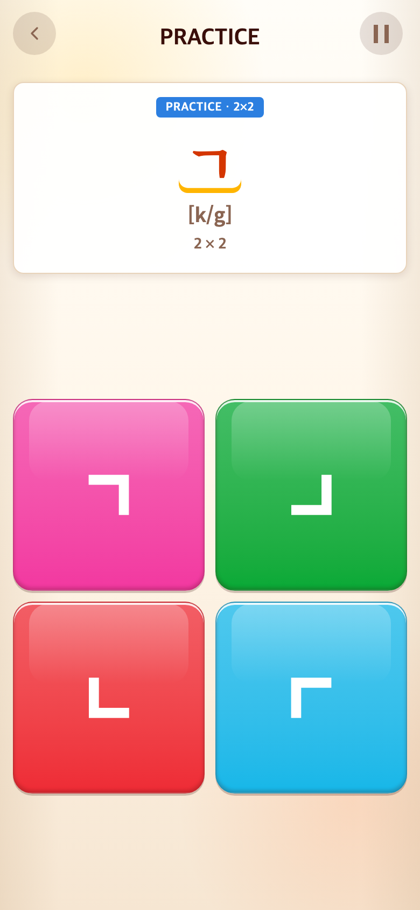

# 2026-09-11 무제한 튜토리얼과 1분 본게임 분리

- 적용 커밋: `d596acd`
- 비교 커밋: `fb5f058`
- 재현 여부: 성공
- 비교 조건: Alphabet → START → 첫 ㄱ 문제, Chrome 모바일 390×844 CSS px / DPR 2
- 과거 화면은 `git archive fb5f058`을 별도 임시 폴더 `/private/tmp/talk-before-UnU6Yv`에 추출하여 실행한 재현 화면이다. 현재 파일로 과거 화면을 꾸미지 않았다. 블록 위치는 무작위라 전후 순서가 다르다.

## 문제·개선 요구

학습 단계부터 1분 제한이 걸려 Syllable처럼 문제가 많은 구간을 익히기 어려웠다. 진행 점수와 시간 보너스를 합산하는 방식도 이해하기 어려웠다. 사용자는 6×6까지 튜토리얼, 8×8부터 1분 본게임을 원했고, Word는 처음부터 1분 본게임으로 지정했다.

## 수정 내용과 이유

- Alphabet/Syllable 2·4·6판은 무제한 PRACTICE. 기존 문제 순서와 개수는 유지.
- 판 크기 구간을 마칠 때 점수 카드 없이 GREAT! 영상 → 탭 대기. 6판 종료 후 8판 진입 순간 60초 시작.
- Word는 처음부터 8판·60초. 매 10단어 보너스나 무제한 시간 방식은 사용하지 않음.
- 본게임은 완성 제시어 수/게임별 목표×1500, 최대1500점. 미완성·오입력·튜토리얼은 점수 제외. 별도 속도/완성 가산 없음.
- 초기 1500점 목표: Alphabet 30문제(문제당50점), Syllable 20음절(75점), Word 10단어(150점). 실측 기준이 아닌 초기 튜닝값이며 content 설정으로 변경 가능.
- 등급: 0 NOT BAD, 1–299 GOOD TRY, 300–599 GREAT, 600–999 AMAZING, 1000–1399 UNBELIEVABLE, 1400–1500 OH MY GOD.
- GOOD TRY는 기존 GREAT의 1번 영상을 공유. 0점만 티피. 나머지 기존 등급별 영상 유지.
- 1분 종료 → 점수 2초 → 영상 → 탭으로 다음 1분. 완료 수 초기화, 콘텐츠 순서 유지. 기록 저장은 추후 구현 대상으로 이번에는 추가하지 않음.

## 수정 결과·검증

- Vitest 177개 통과, TypeScript/Vite 빌드 통과.
- 브라우저 통합 검사: Alphabet 고정27문제 / Syllable 고정82문제를 실제 버튼 클릭으로 통과, 크기 전환3회 및 8판 60초 시작 확인.
- 튜토리얼 시계를 2분 이상 진행시켜도 만료되지 않음. 일시정지 시간 제외 및 영상 중 배경 입력 차단 확인.
- 각 본게임 1문제 완료 후 시간 초과: 50/75/150점 GOOD TRY 확인. 다음 라운드 0완료는 0점 NOT BAD.
- 2초 결과 카드 조기 탭 방지, 영상 재생 거절 시 탭 대기, 다음 라운드 타이머 초기화 확인.
- 검증 스크립트: `tests/browser/timed-rounds.mjs`. 시간 이동은 테스트에서만 수행하며 제품 코드에 포함되지 않음.

## 모바일 화면

| 수정 전 — `fb5f058` 재현 | 수정 후 — `d596acd` |
| --- | --- |
|  |  |

두 PNG는 각각 780×1688px. 시작부터 내려가던 타이머가 무제한 PRACTICE 표시로 변경되었다.
