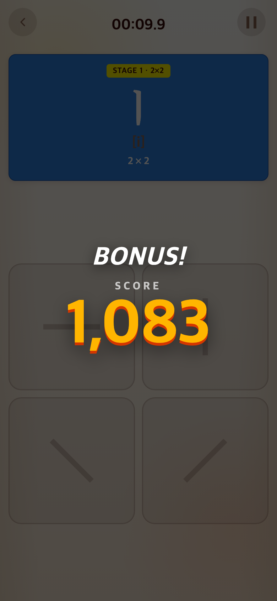
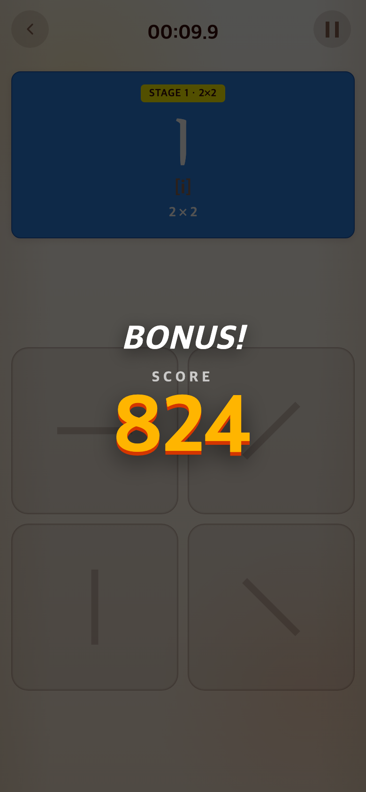

# 고정 구간 점수 재조정

- 적용 커밋: `9d23c1c`
- 비교 커밋: `d03ab26`, `/private/tmp/talk-score-before.ahi8dZ`에 별도 추출해 재현.

## 요구·원인

기존에는 구간을 완료하면 최소 1000점이라 상위 등급에 편중됐다. 제안한 진행 600점 + 완료 속도 900점 모델을 사용자 승인으로 적용했다.

## 변경

- 고정 구간 미완료: 정확한 진행 단위/전체 목표 단위 × 600. 절반 진행은 300점.
- 완료: 600 + 900 × (60초−완료 시간)/(60초−최고점 시간). 보너스 0–900, 총점 최대 1500, 소수점 버림.
- 최고점 기준 시간: Alphabet 2×2/4×4/6×6 = 20/24/28초, Syllable = 25/35/45초. 자소량·보드 크기를 고려한 초기 설정이며 사람의 실측 기록이 아니다.
- 8×8·Word의 처리량 점수와 등급 경계·영상 배정은 유지했다.
- 20초 기준 구간의 완료 시간/점수: 20초 1500, 30초 1275, 40초 1050, 50초 825, 60초 600.

## 검증·결과

단위 테스트 178개 및 빌드 통과. 절반 진행 300점, 늦은 클리어 600점, 최고점 기준 시간별 1500점, 무한 라운드 기존 점수 유지 확인. 브라우저에서 같은 Alphabet 첫 구간을 약 50초에 완료해 전후 점수를 검사했다.

캡처는 390×844 CSS px / DPR 2 / PNG 780×1688이다. 두 버전 모두 테스트에서 performance.now를 약 50초로 앞당긴 후 마지막 정답을 실제 버튼으로 입력했다. 이미지 합성이나 점수 DOM 수정은 없으며, 사람 플레이 기록은 아니다. 밀리초 처리와 버림으로 이후 화면은 824점(이론상 정확히 50초일 때 825점)이다.

| 이전 `d03ab26` 재현 | 이후 `9d23c1c` |
| --- | --- |
|  |  |
