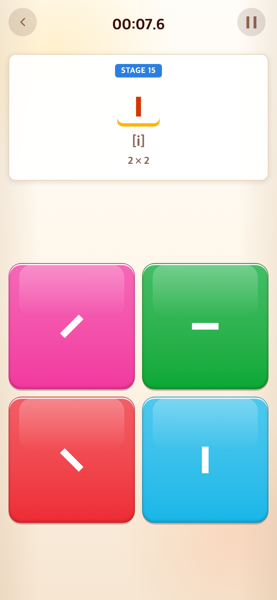
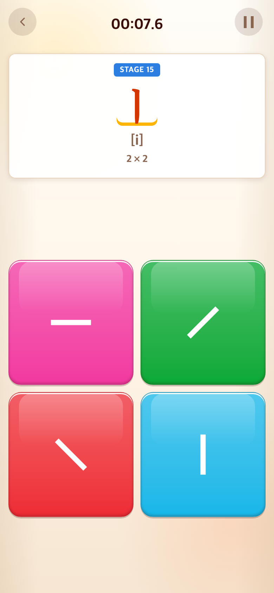
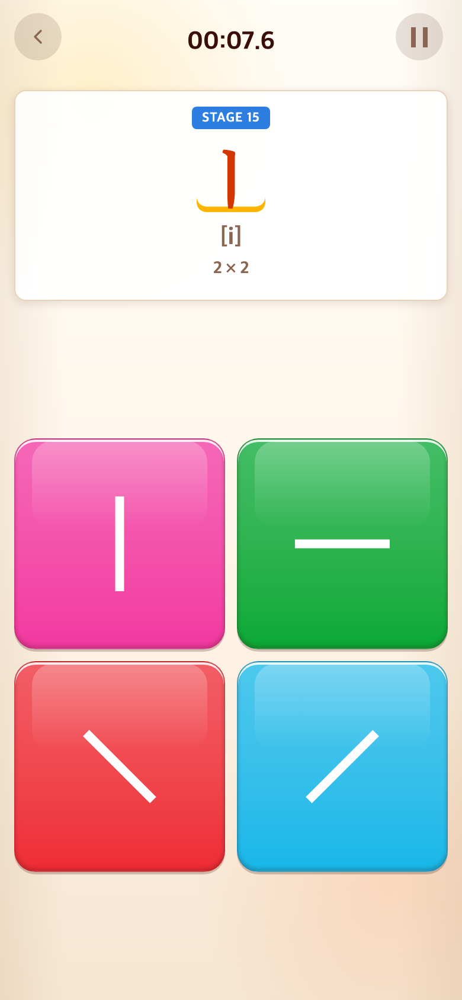

# 2026-09-11 명조체 제시어·긴 모음 획

- 적용 커밋: `f956565`
- 비교 커밋: `98cc6fd`
- 재현 여부: 성공. 이전 커밋을 `/private/tmp/talk-lines-before.KbRYyd`에 별도 추출해 실행했다.
- 비교 조건: Alphabet START 후 자음 14개를 순서대로 완료한 Stage 15(ㅣ). Chrome 390×844 CSS px, DPR 2, PNG 780×1688 px. 보기 위치는 무작위이므로 전후 다를 수 있다.

## 문제·개선 요구

제시창 글자를 명조체로 표시하고, 사용자가 길이를 늘린 ㅣ·ㅡ 관련 업로드를 반영해 달라는 요청.

## 수정 내용과 이유

Alphabet 제시어의 SVG 대체 표시를 제거해 기존 내장 TAP Serif KR을 상속하도록 했다. Syllable·Word 제시어는 기존 명조체를 유지한다. 모음천은 학습용 네모점을 유지했다.

`탭투톡체3-02/03/04/05.svg`의 ㅣ·ㅡ·양쪽 사선을 추출했다. 카드 배경과 설명 문구는 제외하고 실제 획의 길이·굵기를 보존해 중심 정렬했다. 재추출 시에도 개별 업로드가 우선 적용되도록 스크립트를 수정했다.

## 수정 결과

제시창은 명조체, 버튼은 사용자 SVG로 구분된다. 모음과 사선은 업로드한 긴 획으로 바뀌었다. 판 크기·함정 규칙·색상은 변경하지 않았다. 테스트 172개 및 빌드 통과.

## 모바일 화면

| 수정 전 — `98cc6fd` 재현 | 수정 후 — `f956565` |
| --- | --- |
|  |  |

## 추가 조정: 길이 140%

- 적용 커밋: `ba7400f`
- 비교: `f956565`의 위 수정 후 캡처를 재사용한다.
- 요청: 파일 재업로드 없이 ㅣ·ㅡ·양쪽 사선을 현재 길이의 140%로 확대.
- 변경: `uploadedGlyph.ts`에서 각 획의 긴 축 방향만 1.4배 변환한다. 사선은 축을 회전해 길이만 늘리고 원래 방향으로 되돌린다. SVG 원본, 획 굵기와 중심, 명조체 제시어는 유지한다.
- 결과: Stage 15에서 네 도형의 길이가 늘고 중앙 정렬·잘림 없음 확인. 테스트 172개와 빌드 통과. 이전 추가 테스트의 TypeScript undefined 검사 오류도 보완했다.
- 캡처: 동일한 Stage 15, 390×844 CSS px / DPR 2 / PNG 780×1688. 무작위 보기 위치는 다르다.

| 이전 — `f956565` | 길이 140% — `ba7400f` |
| --- | --- |
|  |  |
