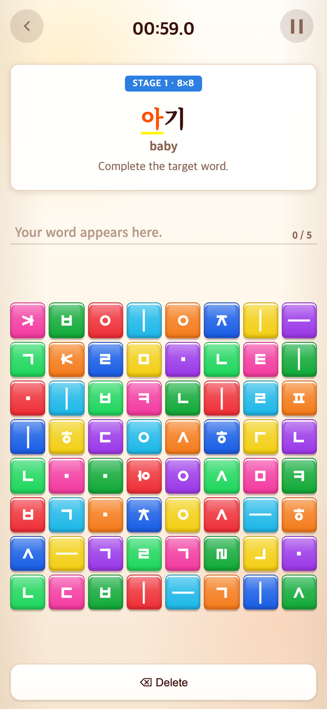
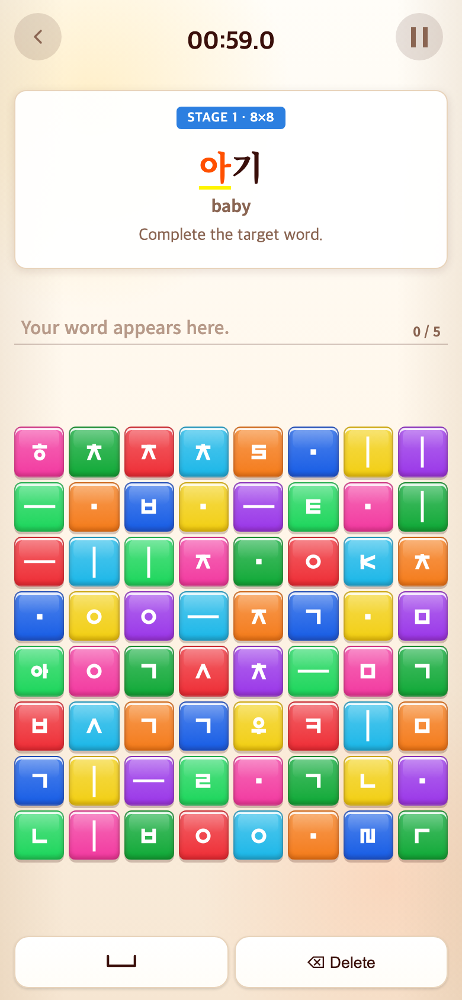

# 2026-09-11 Word 띄어쓰기 복원·Alphabet 점수 상한 제거

- 적용 커밋: `eb14195`
- 비교 커밋: `dd14eea`
- 재현 여부: 성공
- 과거 버전은 `git archive dd14eea`로 `/private/tmp/talk-space-before-Qi63Rj`에 추출하여 독립 실행.
- 비교 조건: Word → START, 첫 아기 문제. 모바일390×844 CSS px / DPR2 / PNG780×1688.

## 문제·개선 요구

걷도와 거또는 기본 자음 분해 입력 순서가 같아 경계를 직접 구분하는 수단이 필요했다. 사용자는 글자 확정 대신 일반 띄어쓰기 버튼 복원을 원했다. Alphabet은10문제1500점, 이후에도 추가 점수를 요청했다.

## 무엇을 왜 수정했는가

- Word 하단 Space 아이콘과 Delete를 두 칸으로 복원. 실제 공백을 입력·표시하고 Delete로 되돌릴 수 있다.
- 제시어의 올바른 음절이 완성된 경계에서 공백 허용. 선행·연속 공백과 모음/쌍자음 중간의 공백은 막는다. 이는 일반 휴대폰 자판 전체 기능을 구현한 것이 아니라 목표 단어 조합을 위한 게임 입력 규칙이다.
- 단어 비교는 공백을 제외하지만, 공백으로 분리된 음절이 정확히 조합되어야 한다. 걷 도와 거 또는 서로 다른 결과다. 공백을 무조건 지워 입력 토큰을 합쳐 정답 처리하지 않는다.
- 공백은 자소 용량과 진행률에서 제외해 공간 때문에 마지막 자소를 못 누르는 문제가 없도록 함.
- Alphabet 완성 묶음당150점. 10문제1500, 11문제1650, 12문제1800, 상한 없음. ㄱㄴㄷ 같은 제시 묶음을 모두 완성해야1문제다.
- 등급 경계 유지: 0 NOT BAD / 1–299 GOOD TRY / 300–599 GREAT / 600–999 AMAZING / 1000–1399 UNBELIEVABLE / 1400 이상 OH MY GOD. 영상 배정 유지.
- Syllable/Word 점수 및1500점 상한 유지. 튜토리얼은 여전히 점수 없음.

## 결과·검증

- Vitest182개, TypeScript/Vite 빌드 통과.
- 걷도·거또·아뿔사·사랑의 음절 사이 공백, 잘못된 경계, 연속 공백, 삭제 후 접두부 조합 검사.
- Alphabet10/11/12/100문제 점수 및1500 초과 등급 검사.
- 브라우저 회귀 테스트에 Word 실제 Space 입력 → 삭제 → 재입력 → 단어완성 → 다음 문제 진행 검사 추가.

## 모바일 화면

| 수정 전 — `dd14eea` 재현 | 수정 후 — `eb14195` |
| --- | --- |
|  |  |

두 화면은 동일 진입 행동으로 촬영했다. 블록은 무작위이므로 위치가 다를 수 있다.
