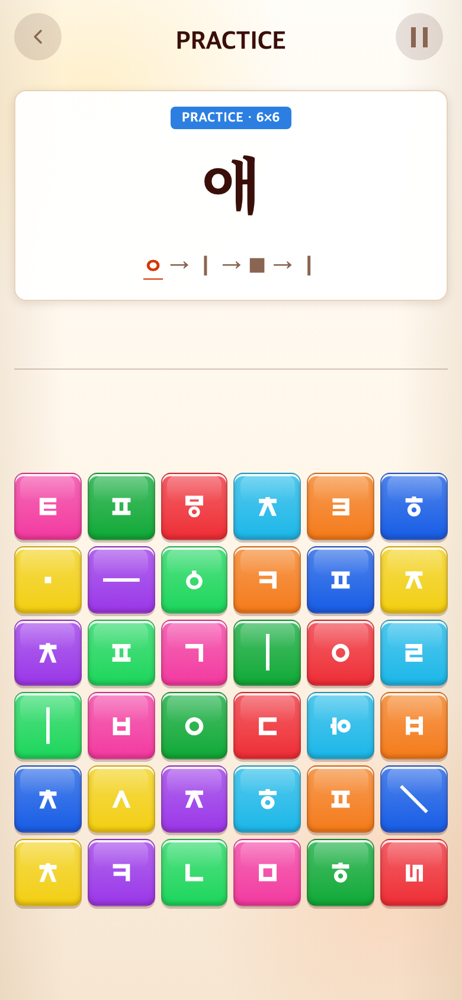
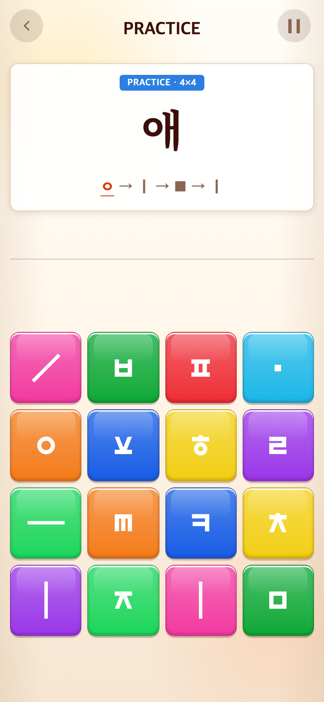
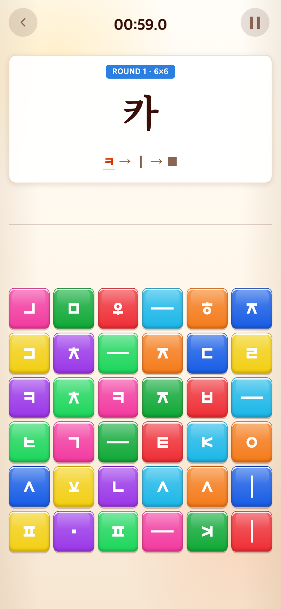

# 2026-09-11 Syllable 조합 학습 확장·6판 본게임

- 적용 커밋: `490812e`
- 비교 커밋: `005e6ba`
- 재현: 성공. 과거 커밋을 `/private/tmp/talk-syllable-before-6Tc3RJ`에 git archive로 추출하여 별도 서버에서 실행했다.
- 캡처: Chrome390×844 CSS px / DPR2 / PNG780×1688.

## 문제·요구

기존 Syllable은 모음 학습만 있고 쌍자음·받침·겹받침을 체계적으로 연습하지 않았다. 사용자는 새로운 조합을4판에서 배우고6판부터1분 본게임, 이후8판으로 커지는 흐름을 요청했다.

## 수정 내용·이유

| 구간 | 내용 | 문제 수 |
| --- | --- | ---: |
| 2×2 | 가~하 |14|
| 4×4 | 아야어여오요우유으이 |10|
| 4×4 | 애에얘예와왜외워웨위의 |11|
| 4×4 | 까따빠싸짜 |5|
| 4×4 | 각간갇갈감갑갓강갖갗갘같갚갛 |14|
| 4×4 | 넋앉많읽삶넓곬핥읊싫값밖있 |13|

- 총67문제. 모음21종·쌍자음5종·받침27종 포함. 일부 기본받침 예시는 실제 어휘가 아닌 조합 연습용 음절이며, 전체를 교육기관 인증 어휘로 표방하지 않는다.
- 한 음절만 사용. 외곬 대신 곬. ㄲ는 ㄱ+ㄱ, 겹받침은 각 기본 자음으로 입력하고 반복 자소는 별도 블록 제공.
- 2판 완료 후 GREAT! 영상, 4판 전체 완료 후 GREAT! 영상. 튜토리얼 시간·점수 제한 없음.
- 이어지는6판은 배운 음절 무작위 출제·60초 본게임. 1분 종료 후 점수2초·등급영상·탭 대기를 거쳐8판으로 넘어가고, 이후8판 유지. 점수에 관계없이 첫 라운드 종료 후8판으로 전환.
- roundNumber를 stageSection/learningStageAt에 함께 전달해 타이머 단계와 보드 크기가 일치하도록 함.
- Alphabet/Word 구성과 모든 점수 기준은 변경하지 않음.

## 검증 결과

- Vitest184개, TypeScript/Vite 빌드 통과.
- 21모음·5쌍자음·27받침 포함 검사. 모든 학습 타겟 한 음절/4판 용량/필요 블록 확보/조합 결과 검사.
- 실제 버튼으로67문제 완료,6판 ROUND1 타이머 시작, 타임아웃·영상·탭 후8판 ROUND2 확인.
- Alphabet/Word 브라우저 회귀 검사 통과. 일시정지·영상 중 입력잠금·점수 초기화 검사 포함.

## 전후 모바일 화면

동일하게 앞24문제를 완료하고 애에 도달한 화면. 이전에는6판이었고 현재는4판이다. 블록 배치는 무작위다.

| 이전 `005e6ba` 재현 | 수정 `490812e` |
| --- | --- |
|  |  |

전체 튜토리얼67문제 완료 후 실제6판 본게임 시작:

