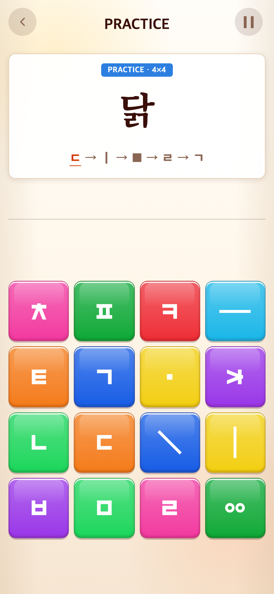
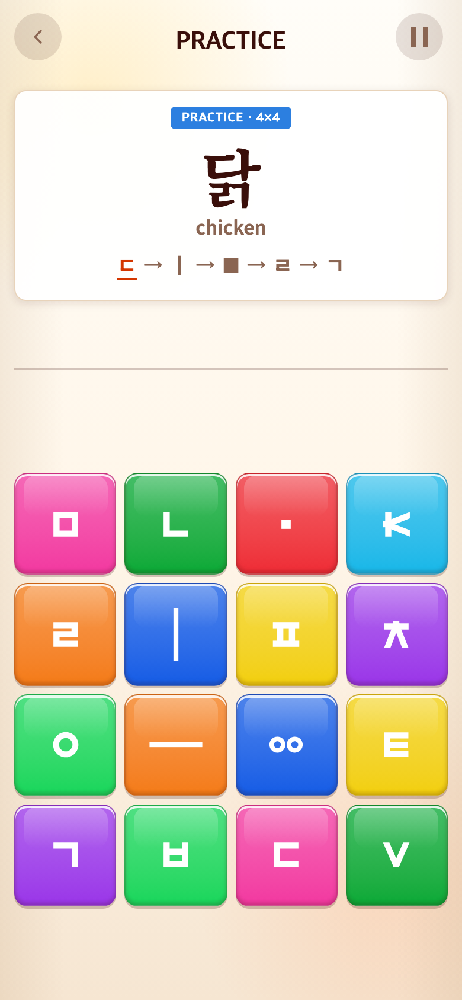
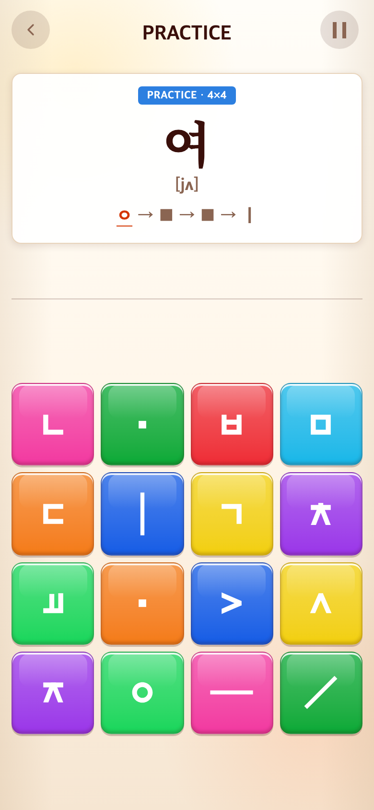

# 2026-09-11 Syllable 발음과 영어 뜻

- 적용 커밋: `b5b00e5`
- 비교 커밋: `7f9f593`
- 재현: 이전 커밋을 `/private/tmp/talk-notes-before-HZ6yhs`에 git archive로 풀어 별도 실행.
- 조건: Syllable START 후 실제 정답 버튼으로 진행, 양쪽 모두 ‘닭’ 입력 전. 랜덤 추첨 순서와 보드 배치는 실행별로 다르다.

## 문제와 수정 이유

기본 음절에는 발음을, 발·닭 같은 명사에는 영어 뜻을 함께 보여주어 외국인 학습자가 무엇을 배우는지 알 수 있게 해달라는 요청.

## 수정과 결과

- 앞 4유형은 단독 음절의 IPA 기반 간략 발음 표기(가 [ka], 으 [ɯ], 까 [k͈a]). 실제 발음은 환경·화자에 따라 달라지며 정밀 음성 전사는 아니다. 외·위는 흔히 쓰이는 이중모음 발음을 채택했다.
- 받침 명사는 뜻(발 foot, 닭 chicken)을 표시한다. 눈은 eye, 밥은 rice로 입문용 의미 하나를 선택했다.
- `src/content/syllableNotes.ts`에 모든59개 후보 안내를 집중 관리. 튜토리얼과 무작위 본게임 모두 사용한다.
- 제시어 아래16px 고딕 한 줄. 기존 한글52px·제시창178px·보드 크기와 위치는 유지했다. 정답 완료 시 안내도 흰색으로 전환한다.
- 참고: [Korean — Journal of the International Phonetic Association](https://www.cambridge.org/core/services/aop-cambridge-core/content/view/07312FF2A7409D9C71A4FE83E12AA54D/S0025100300004758a.pdf/korean.pdf). 로마자 표기와 발음 기호를 혼용하지 않고 기존 Alphabet 발음 안내 형식에 맞췄다.

## 검증

Vitest189개, 빌드, 실제 브라우저 Syllable30판 완주 및6×6→8×8 본게임 검증 통과. 모든 후보·세션·무작위 문제의 안내 존재를 테스트했다.

## 화면

390×844 CSS px, DPR2, 780×1688 PNG. 과거 화면은 해당 커밋 실행 결과다.

| 이전 `7f9f593` | 수정 후 `b5b00e5` |
| --- | --- |
|  |  |

