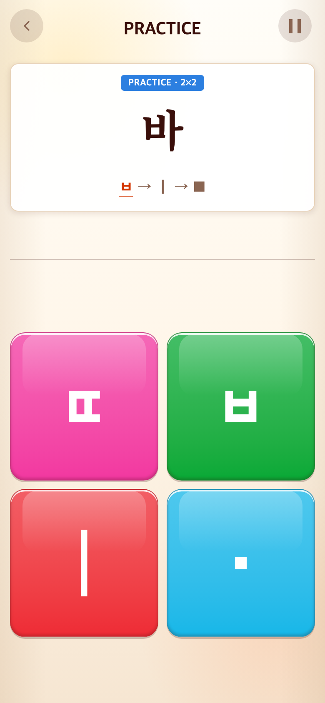
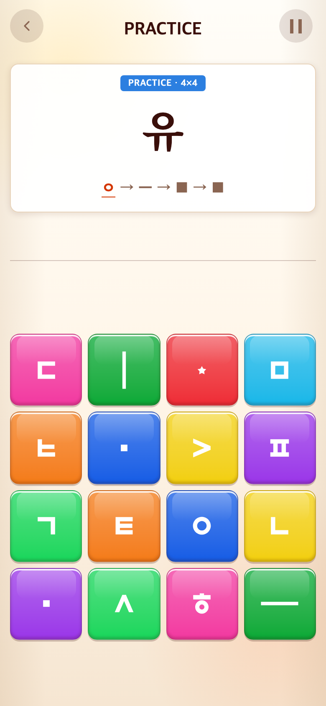

# 2026-09-11 Syllable 유형별5개·30판 튜토리얼

- 적용 커밋: `3b05fd0`
- 비교 커밋: `2c6b36b`
- 과거 재현: git archive로 `/private/tmp/talk-thirty-before-4Hunof`에 추출해 별도 실행.
- 캡처: Chrome390×844 CSS px, DPR2, PNG780×1688.

## 문제·요구

6개 학습 유형은 유지하되67개 예시를 매번 모두 풀지 않고, 각 유형에서5개씩 경험하는 짧은30판 튜토리얼을 요청했다.

## 수정 내용·이유

- 기본음절/기본모음/복모음/쌍자음/기본받침/겹받침·쌍받침 순서를 유지한다.
- START에서 유형별 후보를 섞어5개씩 추첨. 유형 안 중복 없음. 쌍자음은5개 후보 모두 나오되 순서는 무작위.
- 실행 중 세션 목록을 유지해 문제를 불러올 때마다 재추첨하지 않는다. 새 게임 START에서만 다시 생성한다.
- 2판5문제 후 GREAT!, 4판25문제 후 GREAT! 영상/탭으로 진행. 전체30판 뒤6판1분 본게임, 다음 라운드부터8판은 유지.
- 본게임은 선택된30개가 아니라 전체67개 후보에서 출제한다.
- 한 회차에서 모든 모음·받침을 경험한다고 표방하지 않으며 반복 플레이로 다른 예시를 경험할 수 있다.
- Alphabet·Word와 점수는 변경하지 않음.

## 검증

- Vitest187개·TypeScript/Vite 빌드 통과.
-50회 표본 검증: 각 유형5개, 유형별 중복 없음, 총30개, 보드크기 확인.
- 서로 다른 난수로 다른 세션 생성, 세션목록 유지, 전체후보67개 불변 확인.
- 본게임 난수 구간을 순회하여 전체67개에서 출제하는지 검사.
- 브라우저 회귀 스크립트는 실제 표시된 음절을 읽어30판을 진행하며,5/30판 영상과6판→8판 전환 확인.

## 전후 모바일 화면

동일하게5문제 완료 후 다음 문제. 이전은 아직 기본음절2판, 현재는 GREAT! 영상 탭 후 기본모음4판이다. 현재 예시는 무작위로 선택된 실제 문제다.

| 이전 `2c6b36b` 재현 | 수정 `3b05fd0` |
| --- | --- |
|  |  |
