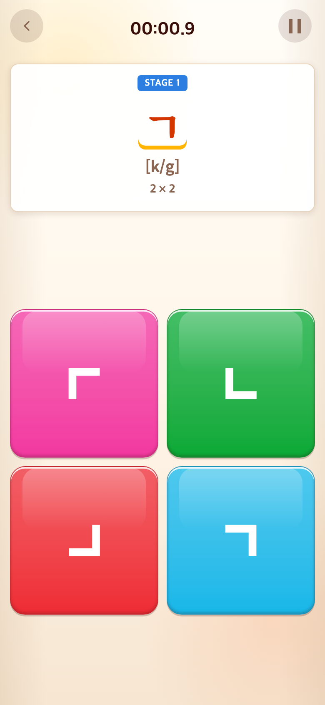
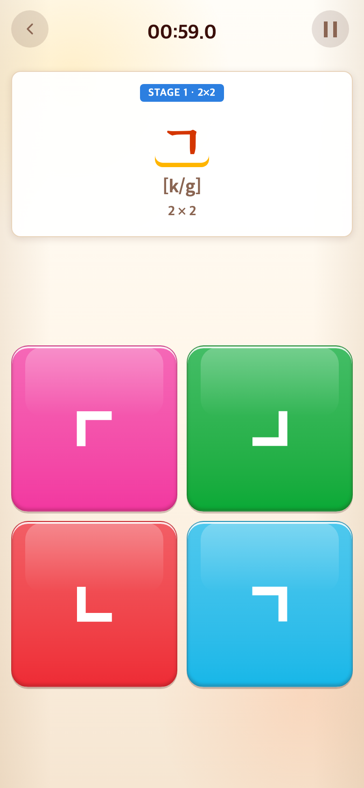
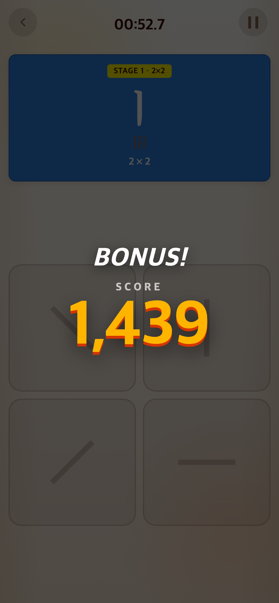

# 2026-09-11 1분 스테이지와 등급별 결과

- 적용 커밋: `9e56d13`
- 비교 커밋: `c46d823`
- 재현: 비교 커밋을 `/private/tmp/talk-timed-before.fgJt8c`에 git archive로 추출하여 별도 실행했다. 현재 작업 파일로 과거 화면을 합성하지 않았다.
- 모바일 규격: Chrome 390×844 CSS px / DPR 2 / PNG 780×1688.

## 문제·개선 요구

무제한으로 이어지는 문제를 게임판 크기별 스테이지로 묶고, 1분 동안의 성과를 점수·캐릭터 연출로 보상하자는 요청. TAPtoTEN의 점수 카드→등급·영상→탭 진행 흐름을 참고하되 점수 카드는 2초로 한다.

## 무엇을 왜 바꿨는가

- Alphabet: 17문제의 2×2, 6문제의 4×4, 4문제의 6×6을 각각 한 스테이지로 묶는다.
- Syllable: 판 크기를 기준으로 14문제/28문제/40문제를 묶는다. 고정 학습 내용은 유지한다.
- 고정 구간은 60초 이내 전부 완료하면 클리어. 실패하면 탭 후 같은 구간 처음부터 재도전한다.
- 이후 8×8은 60초씩 새 라운드. Word도 8×8의 60초 라운드이며 단어 순서를 유지한다. 미완성 단어는 다음 라운드에서 입력을 초기화해 다시 제시한다.
- 문제를 바꿀 때 타이머는 리셋하지 않는다. 스테이지 결과 뒤에만 60초로 리셋한다. 일시정지 시간은 제외한다.
- UI STAGE는 개별 문제 번호가 아닌 라운드 번호다. 옆에 현재 보드 크기를 표시한다.
- 고정 구간 완료는 BONUS!, 시간 종료는 TIME’S UP!. 점수를 2초 표시하고 등급별 영상을 재생한 후 탭을 기다린다. 영상 중·결과 대기 중 입력과 시계를 잠근다. 영상 오류에도 자동 진행하지 않는다.
- Word의 이전 10문제 자동 보너스는 제거했다.

## 초기 점수 밸런스

정확하게 유지된 자소 입력 1개를 1단위, 문제 완성을 추가 3단위로 계산한다. 미완성 Word는 처음부터 연속으로 맞게 입력한 부분만 인정한다. 삭제·재입력 반복으로 점수를 중복 획득하지 않는다.

고정 구간 목표는 전체 자소 수 + 문제당 3단위다. 8×8 목표는 Alphabet 45 / Syllable 54 / Word 60단위이며 실제 사용자 플레이 데이터가 아닌 **초기 튜닝값**이다.

- 기본 점수: 획득 단위 ÷ 목표 단위 × 1000
- 고정 구간 완료: 기본 1000 + 남은 시간 비율 × 500
- 상한 1500, 소수점 버림. 아무것도 하지 않으면 0점.

| 점수 | 등급 | 영상 |
| --- | --- | --- |
| 0–299 | NOT BAD | 티피 |
| 300–599 | GREAT! | 1 |
| 600–999 | AMAZING! | 4 |
| 1000–1399 | UNBELIEVABLE!! | 태피·후피 중 무작위 |
| 1400–1500 | OH MY GOD~! | 해피·재피 중 무작위 |

설정은 `src/content/timedStages.ts`, 순수 점수 계산은 `src/core/hangul/timedScore.ts`, 영상 배정은 `src/config/app.ts`에 분리했다.

## 검증 결과

- 단위 테스트 177개 및 TypeScript/Vite 빌드 통과.
- `node tests/browser/timed-rounds.mjs`: bonus, retry, word, syllable, endless, media-error 6개 통과.
- 브라우저 테스트에서 일시정지 시간 제외, 0점, 정확한 부분 점수, 고정 구간 재도전, 2초 카드와 조기 탭 차단, 결과 중 시계·블록 정지, Word 10문제 보너스 제거, 8×8 반복, 영상 재생 거절 시 탭 대기를 검증했다.
- 테스트의 시간 초과는 브라우저의 performance.now를 테스트 안에서만 앞당겨 확인했다. 실제 게임 시간 설정은 60초이며 테스트 훅을 게임에 추가하지 않았다. 자동 클릭 점수는 인간 플레이 기준 측정값이 아니다.

## 전후 화면

같은 Alphabet START 진입 약 0.9초 후. 무작위 블록 위치는 다를 수 있다.

| 이전 `c46d823` 재현 | 이후 `9e56d13` |
| --- | --- |
|  |  |

실제 자동 클릭으로 첫 구간을 완료했을 때의 점수 카드:

