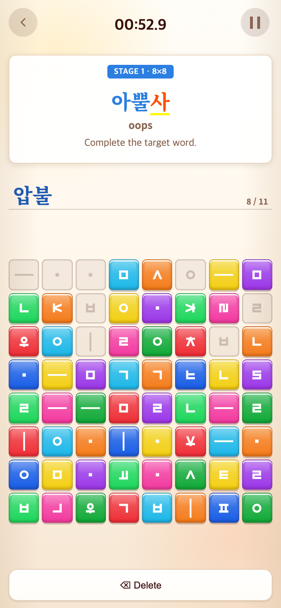
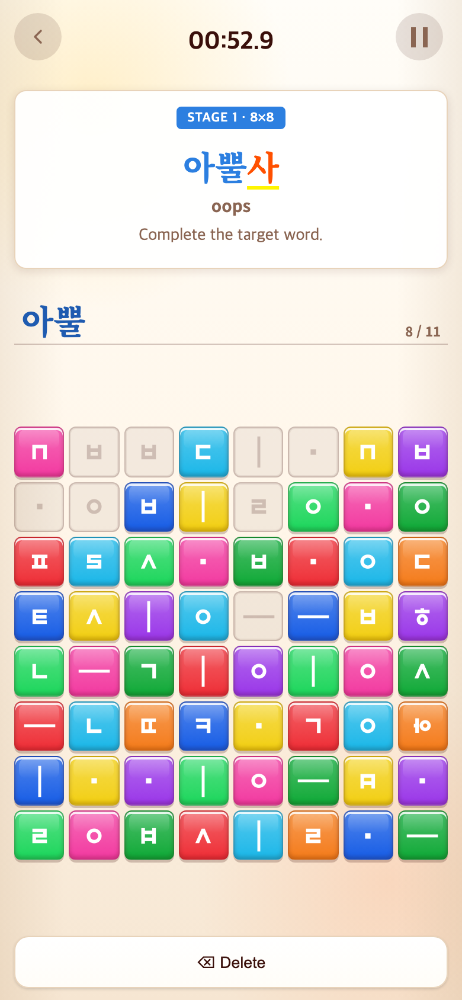
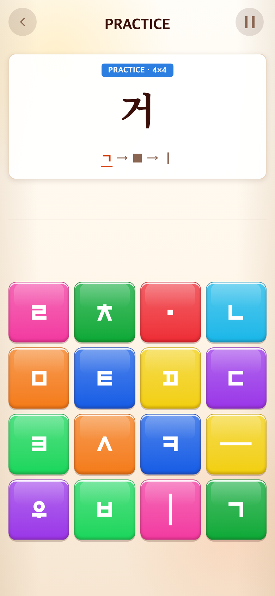
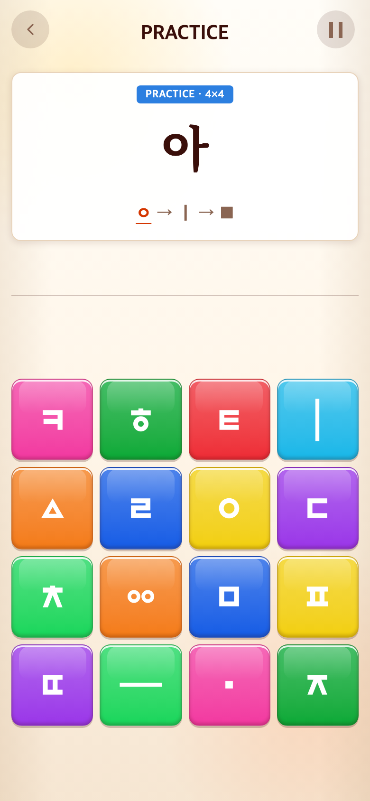

# 2026-09-11 점수 완화·모음 전종 학습·쌍자음 입력 표시

- 적용 커밋: `c3bd6da`
- 비교 커밋: `859fd70`
- 재현 여부: 성공(아뿔사의 중간 입력 표시). 정확한 전체 입력 후 진행 불가는 과거 버전에서 재현되지 않았음.
- 과거 소스: `git archive 859fd70`을 `/private/tmp/talk-vowels-before-hdU0Hh`에 추출해 별도 Vite 실행. 원본/다른 게임 저장소 수정 없음.
- 캡처: Chrome, 390×844 CSS px, DPR2, PNG 780×1688. 게임판은 무작위여서 블록 순서는 다름.

## 문제·개선 요구

사용자가 Alphabet 본게임에서 300점을 얻어 점수를 후하게 요청했다. Syllable은 일부 모음이 빠지고 같은 모음에 자음만 바뀌는 반복이 길었다. Word에서 아뿔사 입력이 압불사로 보인다는 보고가 있었다.

## 무엇을 왜 수정했는가

- Alphabet 만점 목표 30→15문제. 문제당50→100점, 동일6문제 완성은 300→600점. 상한1500과 등급 기준은 유지. Syllable/Word 점수는 변경하지 않음.
- Syllable 82문제→35문제: 2판 가~하14개 / 4판 아야어여오요우유으이10개 / 6판 애에얘예와왜외워웨위의11개. 모든 현대 모음21종을 ㅇ 결합 음절로 조합해 경험하도록 구성. 학습 목표는 모든 가능한 한글 음절이 아니라 모음21종 조합 경험이다. 교육기관 인증 커리큘럼을 표방하지 않는다.
- 8판 본게임은 위에서 배운 음절 목록에서 무작위 출제. 기존 시간제한·함정·영상 흐름 유지.
- 기존 일반 조합기는 아 뒤의 ㅂ을 받침으로 해석해 8/11 입력 때 압불로 표시했다. 전체 정확한 토큰열은 이미 제시어로 보정됐지만, 중간에는 일반 조합기 결과가 노출됐다.
- 올바른 입력 접두부도 제시어 음절 경계대로 합성: 아→아ㅂ→아ㅃ→아뿌→아뿔. 삭제 후 재조합도 동일. 틀린 토큰·추가 토큰은 정답으로 자동 변환하지 않는다.
- 아뿔사와 압불사는 기본 자음 분해 시 동일 토큰열이므로, 제시어가 경계를 구분한다. 입력 제한은 원래11개였고, 이번 문제의 재현 원인은 글자수 제한이 아니었다.

## 검증 결과

- Vitest180개·TypeScript/Vite 빌드 통과.
- 모음21종 전체 포함, 새 고정 구간 경계, 8판 출제 범위 테스트.
- 아뿔사11탭 모두 입력 가능, 중간 표시, 삭제·재입력, 최종 완성 및 다음 단어 진행을 실제 Word 버튼으로 확인.
- 비교 스크립트 `tests/browser/vowel-word.mjs`: Word는 첫 단어부터 아뿔사까지 진행 후 앞8토큰 입력. Syllable은 가~하14개 완료 후 영상 탭으로 다음 구간 진입.
- 회귀 스크립트 `tests/browser/timed-rounds.mjs`: Alphabet/Syllable/Word 시간·점수·영상 검증. 60초 진입 직후 표시가59.9초가 되는 정상 렌더링 지연을 검사에서 허용하도록 보정.

## 모바일 전후 화면

| 수정 전 — `859fd70` 재현 | 수정 후 — `c3bd6da` |
| --- | --- |
|  |  |
|  |  |
