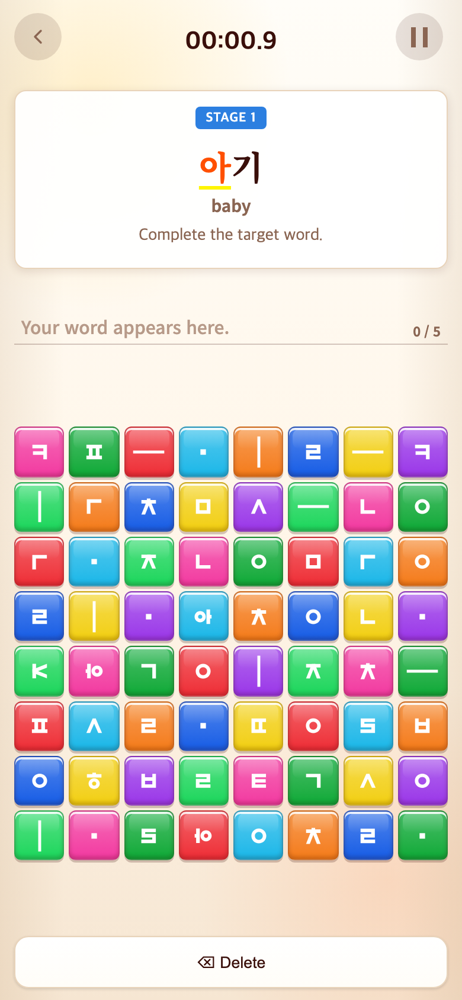

# Word 띄어쓰기 버튼 제거

단어만 작성하는 Word에 문장용 Space 버튼이 남아 있어 혼동을 주었다. Word 화면에서 Space를 숨기고 하단을 한 열로 바꿔 Delete만 표시한다. 다른 모드와 삭제 동작은 유지한다.

테스트 173개와 빌드 통과. 모바일 Word 진입 후 Space의 실제 display가 none인지 검증했다. 소규모 버튼 변경으로 변경 후 화면만 기록한다(390×844 CSS px, DPR 2, PNG 780×1688).

