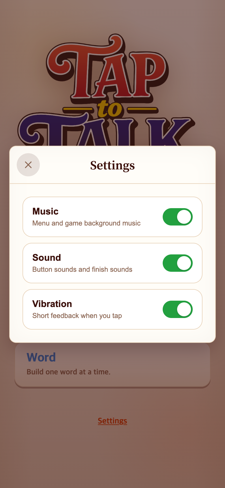
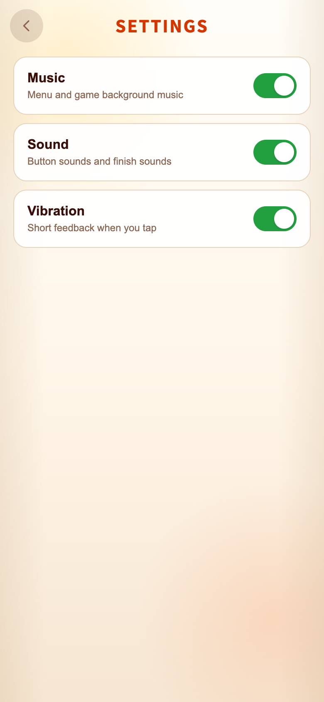

# 2026-09-14 Settings 전체화면

- 적용 커밋: `7f71d2f`, 아이콘 보정 `916131d`
- 비교 커밋: `f26124d`
- 재현 성공: 비교 커밋은 별도 /private/tmp 폴더에 git archive로 추출해 실행했다.

## 문제·요구

기존 Settings는 메인 위 팝업이었다. TAPtoTEN처럼 전용 전체화면과 뒤로가기 구조를 원했다. Music/Sound/Vibration 표기는 유지한다.

## 수정 내용·이유

Settings 전용 section과 설정 본문을 만들고 메인 화면을 숨긴다. 상단 SETTINGS와 뒤로가기 화살표, 스크롤 가능한 본문을 사용한다. 일시정지 help-layer는 변경하지 않아 게임 중 팝업 동작과 분리한다. 설정 변경 시 화면을 유지하고 키보드 포커스를 복원한다. 대기 BGM과 설정 저장 동작은 유지한다.

## 검증

- Vitest213개 및 웹 빌드 통과.
- 실제 브라우저에서 전체화면/메인 숨김, 세 토글, 뒤로가기와 재진입 시 값 유지, 320×568에서 하단 항목 접근, Word 일시정지/재개 팝업 회귀 검증 통과.
- 첫 캡처에서 발견한 SVG 채움 문제를 보정한 뒤 다시 캡처했다.
- [check.mjs](check.mjs)는 실제 UI를 조작한다. Playwright 모듈 경로는 PLAYWRIGHT_MODULE로 지정 가능하다.
- 다른 게임 저장소는 참조만 했다. 게임 규칙 및 음악 파일 변경 없음.

## 모바일 화면

같은 Settings 진입 행동, 기본 설정. 390×844 CSS px / DPR2 / PNG780×1688.

| 이전 `f26124d` 과거 버전 재현 | 이후 `916131d` |
| --- | --- |
|  |  |
