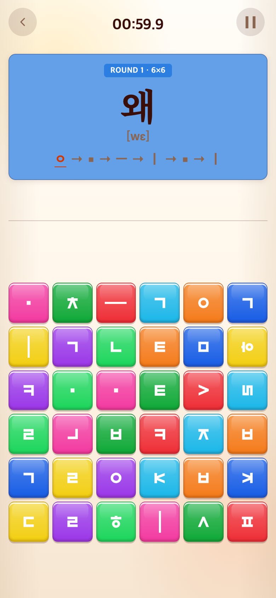
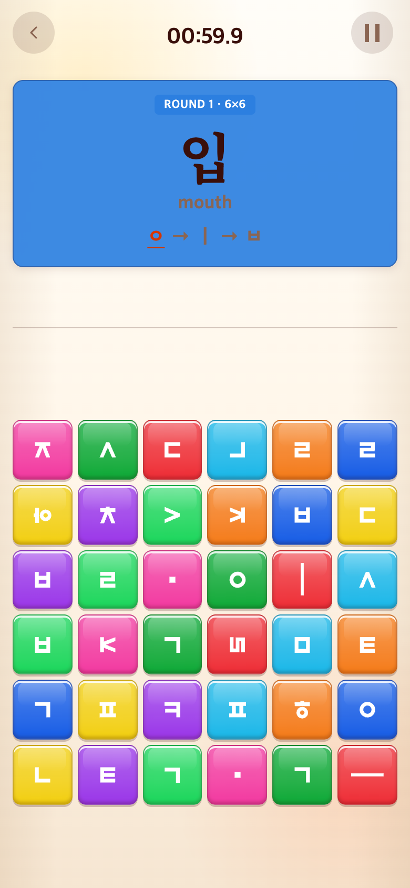

# 2026-09-14 조합 연습과 의미 있는 어휘 구분

- 수정 전: `f15212e` (임시 폴더에 git archive로 추출하여 실제 실행)
- 수정 후: `d81b162`
- 재현: 성공. Chrome 390×844 CSS px / DPR2 / 780×1688 PNG.

## 문제와 요구

교수님 피드백: 밥의 생활 의미, 발음과 번역 구분, 기초 이후 의미 없는 단독 음절의 반복을 개선할 필요가 있었다. 기존 Syllable은 튜토리얼 이후에도 전체59개 후보에서 발음 연습용 음절을 출제했다.

## 변경과 이유

- 튜토리얼은 기존59개 후보·6유형·총30판 유지. 소리 연습은 대괄호 표기 유지.
- 본게임은 뜻이 있는 한 음절 명사26개만 출제: 산 강 물 불 눈 손 발 집 밥 옷 달 별 입 몸 닭 흙 값 삶 몫 개 게 귀 꿈 뼈 쌀 땀. 직전 문제는 재출제하지 않는다.
- 밥은 meal, 흙은 soil 유지. 쌀은 rice. 음절 워를 영어 war/전쟁과 등치하지 않는다.
- Word 마지막8개는 개·게·샤워·의자·왜·웨이터·귀·외국. 기존 내·네·와·꾀·외 대신 실제 단어 안에서 복모음을 체험하도록 구성했다. 고정33판과 이후60개 단어 구조는 유지한다.
- 비빔밥은 bibimbap, 운동장은 sports field, 놀이터는 playground로 구분했다.
- 시간·점수·자판·음악·다른 게임 저장소는 수정하지 않았다.

## 검증과 결과

- Vitest213개, TypeScript/Vite 빌드 통과.
- 본게임26개 모두 뜻이 있고 기본 자소 입력으로 조합되는지, 발음용 음절 제외·직전 중복 방지·Word 새 어휘 연결을 테스트했다.
- 캡처는 같은 난수 시드와 진입 행동으로 실제 튜토리얼30판을 완료한 직후다. 후보 목록 변경 때문에 첫 본게임 정답은 서로 다르다. 화면 문구를 임의 합성하거나 강제로 바꾸지 않았다.
- 임시 버전 자산의 실제 경로 허용 문제를 수정한 뒤 캡처를 다시 실행했다.
- 재현 스크립트: [capture.mjs](capture.mjs). Playwright 경로는 PLAYWRIGHT_MODULE 환경변수로 지정할 수 있다.

| 수정 전 — 과거 `f15212e` 재현 | 수정 후 — `d81b162` |
| --- | --- |
|  |  |
