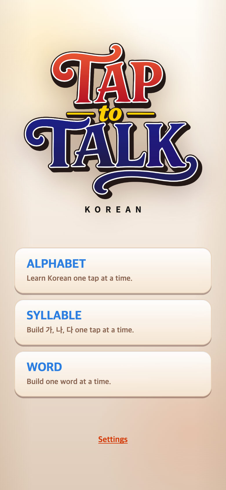

# 2026-09-14 메인 메뉴 위치 통일

- 이전 커밋: `bd8e4ec`, 별도 임시 폴더에서 git archive로 재현.
- 적용 커밋: `9287eda`.
- TAPtoTEN은 비교용으로만 읽고 실행했다. 비교 서버 캐시도 임시 폴더에 분리했다.

## 요구와 원인

Settings와 메인 게임 선택 버튼 위치를 TAPtoTEN과 맞추고 게임명을 모두 대문자로 표시하라는 요청. 390×844에서 기존 게임 목록 y412.17, Settings y711.55로 TEN의 y425.80, y741.34보다 위에 있었다. 로고 영역과 음악 안내의 레이아웃 높이 차이가 원인이었다.

## 변경

- 로고와 KOREAN을 TEN 로고와 같은 높이의 영역 안에 비율을 유지해 배치한다. 로고 파일은 그대로이며 영역에 맞게 크기가 조절된다.
- 음악 안내는 Settings 아래에 절대 위치로 배치해 보이거나 숨겨져도 게임 버튼 위치를 움직이지 않는다. 작은 화면에서는 안내 높이를40px로 조절한다.
- 게임 선택 제목은 ALPHABET / SYLLABLE / WORD. 시작 안내 제목은 기존에도 대문자였다.
- 게임 규칙·점수·음악 동작은 변경하지 않는다.

## 검증

TypeScript/Vite 빌드 및 diff 검사 통과. 390×844,375×667,320×568에서 게임 목록·첫 버튼·Settings의 x/y/width/height가 TEN과 모두1 CSS px 이내로 일치했다. 크기 변경 이벤트 완료를 기다린 뒤 측정했다. [좌표 기록](metrics.json), [재현 스크립트](check.mjs).

390×844, DPR2, PNG780×1688. 실제 화면을 캡처했으며 문구나 위치를 합성하지 않았다. 음악 자동재생 중이라 안내는 숨겨져 있다.

| 이전 `bd8e4ec` 재현 | 이후 `9287eda` |
| --- | --- |
|  |  |

[비교한 TAPtoTEN 화면](reference.png)
