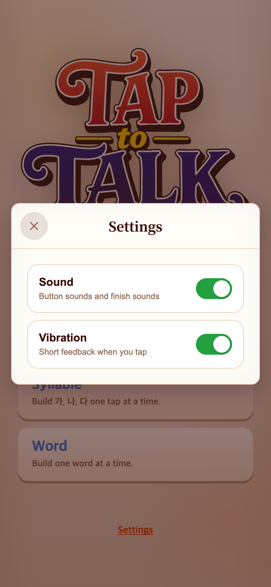
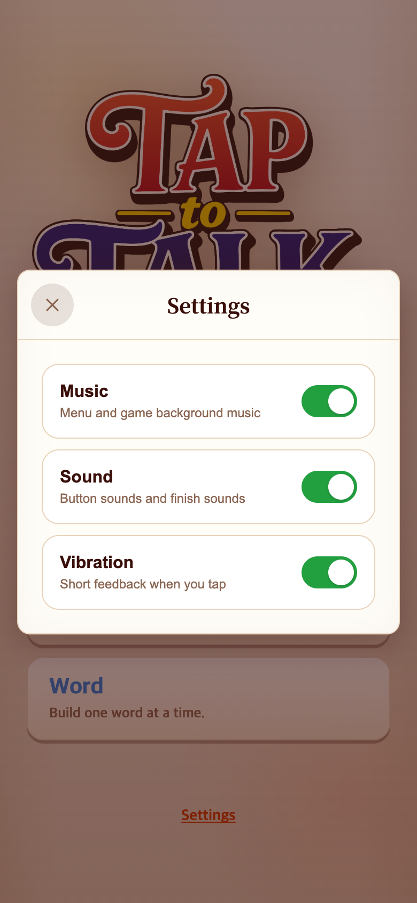

# 2026-09-14 화면별 배경음악 적용

- 적용 커밋: `510f973`
- 비교 커밋: `f7a7d8a`
- 재현: 성공. 과거 커밋을 `/private/tmp/talk-music-before-A6hRQm`에 git archive로 추출하여 실행했다.
- 조건: Chrome 모바일 390×844 CSS px, DPR 2, PNG 780×1688. 시작 화면 종료 후 Settings 열기. 기본 설정 사용.

## 문제·개선 요구

승인한 대기곡과 게임곡을 TAPtoTEN·TAPtoPICK처럼 화면별로 전환하고 결과 영상과 겹치지 않게 재생하고자 했다. 다른 게임 저장소는 읽기 전용으로 참고했다.

## 무엇을 왜 수정했는가

- 대기곡은 시안 08(128 BPM), 게임곡은 시안 14(12번 선율에서 지속 베이스 제거, 142 BPM)를 사용했다. 다른 게임의 음악을 사용하지 않는다.
- 정수 마디 길이로 생성하고 마지막 잔향을 시작에 연결한 반복용 파일을 제작했다. 선율·템포는 승인 시안 그대로다. MP3 44.1 kHz stereo/192 kbps, 대기 30초·게임 약40.56초.
- SceneMusic이 대기/게임/무음 상태를 소유하고 BackgroundMusic이 디코딩 캐시, 루프, 첫 입력 잠금 해제, 비동기 경합과 화면 숨김을 처리한다.
- 메인/설정은 대기곡, START 안내/플레이는 게임곡. 일시정지와 결과·보너스 영상은 무음. 영상 자체 소리는 기존 Sound 설정을 따른다.
- Music 설정은 Sound와 분리하고 기존 설정 저장 형식을 유지했다. 브라우저 정책으로 자동재생이 막히면 첫 탭 이후 시작한다.

## 수정 후 결과·검증

- Vitest 212개 통과, TypeScript/Vite 빌드 성공.
- 실제 Chrome AudioContext를 관찰하여 활성 루프가 최대 하나임을 확인. 세 게임의 진입·일시정지·재개·메인 복귀, Music 토글, Sound 독립, Word 시간 종료 시 무음을 확인했다.
- 자동화: [check.mjs](check.mjs), [검증 결과](verification.json). 실행 시 BEFORE_ROOT와 Playwright 모듈 경로(필요 시 PLAYWRIGHT_MODULE)를 지정한다.
- iPhone/Android 실기기 청취 및 Safari 자동재생 정책은 여기서 검증하지 못했다. 실제 음색·루프 연결 청감은 사용자가 최종 확인한다.
- 아래는 UI 변경 비교이며 음악은 스크린샷으로 표현할 수 없다. 게임 규칙·점수·로고·다른 게임 저장소는 변경하지 않았다.

## 모바일 화면

| 수정 전 — `f7a7d8a` 과거 버전 재현 | 수정 후 — `510f973` |
| --- | --- |
|  |  |
