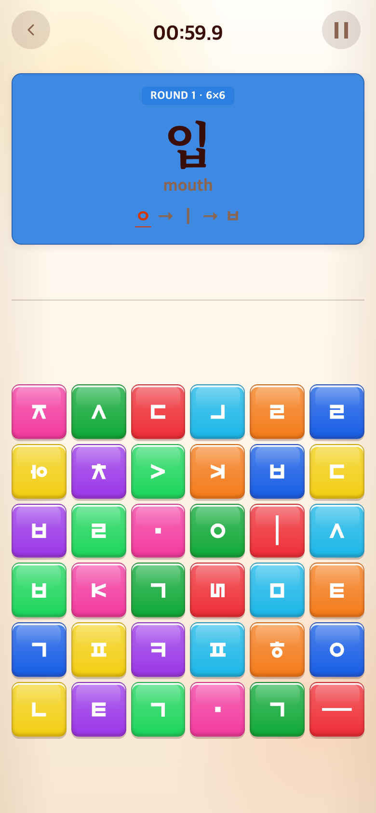
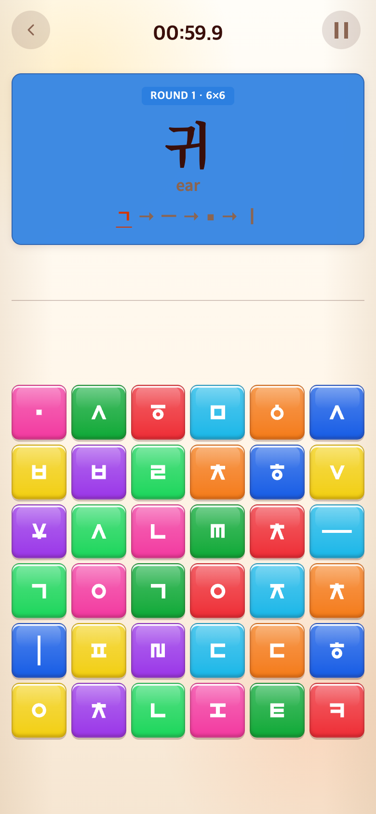

# 2026-09-14 Syllable 50개 순환 출제

- 적용: `fcb36ae`
- 비교: `7e78422`, git archive로 별도 임시 폴더에서 실행.

## 문제·요구

26개에서 직전 단어만 제외하고 매번 추첨하여 닭→산→닭처럼 짧은 간격의 반복이 가능했다. 전체 목록을 소진하기 전 중복을 막고 어휘를 추가하기로 했다.

## 변경과 이유

- 24개 추가해 총50개: 코·피·턱·목·팔·등·배·폐·간·뇌·혀·꽃·풀·숲·돌·섬·땅·길·책·문·컵·빵·콩·팥.
- 영어는 해당 대표 뜻을 선택한다. 예: 배 belly, 등 back, 간 liver, 문 door. 문맥 없는 단어이므로 모든 동음이의어 뜻을 나열하지 않는다.
- 세션별 셔플 목록에서 하나씩 출제한다. 50개를 소진하면 재섞고 묶음 경계에서도 같은 단어가 연속 등장하지 않게 한다.
- 다음 라운드에도 목록을 유지한다. 같은 stage index(미완성 재시작)는 기존 문제를 재사용하여 건너뛰지 않는다. 메인으로 나갔다 새 START를 누르면 새 목록이다.
- 튜토리얼30판, 판 크기·시간·점수·Word·Alphabet 규칙은 변경하지 않는다. 튜토리얼에서 연습한 어휘가 본게임에 다시 나올 수는 있다.

## 검증

Vitest216개와 빌드 통과. 3종 난수 조건에서 각20묶음을 검사해 모든50개가 한 번씩 나옴과 경계 중복 방지를 확인했다. 라운드·6×6→8×8 전환에서 미완성 제시어와 남은 목록 보존, 새 세션 초기화도 검사했다. 전체50개 자소 조합 및 영어 뜻 검사 통과.

전후는 동일 난수 시드로 실제 튜토리얼30판을 진행한 뒤 본게임 첫 화면이다. 목록과 추첨 방식이 달라 제시어는 다를 수 있다. 반복 방지는 단일 이미지가 아니라 위 테스트로 검증한다. 캡처 도구는 `../2026-09-14-meaningful-words/capture.mjs`에 BEFORE_REVISION=7e78422 및 CAPTURE_OUTPUT을 지정했다.

## 모바일 비교

재현 성공. 390×844 CSS px / DPR2 / PNG780×1688. 과거 화면 임의 합성 없음.

| 이전 `7e78422` 재현 | 이후 `fcb36ae` |
| --- | --- |
|  |  |
