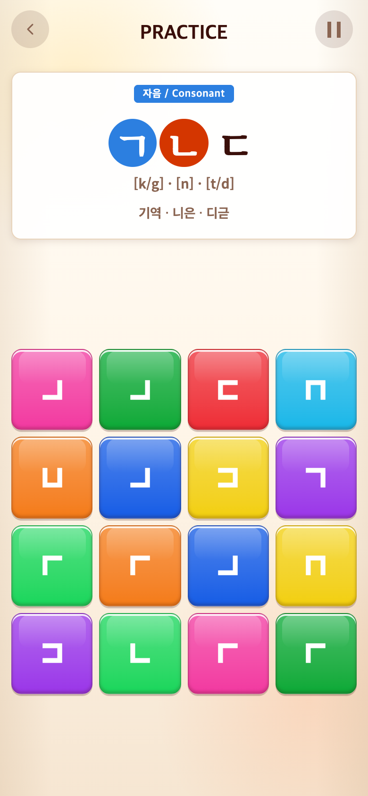
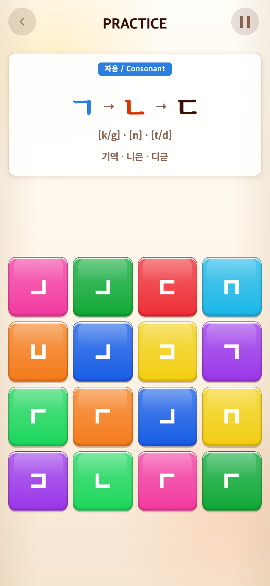
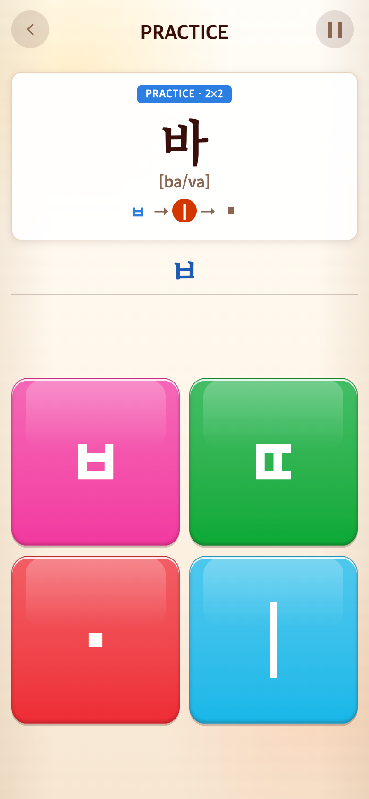
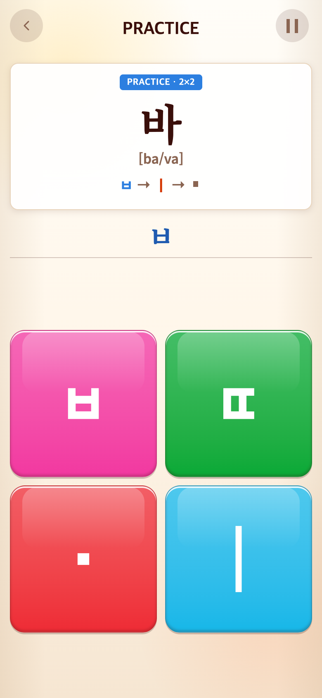
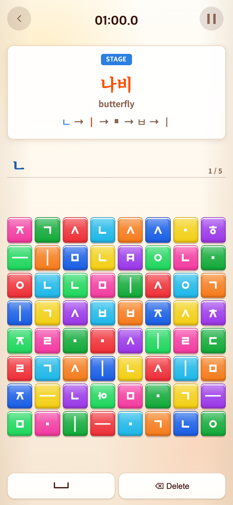

# 2026-09-16 화살표와 색상으로 입력 순서 표시

- 적용 커밋: `4f3af15`
- 비교 커밋: `8b07881`
- 재현 여부: 성공

## 문제와 개선 요구

Alphabet 자소의 원형 강조, Syllable의 원형 입력 안내, Vocabulary의 입력 안내를 참고 이미지처럼 자소 → 자소 형태로 통일하되 밑줄 없이 색으로만 구분하라는 요청.

## 수정 내용·이유·결과

- 원형 강조 배경과 제시어 밑줄 제거. 현재 위치는 빨강, 완료는 파랑, 나머지는 기존 기본색으로 표시한다.
- Alphabet 자소 사이에 화살표 추가. Syllable/Vocabulary는 공통 렌더러로 화살표와 작은 정사각형 아래아를 표시한다.
- Vocabulary는 중복 자소를 유지하고 실제 입력의 연속 정답 구간에 맞춰 강조한다. 오입력에서는 진행을 멈추고 삭제하면 강조 위치도 돌아온다. 확정 경계는 안내 비교에서 제외하지만 실제 공백은 포함한다.
- 입력 판정, 점수, 영상, 출제는 변경하지 않았다. 이미지의 WINDOWS 문구는 참고 대상이 아니며 복구하지 않았다.
- Vitest 224개, production build 통과. 브라우저에서 세 모드의 투명 배경·밑줄 없음·화살표 및 Vocabulary 오입력/삭제 후 강조 위치 검증.

## 모바일 전후

390×844 CSS px, DPR2, 780×1688 PNG. Chrome Headless, seed123. 과거 `8b07881`을 별도 임시 폴더로 git archive하여 실행한 **과거 버전 재현 화면**과 수정 코드를 비교했다.

각 버전에 존재하는 Alphabet 4×4 첫 묶음, Syllable 바, Vocabulary 나비를 캡처 전용 앱 접근으로 선택하고 첫 자소가 입력된 체크포인트 상태로 렌더링했다. 타이머는 정지했다. 연속 플레이 기록이 아니라 UI 상태 검증용이며, 게임판은 이 체크포인트의 입력에 해당하는 사용 타일을 별도로 재현하지 않았다. 이미지 합성·과거 UI 조작은 하지 않았다. 테스트 접근은 브라우저 응답에만 추가하여 배포에는 포함되지 않는다.

| 모드 | 수정 전 `8b07881` 재현 | 수정 후 `4f3af15` |
| --- | --- | --- |
| Alphabet |  |  |
| Syllable |  |  |
| Vocabulary |  |  |

[캡처 및 브라우저 검증 스크립트](capture.mjs). after는 실행 시 작업 트리를 사용한다.
