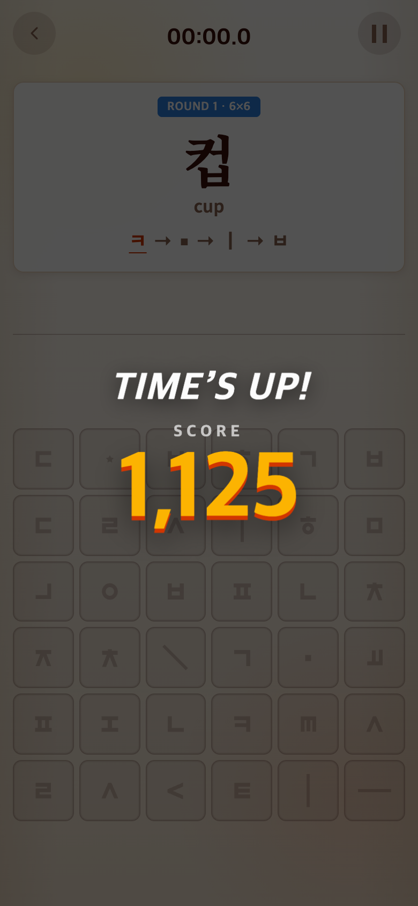
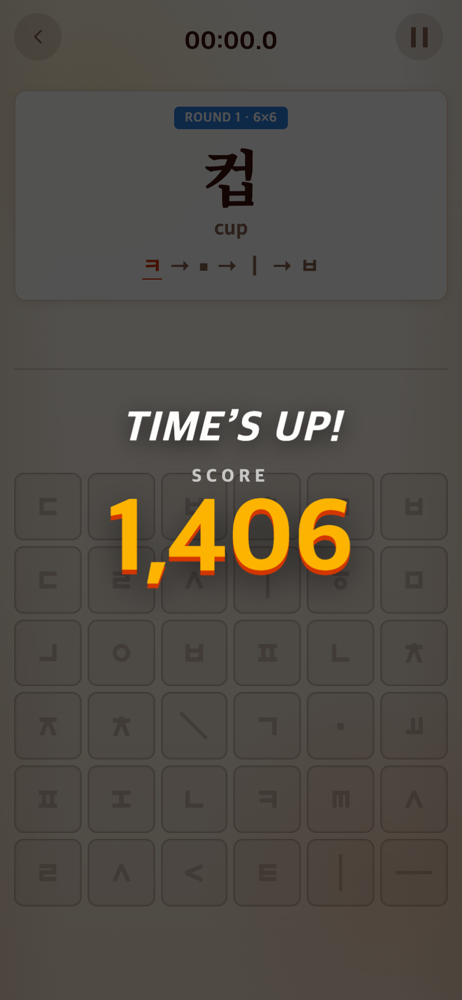
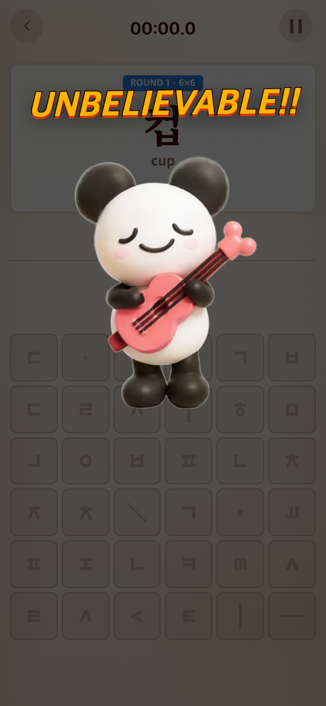
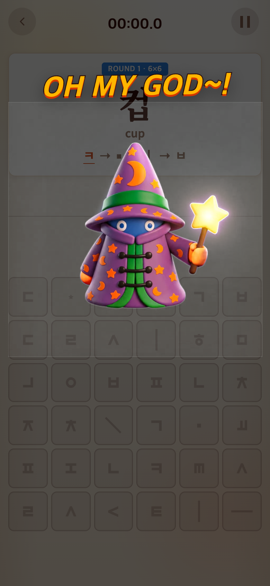
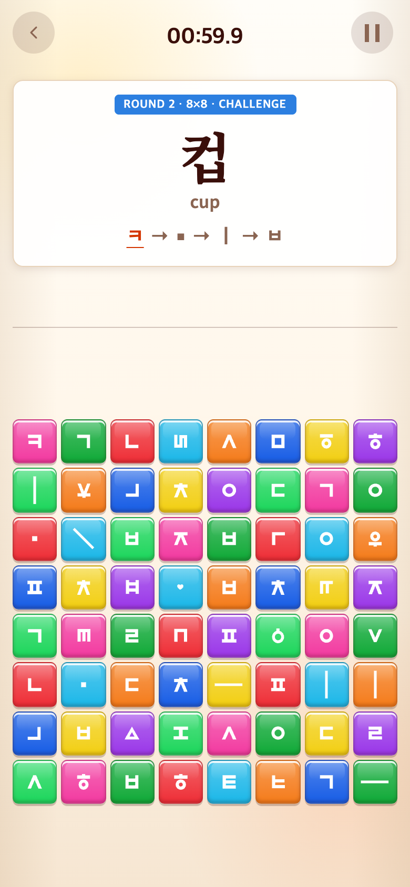
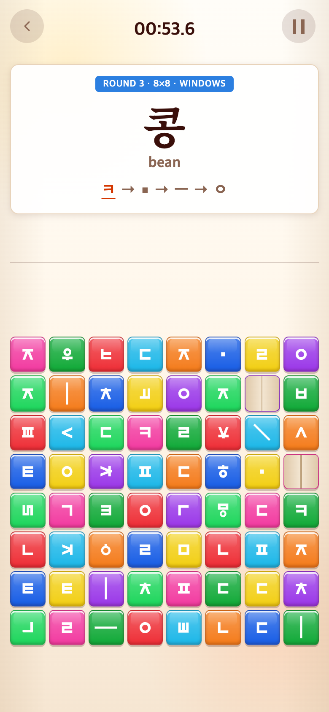
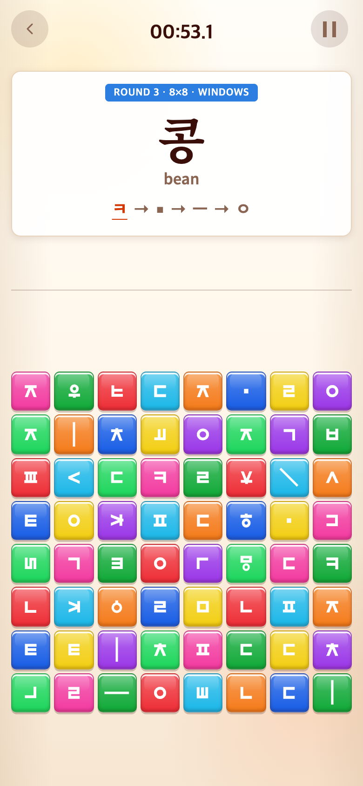

# 2026-09-16 무한 어휘·Syllable 숙련 난도

- 적용 커밋: `db5ec62`
- 비교 커밋: `5fbb471` — 별도 임시 폴더에 git archive로 풀어 실행한 과거 버전
- 창문 참고: TAPtoPICK `d209571`, `src/core/pick/montage.ts`, `src/ui/styles/talk.css` (읽기 전용 참조)
- 재현: 성공. Chrome 모바일 390×844 CSS px, DPR 2, PNG 780×1688px.

## 문제·개선 요구

Syllable은 50개 셔플의 경계와 튜토리얼 직후에 최근 음절이 다시 나올 수 있었다. Vocabulary는 후반에 5글자19개만 반복했다. Syllable은 1분19개를 완성해야 OH MY GOD이라 어렵고, 달성 이후 별도 도전도 없었다.

## 수정 내용과 이유

- Syllable 튜토리얼 유형 간 중복(아) 제거. 본게임은 기존50개를 한 번씩 사용하면서 최근10개를 피한다. 튜토리얼 마지막10개도 최근 기록에 포함한다.
- Vocabulary 5글자29개 추가: 기존19→48개. 추가 어휘 전체86개(3글자21/4글자17/5글자48), 고정32개까지 총118개.
- 고정32판·3글자10판·4글자10판은 유지. 그다음 아직 보지 않은 추가66개를 먼저 사용한 뒤, 전체86개를 셔플 반복한다. 각 묶음에서 단어는 한 번만 출제하고 최근10개를 다시 내지 않는다. 미완성 문제의 재개는 의도적으로 유지한다.
- 5글자가 전체 풀의 과반이며 출제 순서 추첨 가중치는 3/4/5글자 1/2/4. 최근3개와 두 글자 이상 겹치는 복합어는 다른 후보가 있으면 뒤로 미룬다. 유한한 풀이라 영구적인 무중복이나 모든 복합어 겹침 제거를 보장하지는 않는다.
- 실제 어휘와 영어 뜻을 사용하며, 제외 요청된 학교·초등학교·국립박물관·반짝반짝·휴대전화는 복원하지 않았다. 모든118개가 Space 없이 그대로 조합되는지 테스트한다. 검토 중 악기연주자는 아끼연주자로 합쳐져 최종 목록에서 제외했다.
- Syllable 완성 수/16×1500(내림, 상한1500). 14개1312=UNBELIEVABLE, 15개1406=OH MY GOD, 16개1500. 기존 등급 경계1400과60초는 유지.
- Syllable 본게임 일반20%→OMG 후 다음 라운드30%→다시OMG 후 창문(30% 유지). 낮은 점수에도 강등하지 않고 새 START에서 초기화한다. 기록 저장과 다른 게임 난도는 변경하지 않는다.
- 창문 주기: 6초 열림,360ms 닫힘,120ms 닫힌 상태 교환,360ms 열림. 미사용·다른 모양 두 버튼 노드를 교환해 정답 데이터와 ID/사용 상태를 보존한다. 연출 중 입력 및 이전 위치에서 시작한 탭을 차단한다. 시계와 함께 일시정지한다.

## 수정 결과·검증

`npm test`: 30파일222테스트 통과. `npm run build` 통과. 64개 실제 Word 보드에서도 필요한 모든 자소가 있는지 검사했다. 셔플 여러 묶음, 최근10개 제외, 어려운 어휘 가중치, 튜토리얼·본게임 경계, 점수 경계 및 승급, 함정30%의 정답 보존을 검사했다.

브라우저에서 실제 튜토리얼30판을 자동 탭하고 본게임15개를 완성한 뒤 실제 라운드 시계만 만료시켜 전후를 비교했다. 사람의 플레이 속도 실측 자료가 아니다. 두 차례 결과 화면을 거쳐 30% 함정19개/64개 및 창문 단계 진입, 두 노드만 교환, 다시 열림, 일시정지와 새 START 초기화를 확인했다.

## 모바일 화면

| 수정 전 `5fbb471` 재현: 15개 완성 | 수정 후 `db5ec62`: 15개 완성 |
| --- | --- |
|  |  |
|  |  |

같은 뷰포트·난수 시드123·자동 정답 입력·라운드 종료 조건을 사용했다. 재생 영상의 특정 프레임은 실행 시점에 따라 달라질 수 있다.

| 함정30% | 창문 닫힘·교환 | 창문 열림 |
| --- | --- | --- |
|  |  |  |

창문은 새 기능이라 이전 대응 화면을 만들지 않았다. 위 신규 단계는 실제 승급 후 연출 시점을6.4초/6.84초로 제어해 촬영한 테스트 화면이다. PNG를 합성하거나 가공하지 않았다. 캡처·검증 절차는 `capture.mjs`에 보존한다.
