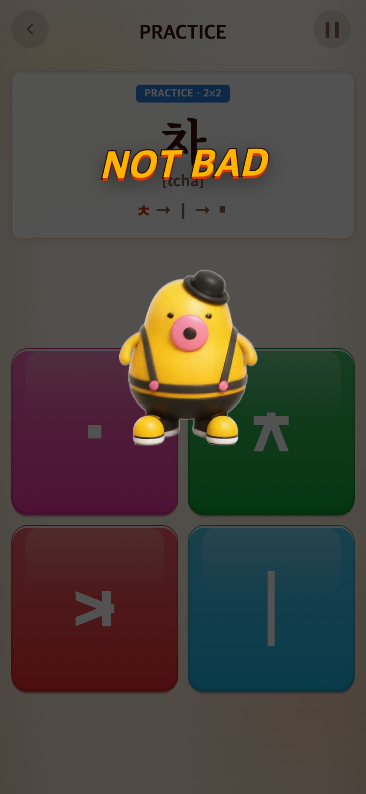
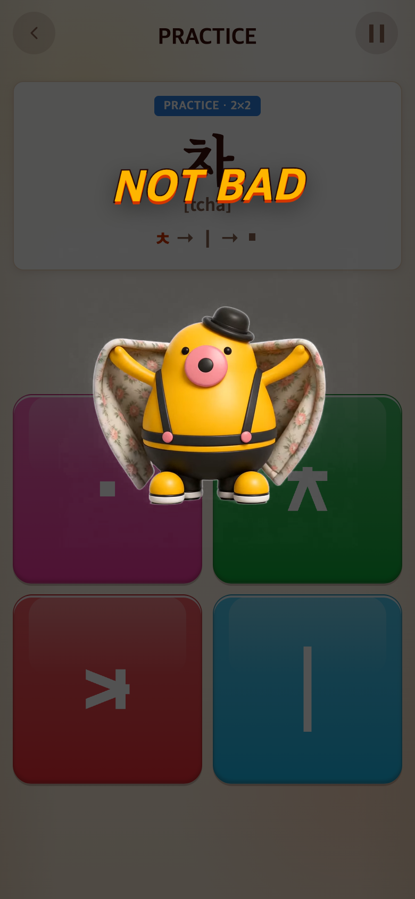
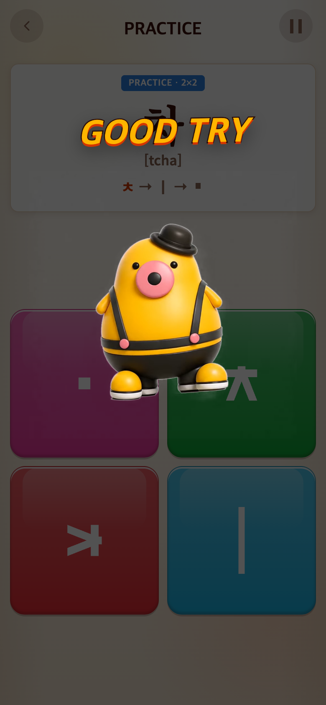
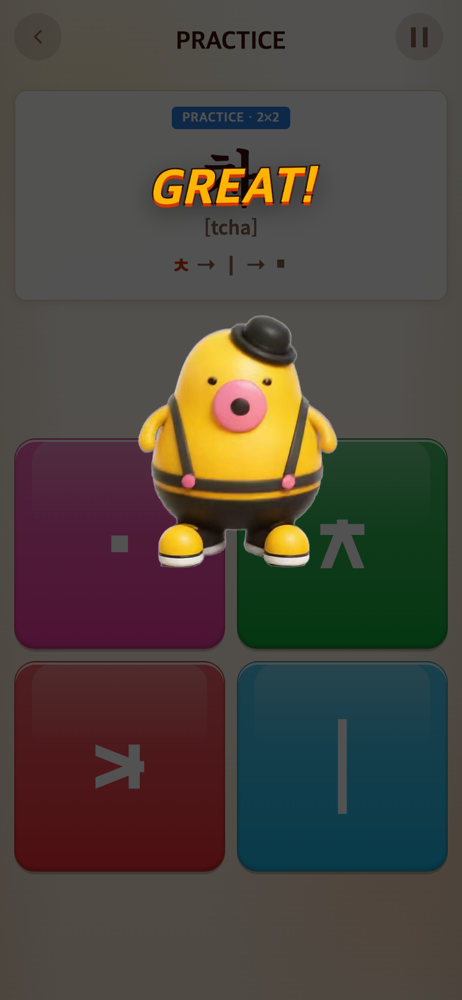
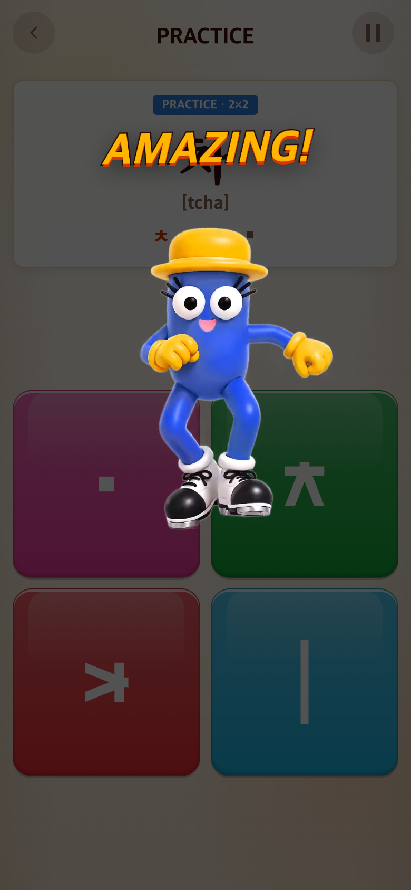
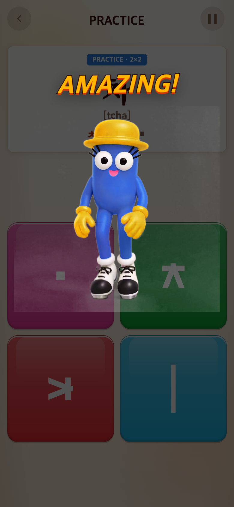
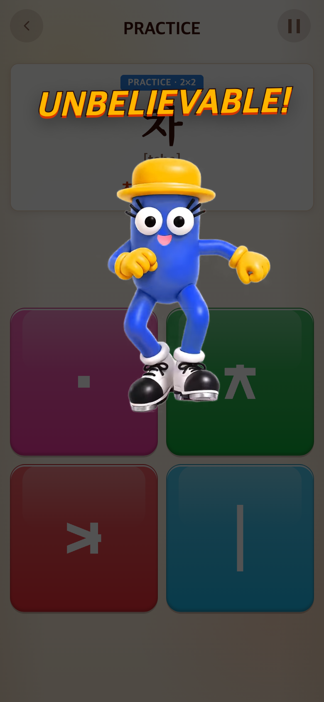
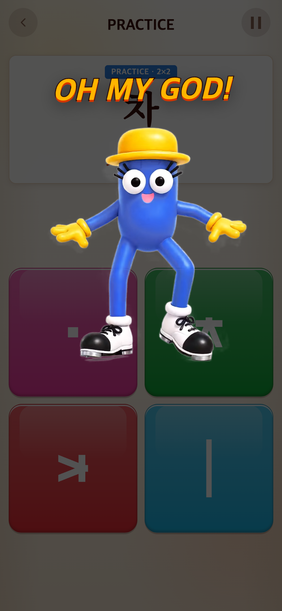

# 2026-09-16 등급별 업로드 영상 연결

- 적용 커밋: `adc0c7a`
- 비교 커밋: `57550ad`
- 재현: 성공

## 요구·이유·결과

movie 폴더에 올린 AMAZING, GOOD TRY, notbad, OH MY GOD의 MP4·WebM·MP3를 각각 해당 등급에 연결하라는 요청. 기존 하위3등급 티피/상위3등급 태피 공유 대신 아래처럼 네 등급의 파일을 교체했다. 업로드 원본은 편집하지 않았다.

| 점수 | 등급 | 파일 묶음 |
| --- | --- | --- |
| 0 | NOT BAD | notbad (신규) |
| 1–299 | GOOD TRY | GOOD TRY (신규) |
| 300–599 | GREAT | tipi (기존 유지) |
| 600–999 | AMAZING | AMAZING (신규) |
| 1000–1399 | UNBELIEVABLE | taepi (기존 유지) |
| 1400 이상 | OH MY GOD | OH MY GOD (신규) |

세 게임 공통이며 튜토리얼 GREAT는 기존 tipi 유지. iPhone/iPad는 MP4, 일반 브라우저/Android는 WebM, 소리는 같은 이름의 MP3. 기존 영상은 무음으로 재생하고 별도 음원은 Sound 설정을 따르는 방식을 유지했다. 점수 기준·등급 문구·배치·BGM은 변경하지 않았다.

## 검증

Vitest224개와 production build 통과. 경계 점수0/1/299/300/599/600/999/1000/1399/1400/1500/9999의3형식 매핑 검사. Chrome에서6등급 WebM 프레임 로딩·MP3 경로 확인. iPhone UA로 MP4 선택 및 파일 HTTP 응답 성공 확인(실제 iPhone Safari 기기 검증은 아님). 12개 PNG 크기 검증.

## 전후 모바일 캡처

390×844 CSS px, DPR2, 780×1688 PNG. 과거 `57550ad`는 git archive로 별도 임시 폴더에서 실행한 **과거 버전 재현**이다. 각 버전 Syllable 첫 화면을 배경으로 실제 Cheer 렌더러에 등급 점수를 전달하는 테스트 미리보기이며, 실제 점수를 획득한 플레이 기록은 아니다. 영상0.5초에서 정지해 같은 조건으로 비교했다. 화면 합성은 하지 않았다. 새 파일의 색·투명도·질감은 원본 그대로다.

| 등급 | 수정 전 `57550ad` | 수정 후 `adc0c7a` |
| --- | --- | --- |
| NOT BAD |  |  |
| GOOD TRY |  |  |
| GREAT |  |  |
| AMAZING |  |  |
| UNBELIEVABLE |  |  |
| OH MY GOD |  |  |

[캡처 스크립트](capture.mjs). after는 실행 시 현재 작업 트리를 사용한다.
