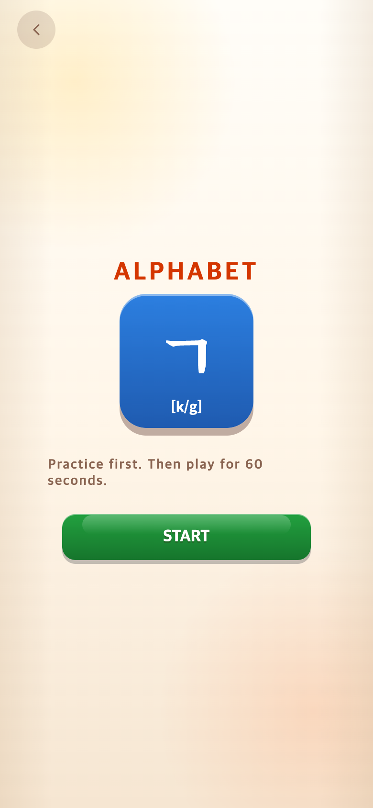
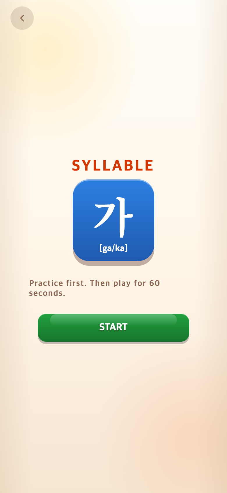
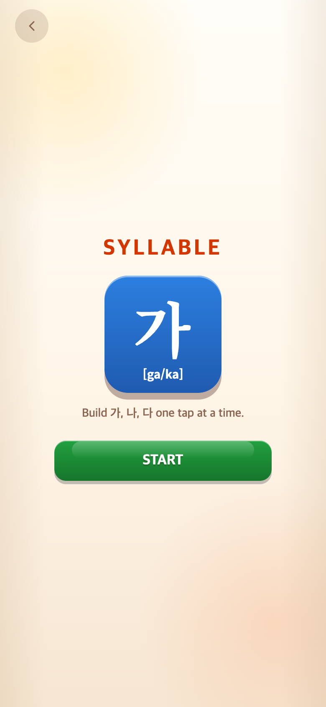
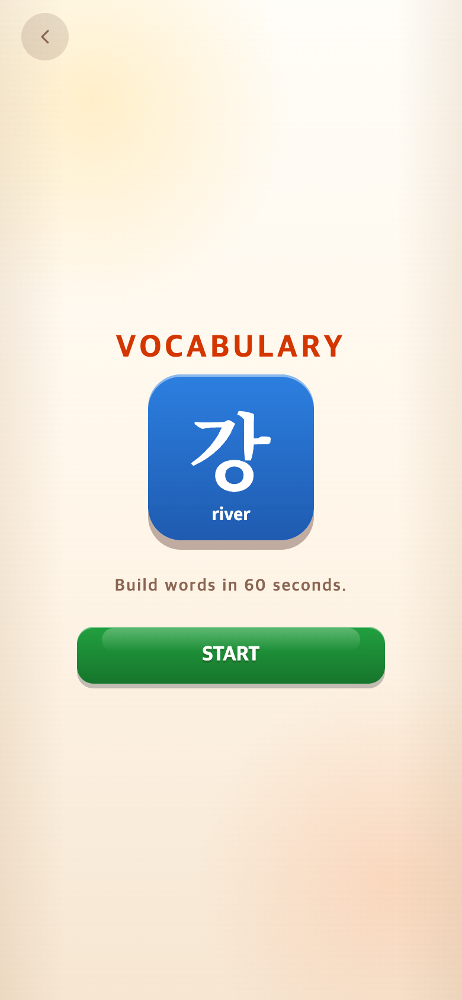
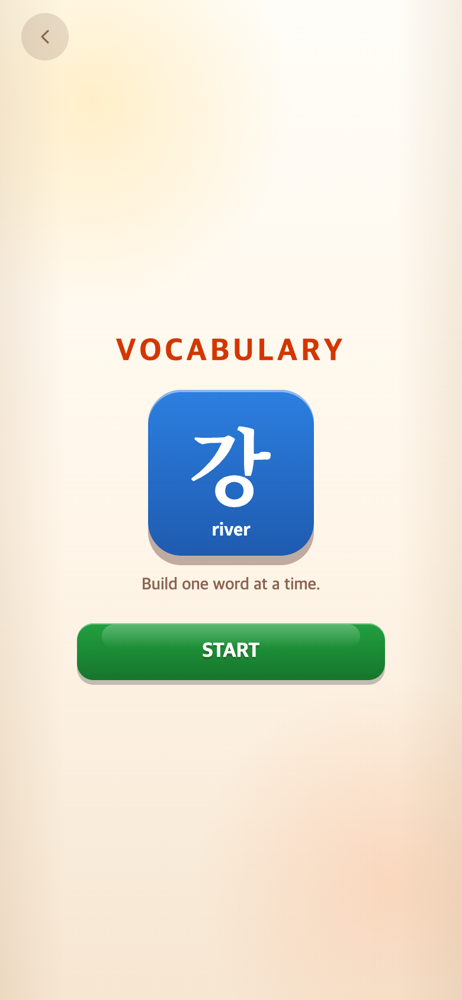
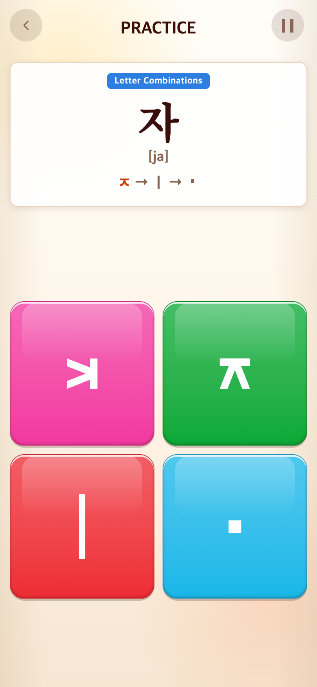
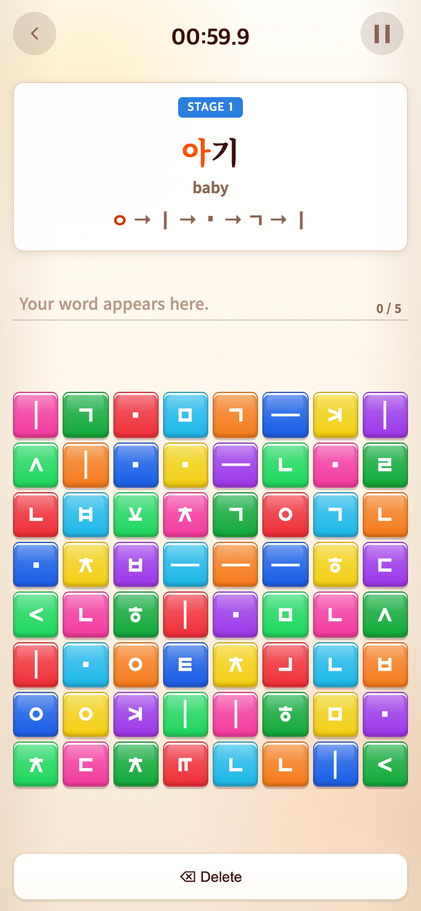

# 2026-09-16 시작 안내·자소 폰트·점수 조정

- 적용 커밋: `9182afd`
- 비교 커밋: `7f715fb` — 별도 임시 폴더에 git archive로 추출해 실행한 과거 화면
- 참고: TAPtoTEN `13edebf`, `src/ui/styles/picker.css`의 intro-body/intro-note. 참조 저장소는 수정하지 않았다.
- 재현: 성공. 390×844 CSS px, DPR2, PNG 780×1688, Chrome 모바일 에뮬레이션. 실제 휴대폰 캡처는 아니다.

## 문제·요구

시작 안내의 글씨 위치·크기를 TAPtoTEN에 맞추고 메인 설명을 재사용한다. Vocabulary 자소 안내가 Syllable보다 가늘었다. 사용자가 본게임에서 약1000점을 잘한 결과로 체감하여 기존1000점을 약1500점으로 높이길 요청했다. 긴 단어 안내는 구현 전 방안을 요청했다.

## 무엇을 왜 바꿨나

- 시작 안내는 메인 `.mode-desc`를 그대로 가져와 중복 문구를 없앴다. 참고 게임처럼 14px/600, 기본 자간, 요소 간16px, 가운데 정렬로 통일했다. 아이콘 컨테이너의 별도 -12px 이동을 제거해 설명과 실제 간격도16px로 맞췄다. 아이콘 내부 글자·읽기/뜻은 유지했다. TAPtoTEN의 별도 기록표는 복사하지 않았다.
- 안내 자소는 원래 둘 다 TAP Sans KR/18px였지만 Vocabulary는400, Syllable은650을 상속했다. 공통 클래스에650을 명시해 폰트·크기·굵기를 일치시켰다.
- `SCORE_MULTIPLIER=1.5`를 콘텐츠 설정에 추가했다. 완성 문제 수를 기준으로 배율 적용 후 합계 소수점을 버린다. 60초, 등급 경계, 영상 연결, 튜토리얼 무점수, 상한은 그대로다.

| 모드 | 기존 문제당 점수 | 변경 | 상한 | OH MY GOD 최소 완성 수 |
| --- | --- | --- | --- | --- |
| Alphabet | 150 | 225 | 없음 | 7묶음, 1575점 |
| Syllable | 93.75 | 140.625 | 1500 | 10음절, 1406점 |
| Vocabulary | 150 | 225 | 1500 | 7단어, 1500점 |

기존 등급은 0 NOT BAD, 1 GOOD TRY, 300 GREAT, 600 AMAZING, 1000 UNBELIEVABLE, 1400 OH MY GOD부터다. Syllable OH MY GOD 이후 함정30% 조건도 그대로이므로 더 적은 정답으로 진입한다.

## 검증

- Vitest 33파일/229테스트 및 production build 통과.
- 세 모드 메인과 시작 설명 동일, 설명14px/아이콘 아래16px 검증.
- 실제 브라우저 computed style: 변경 전 Syllable650/Vocabulary400 → 둘 다 TAP Sans KR/18px/650.
- 모든 전후 PNG 규격 확인. 동일 시드123과 진입 순서 사용. 실제 UI를 렌더링했으며 게임판 합성은 하지 않았다. 게임 화면은 최초 문제에서 타이머만 정지해 촬영했다.
- `capture.mjs`는 검증용으로 TalkApp 인스턴스 접근만 노출한다. 배포 코드 변경 없음. 실행: `PLAYWRIGHT_MODULE=/Users/scdi/Documents/ChatGPT/TAPtoTEN/node_modules/playwright/index.mjs node docs/research/2026-09-16-intro-score/capture.mjs` (after는 실행 시 작업 트리를 사용).

## 모바일 전후 화면

| 화면 | 수정 전 `7f715fb` 재현 | 수정 후 `9182afd` |
| --- | --- | --- |
| Alphabet 시작 |  |  |
| Syllable 시작 |  |  |
| Vocabulary 시작 |  |  |
| Syllable 입력 안내 |  |  |
| Vocabulary 입력 안내 |  |  |

## 긴 단어 제안 — 아직 미적용

전체 단어와 뜻은 유지하고, 입력 안내는 현재 음절 하나만 표시한다. 예: 어슬렁어슬렁에서 ‘어’는 ㅇ→▪→ㅣ, ‘슬’은 ㅅ→ㅡ→ㄹ. 맞추면 다음 음절로 자동 전환하고 Delete 시 이전 진행으로 복귀한다. 표시 영역 높이·글자 크기는 고정해 작은 글씨나 스크롤 없이 읽도록 한다. 사용자 확인 전 기존 긴 안내는 유지했다.
