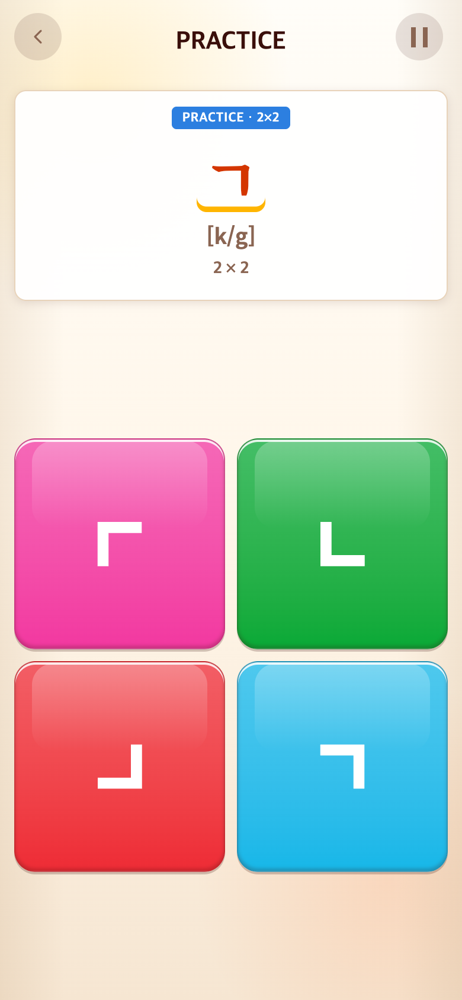
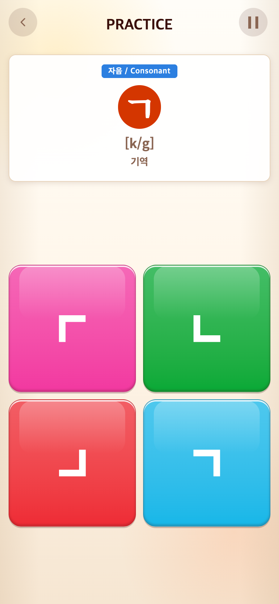
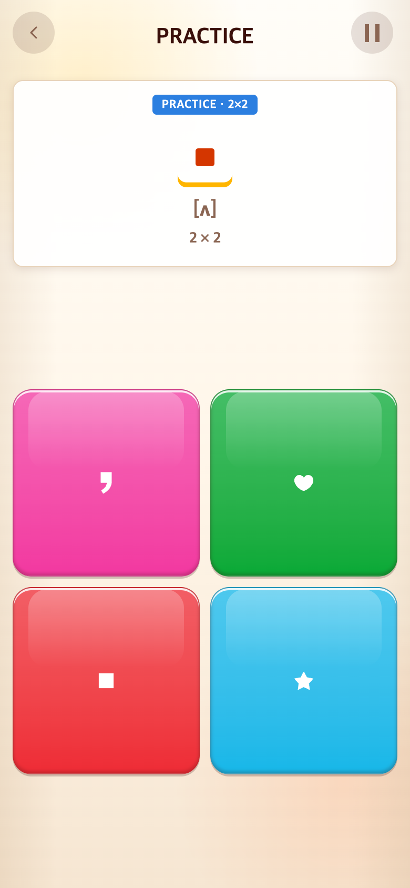
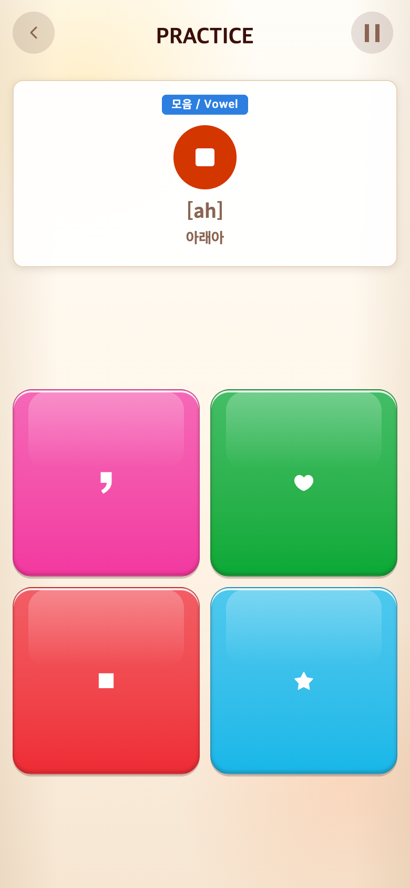
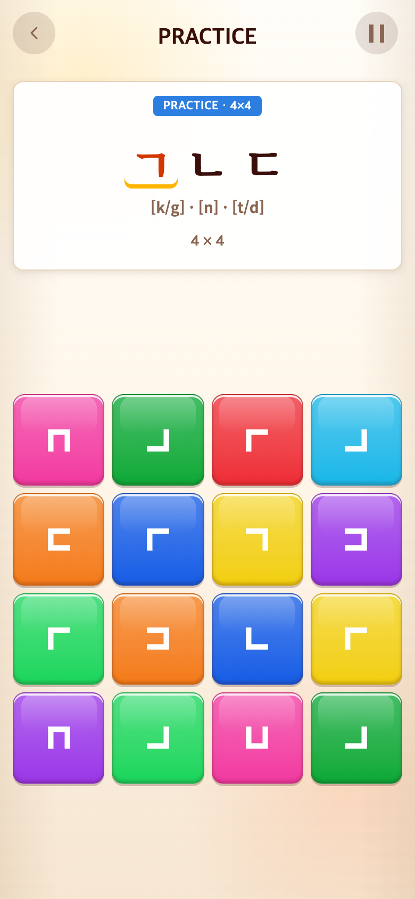
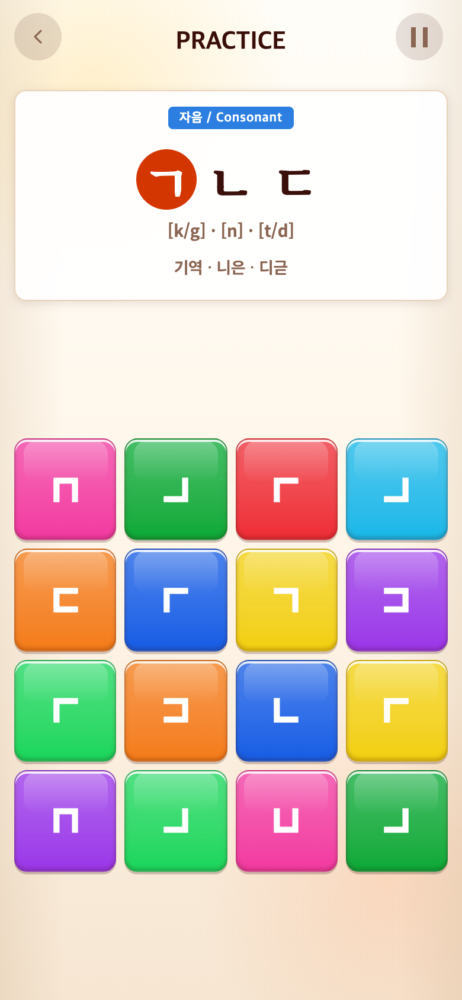
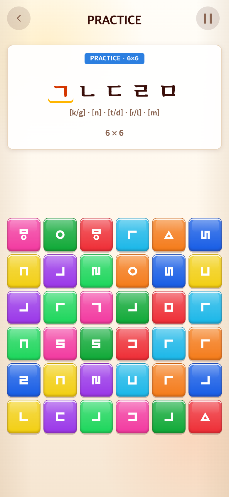
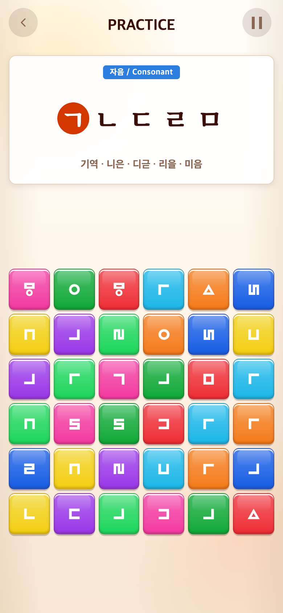
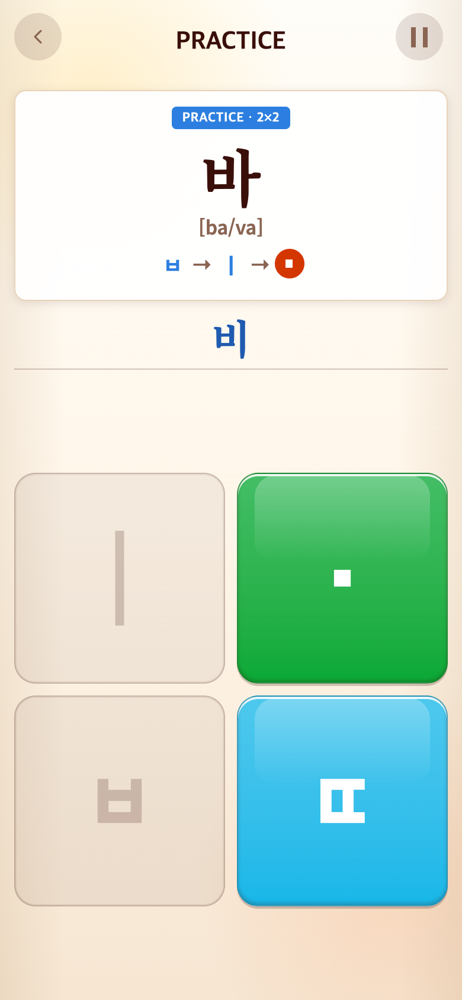

# 2026-09-16 학습 분류·자모 이름·읽기 표기

- 적용 커밋: `e625be5`
- 비교 커밋: `494c30f` (git archive로 별도 임시 폴더에서 실행)
- 재현: 성공. 모바일390×844 CSS px, DPR2, PNG780×1688px.

## 문제·개선 요구

Alphabet의 PRACTICE/보드 크기 중복 표기를 분류와 한글 이름으로 바꾸고, 자소 밑줄이 그·느처럼 추가 모음으로 보이지 않도록 변경 요청. 발음 표기는 처음 두 학습 구간까지만 남긴다는 의미를 사용자에게 확인했다: **Alphabet 2×2·4×4 표시,6×6부터 삭제**. Syllable의 큰 아래아 사각형을 줄이고 지정한 음절 영문 표기를 적용한다.

## 수정 내용·이유

- 파란 막대: 자음 / Consonant, 모음 / Vowel, 혼합은 자음·모음 / Letters.
- 하단 보드 크기 숫자: 기역·니은·디귿 등 한글 이름. 아래아·으·이 포함.
- HUD의 PRACTICE/본게임 타이머는 유지한다. Syllable/Vocabulary의 분류 라벨은 이번 변경 범위가 아니다.
- 현재 자소: 밑줄 삭제, 붉은 원 안 흰 글자. 완료한 자소는 기존 파란 강조를 유지한다. 강조 전후 자소 슬롯 크기를 고정해 줄 배치가 흔들리지 않게 했다.
- Syllable 입력 순서: 폰트 ■ 대신 CSS .36em 정사각형(18px 안내에서 약6.5px). 중앙 정렬 및 현재 위치 원형 강조를 적용했다. 게임판 버튼의 크기와 도형은 유지한다.
- Alphabet 2/4판은 읽기 안내,6/8판은 읽기 안내를 렌더링해도 화면에 표시하지 않는다. 한글 이름은 유지한다.
- 사용자 요청 표기: 가[ga/ka], 나[na], 다[da/ta], 라[la/ra], 마[ma], 바[ba/va], 사[sa], 아[a], 자[ja], 차[tcha], 카[ka], 타[ta], 파[pa], 하[ha], 까[gga], 따[dda], 빠[bba], 싸[ssa], 짜[zza]. 아래아[ah],ㅡ[eu],ㅣ[i]. ‘뽀글스 선례’는 빠 표기의 배경 설명으로 해석해 화면에 추가하지 않았다.
- 위 표기는 표준 IPA가 아닌 사용자 지정 게임용 영문 읽기 안내다. 지정되지 않은 모음 표기·받침 명사의 영어 뜻은 유지했다. Syllable START 아이콘 가의 안내도[ga/ka]로 일치시켰다.

## 결과·검증

31파일224테스트, 빌드 통과. 전체 요청 표기·자모 분류·2/4판 표시·6/8판 숨김·단어 뜻 보존을 테스트한다. 브라우저에서 실제 버전별 콘텐츠를 불러와 단계 미리보기를 실행했다. 전체 튜토리얼을 사람이 플레이한 기록이 아니며, 과거 화면을 현재 코드로 흉내 내지 않았다. 바 화면은 각 버전의 기존 바 콘텐츠를 불러온 뒤ㅂ·ㅣ를 실제 탭해 모음천을 다음 입력으로 만든 화면이다.

## 전후 모바일 화면

| `494c30f` 이전 재현 | `e625be5` 변경 |
| --- | --- |
|  |  |
|  |  |
|  |  |
|  |  |
|  |  |

난수 시드123, 동일 뷰포트·단계·입력 조건. 합성·재가공 없는 PNG이며 `capture.mjs`에 재현 과정과 화면 검증을 보존했다.
