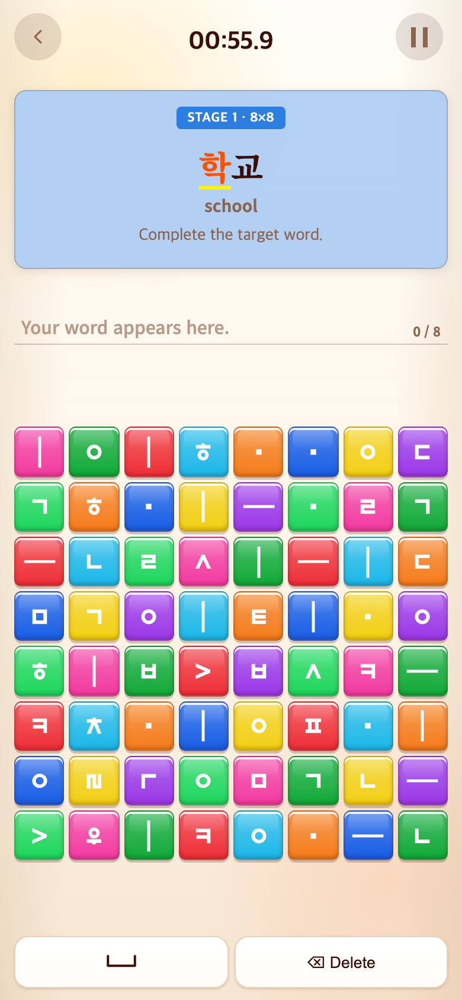
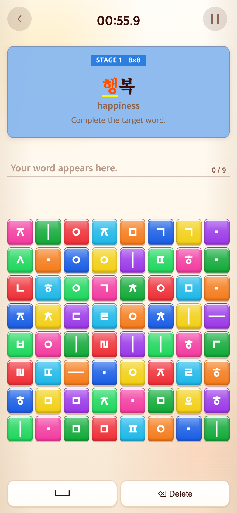

# 2026-09-16 입력 경계가 필요한 네 단어 제외

- 비교: `9018d33` (별도 임시 폴더에서 git archive로 실제 실행)
- 적용: `350df78`

## 요청·이유

사용자가 학교·초등학교·국립박물관·반짝반짝 네 단어만 삭제하기로 결정했다. 현재 연속 입력 시 하꾜·초등하꾜·국리빡물관·밙작밙작으로 조합되어 별도 경계 입력이 필요했기 때문이다.

## 변경·결과

학교는 고정 목록에서, 나머지 세 단어는 추가 목록에서 제거했다. 대체 어휘는 넣지 않았다. 총93→89개, 고정33→32개, 추가60→57개(3글자20/4글자18/5글자19). 길이별10판 전환은 목록 길이에 따라 계속 정상 진행한다. Space 버튼, 다른 단어, 게임 규칙·시간·점수는 그대로다.

테스트217개와 빌드 통과. 제외 네 단어의 부재와 나머지89개 전체가 Space 없이 정상 조합되는지 검사했다. 5글자 순환 테스트도19개 기준으로 갱신했다.

## 화면 비교

Word에서 동일하게 앞9개를 실제 완료한 직후다. 과거에는 학교, 이후에는 다음 단어 행복이 표시된다. 390×844 CSS px / DPR2 / PNG780×1688. 화면 합성 없음. [재현 스크립트](capture.mjs).

| 이전 `9018d33` 재현 | 이후 `350df78` |
| --- | --- |
|  |  |
