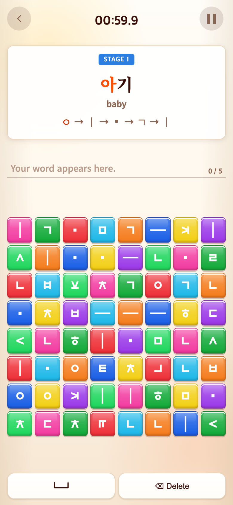
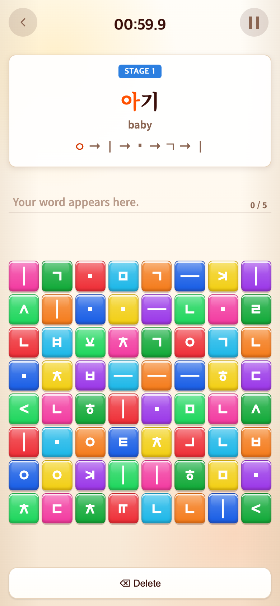

# 2026-09-16 Vocabulary 띄어쓰기 버튼 제거

- 적용 커밋: `490be7a`
- 비교 커밋: `5e97de8`
- 재현: 성공

## 요구·수정·결과

단어 게임에서 불필요한 띄어쓰기 버튼을 없애 달라는 요청. Space 버튼과 이벤트·사용되지 않는 UI 입력 함수를 제거하고 하단은 전체 폭 Delete 하나로 정리했다. 현재118개 단어는 공백 없이 조합 가능하며 기존 콘텐츠 회귀 테스트가 이를 확인한다. core의 공백 확정/삭제 함수는 이력 호환을 위해 유지했다. 입력 칸·정사각형 게임판·점수·영상에는 변경이 없다.

## 검증

Vitest228개와 build 통과. 브라우저에서 Space 버튼 없음, 실제 ㅇ 버튼 탭→Delete 후 입력0, 정사각형 게임판 확인.

## 모바일 전후

390×844 CSS px / DPR2 / PNG780×1688, Chrome Headless seed123. 과거 `5e97de8`를 git archive로 별도 임시 폴더에서 실행한 **과거 버전 재현 화면**이다. 두 버전 모두 Vocabulary START→타이머 정지→ㅇ 탭→Delete 후 캡처했다. 화면 합성은 하지 않았다. 타이머 정지는 테스트 전용 앱 접근이며 배포에 포함되지 않는다.

| 수정 전 `5e97de8` | 수정 후 `490be7a` |
| --- | --- |
|  |  |

[캡처 스크립트](capture.mjs). after는 실행 시 작업 트리를 사용한다.
