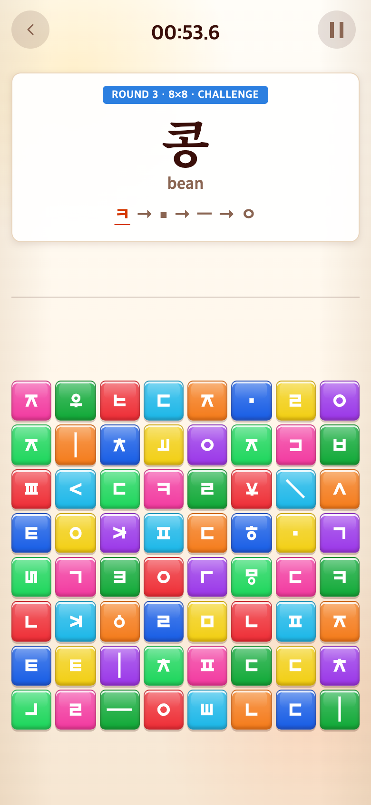

# 2026-09-16 창문 효과 제거

- 적용 커밋: `21afb21`
- 비교 커밋: `b098a33` (별도 임시 폴더에서 git archive로 재현)
- 요청: 창문·자리 교환이 지나치게 어려우므로 제거. 정답 자소 개수 및 등급/영상 연결은 확인만 요청.

## 변경 내용과 이유

Syllable의 난도를 일반20%→OH MY GOD 후30% 두 단계로 제한했다. 다시 최고 등급을 받아도30%를 유지한다. 창문 렌더러·타이밍 모듈·스타일·연출 중 입력 차단 코드를 삭제했다. 이전 코드는 Git 이력에서 복구 가능하다. 15개 OH MY GOD 기준, 어휘 풀, 중복 방지, 정답 배치, 영상 매핑은 유지했다.

## 확인 사항

- Alphabet 2×2는 한 정답과 세 함정. 큰 혼합 판은 필요한 자소를 우선 배치한 후 여분을 채워 같은 정상 자소가 여러 개 나올 수 있다.
- Syllable은 쌍자음·반복 모음 등 실제 입력 횟수만큼 정답 자소를 확보한다. 여분에서 추가로 같은 자소가 나올 수 있다.
- Vocabulary는 필요 입력 수의1.5배(올림)를 우선 확보하고 남은 칸도 가중 추첨한다. 모든 정상 동일 자소는 정답으로 사용 가능하며 특정 ID 하나만 정답인 방식이 아니다.
- 0 NOT BAD→티피 / 1–299 GOOD TRY·300–599 GREAT→1번 / 600–999 AMAZING→4번 / 1000–1399 UNBELIEVABLE→태피·후피 중 무작위 / 1400이상 OH MY GOD→해피·재피 중 무작위. 튜토리얼은 GREAT와1번. 매핑 변경 없음.

## 검증·전후 화면

`npm test` 30파일221테스트 및 `npm run build` 통과. 최고 등급을 반복 달성해도 추가 난도가 열리지 않는 회귀 테스트를 추가했다.

두 버전에서 동일 시드123, 실제 튜토리얼30판 자동 탭, 본게임15개 완료를 두 차례 수행했다. 비교를 위해 각 라운드 시계만60초로 만료시키고, 세 번째 라운드6.4초 시점을 제어해 촬영했다. 사람의 실측 플레이가 아닌 자동 검증 화면이다. 이전 버전은 두 문이 닫히고 두 노드가 교환되며, 변경 버전은 문과 노드 교환이 없다.

| 이전 `b098a33` 재현 | 변경 `21afb21` |
| --- | --- |
|  |  |

모두390×844 CSS px·DPR2, 780×1688px PNG. 합성 없이 실제 브라우저를 캡처했다. 재현 스크립트는 `capture.mjs`.
