# 2026-09-16 제시어 크기 통일·한 음절 입력 안내

- 적용 커밋: `09178d5`
- 비교 커밋: `43923ed`
- 과거 재현: 성공. git archive로 별도 임시 폴더에 추출해 실행. 현재 화면을 과거처럼 합성하지 않았다.
- 조건: Chrome 모바일 에뮬레이션, 390×844 CSS px / DPR2 / 780×1688 PNG. 난수 시드123, 웹폰트 로딩 후 캡처.

## 문제와 요구

Alphabet은 2개52px/3개44px/5개38px로 자소 개수에 따라 크기가 달랐다. Syllable52px와 Vocabulary28px도 달랐다. 세 게임 모두 3개 제시어 크기를 기준으로 통일하고, 긴 단어의 전체 자소 목록 대신 현재 음절 하나만 안내하도록 요청했다.

## 수정 내용·이유·결과

- 공통 제시어44px. 개수별 크기 클래스는 제거했다. 좁은 화면에서는 개수가 아닌 뷰포트에 따라서만 세 모드 공통36~44px로 대응한다.
- Alphabet 자소 폭1em, 간격0, 화살표14px로 좁혀 다섯 자소도 같은 크기로 들어간다. 입력 순서 안내는 기존18px 고딕/650 유지.
- `activeTargetSyllable`이 정확히 일치하는 입력 접두부를 기준으로 현재 음절의 자소 목록을 반환한다. 끝까지 맞히면 마지막 음절 전체 완료 상태를 유지한다. 오류는 진행을 멈추며 삭제 후 입력에 맞춰 되돌아간다. 쌍자음·겹받침은 기존 분해 함수를 그대로 사용한다.
- Vocabulary 전체 단어와 뜻은 유지한다. 제시어 색도 입력 자소 진행 기준으로 맞춰, 다음 초성이 일시적으로 앞 음절 받침처럼 조합되더라도 안내와 강조 위치가 어긋나지 않게 했다. 실제 작성 칸·조합 엔진·정답 판정·점수는 유지했다.
- Syllable은 원래 한 음절을 출제하므로 해당 음절 전체 안내를 그대로 유지한다. Alphabet은 음절 조합이 아니라 자소 찾기이므로 기존 전체 자소 순서를 유지한다.

## 검증

- Vitest 34파일/231테스트 및 production build 통과.
- 브라우저 computed font-size: Alphabet3개44/2개52/5개38, Syllable52, Vocabulary28 → 모두44px.
- ‘어슬렁어슬렁’ 실제 타일 ㅇ→ㆍ→ㅣ 클릭 시 ‘슬’ 안내로 전환. 실제 Delete 클릭 시 ‘어’ 안내와 완료 자소2개로 복귀.
- unit tests: 오류 후 정지, 삭제 복귀, 쌍자음 꾀/아뿔사, 겹받침 닭, 빈 타깃과 전체 완료.
- 긴 단어 제시어는320/390/430px 너비에서 화면 밖으로 나가지 않음을 확인.
- 캡처는 실사용 콘텐츠 체크포인트를 선택한 개발 재현이다. Alphabet17/21/23번째 인덱스로 이동했고 Syllable은 실제 첫 추첨 문제를 사용했다. Vocabulary는 실제 어휘 풀의 ‘어슬렁어슬렁’을 첫 문제로 선택해 비교했으므로 STAGE1 표시는 실제 사용자의 자연 진행 기록이 아니다. 타이머를 정지한 상태에서 촬영했다.

## 모바일 전후

| 화면 | 이전 `43923ed` 재현 | 변경 `09178d5` |
| --- | --- | --- |
| Alphabet 3개 | 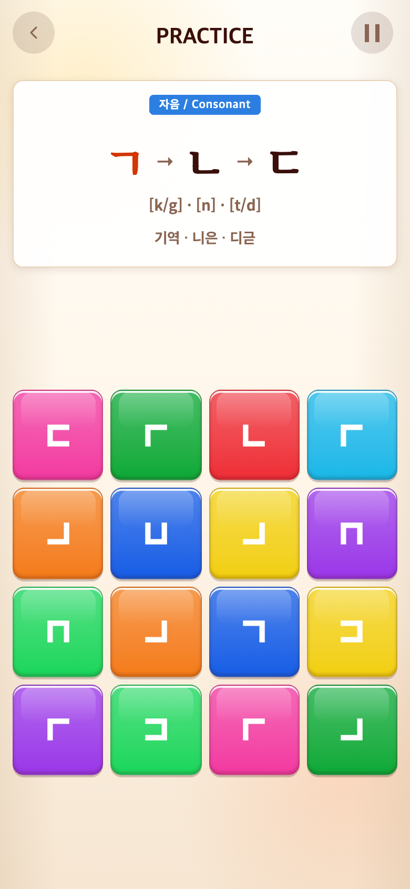 | 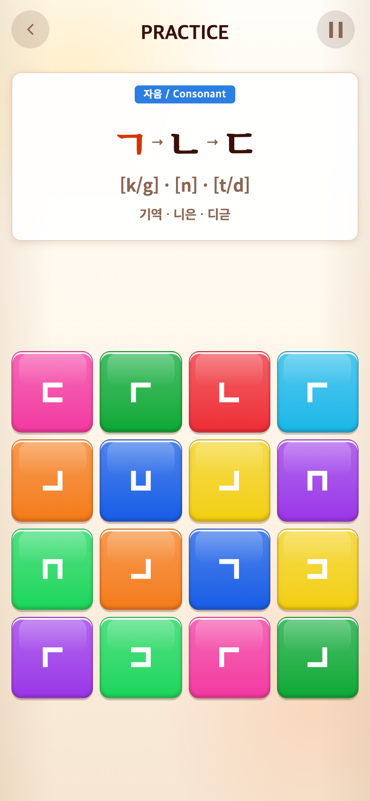 |
| Alphabet 2개 | 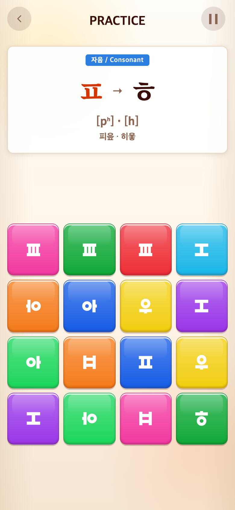 | 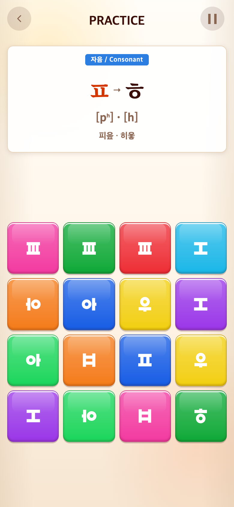 |
| Alphabet 5개 | 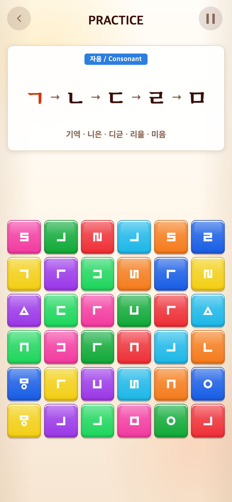 | 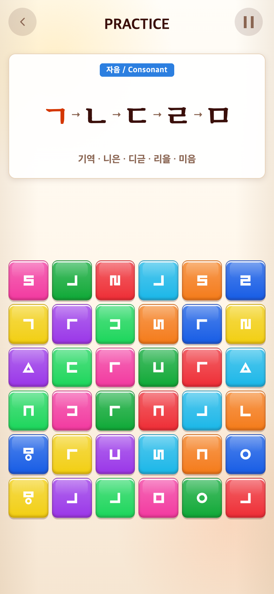 |
| Syllable | 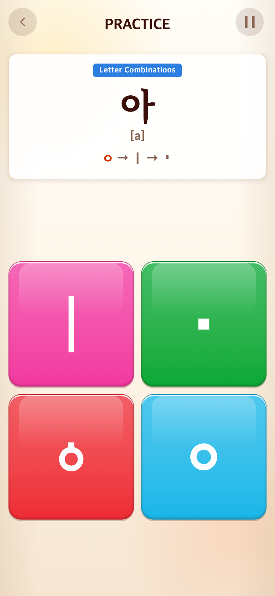 | 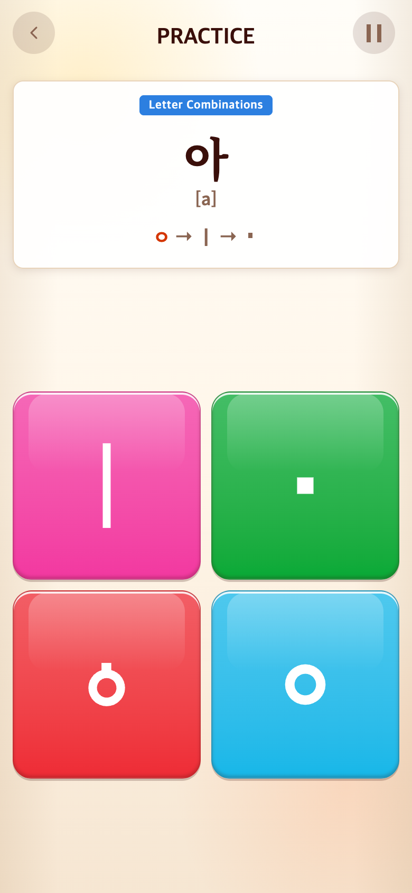 |
| Vocabulary 긴 단어 | 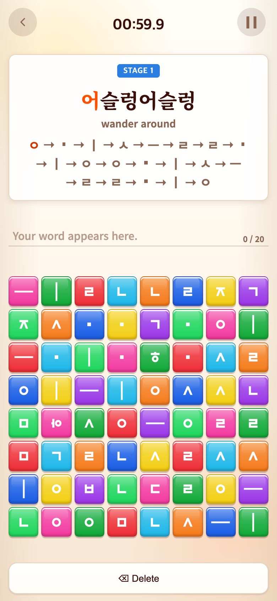 | 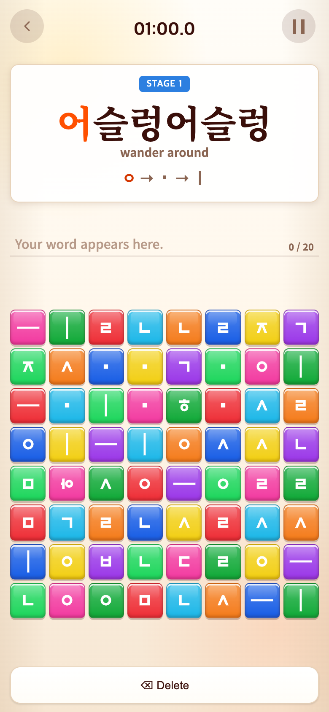 |

‘어’ 완료 후 ‘슬’ 안내:

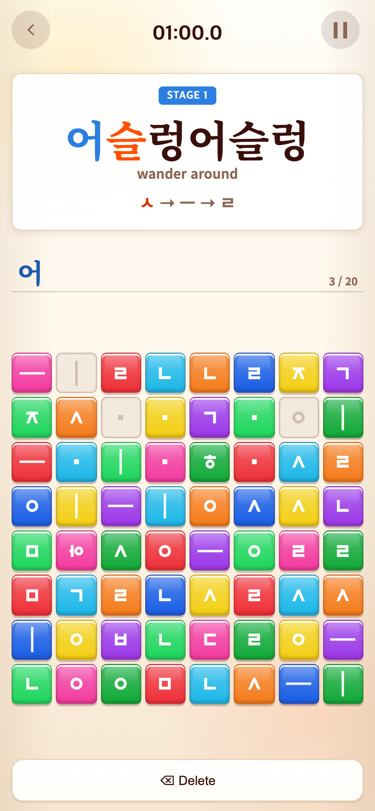

재실행: `PLAYWRIGHT_MODULE=/Users/scdi/Documents/ChatGPT/TAPtoTEN/node_modules/playwright/index.mjs node docs/research/2026-09-16-single-syllable/capture.mjs`. after는 실행 당시 작업 트리다. 캡처 스크립트는 앱 인스턴스만 노출하며 배포 코드에는 포함되지 않는다. 다른 게임 저장소는 수정하지 않았다.
