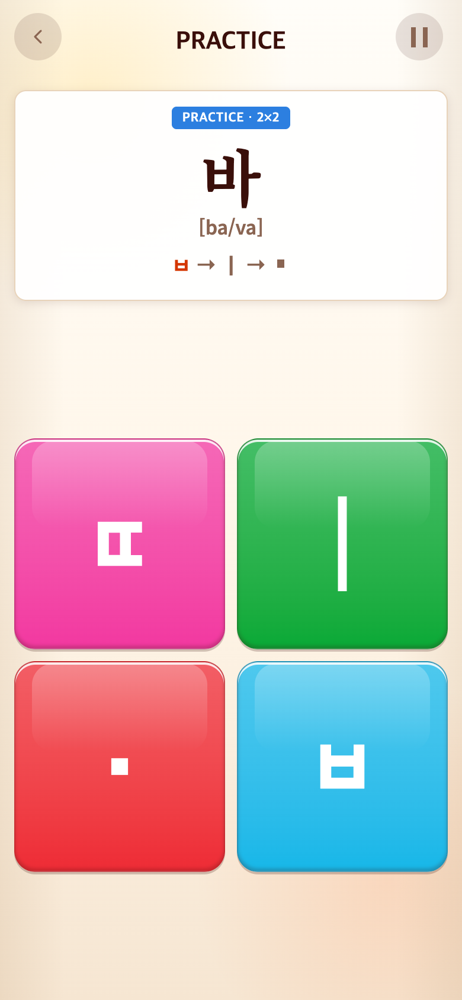
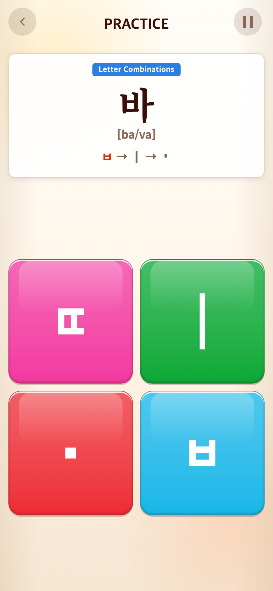
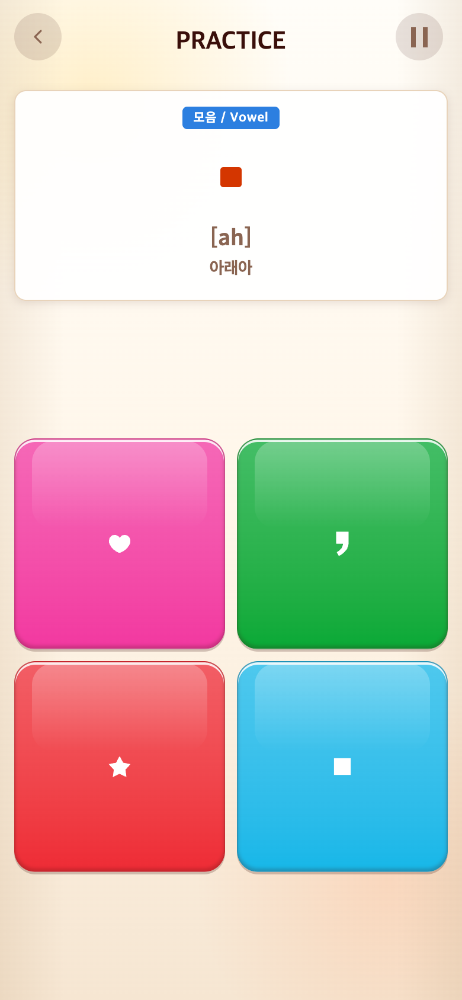
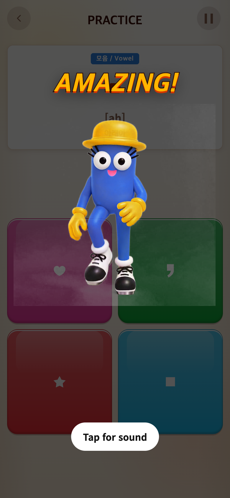

# 2026-09-16 영상 음원 보강·영어 학습명·점 크기

- 적용 커밋: `d32dc22`
- 비교 커밋: `98c8be4`
- 재현: 성공 (실제 사용자 기기의 무음 현상 원인은 미확정)

## 문제·요구

영상 소리가 나와야 한다는 요청, Syllable에 PRACTICE가 HUD와 파란 박스에서 반복되는 문제, 입력 순서의 아래아가 크고 블록 아래아·함정은 조금 더 커야 한다는 요청. 후속 지시에 따라 학습명은 한국어가 아닌 영어로 표시한다.

## 수정·이유·결과

- 기존 코드는 HTML audio.play 실패를 무시했으며 초기 무음 재생의 비동기 pause가 후속 재생과 겹칠 여지도 있었다. 사용자의 기기/설정은 확인하지 못했으므로 실제 원인으로 단정하지 않는다.
- ClipSound를 추가해 사용자 제스처에서 Web Audio를 활성화하고 MP3를 디코딩·캐시한다. 영상 play 성공 후 현재 영상 시각을 offset으로 음원을 시작한다. 늦은 로딩·정지·설정 OFF·종료는 revision으로 보호한다.
- Web Audio가 불가능하면 기존 HTML audio를 사용하며 둘 다 거절되면 `Tap for sound`를 제공한다. 무음 priming 완료의 pause는 시작된 결과 영상을 방해하지 않도록 제한했다. Settings의 Sound OFF는 존중하며 BGM과 이중 재생하지 않는다. 실제 기기 볼륨/무음/OS 제한은 강제로 변경하지 않는다.
- Syllable category 메타데이터를 콘텐츠에 추가했다. 6유형 각5개, 총30판은 유지하며 파란 박스는 Letter Combinations / Basic Vowels / Compound Vowels / Double Consonants / Final Consonants / Double Finals, 본게임은 One-Syllable Words. 상단 HUD PRACTICE는 유지하고 파란 박스의 반복 PRACTICE·보드 숫자는 제거했다.
- 입력 순서의 아래아 .36em→.25em(18px 기준6.48→4.5 CSS px). Syllable·Vocabulary 공통 적용. 게임 블록 아래아는1.1배, 쉼표·하트·별은 기존1.1배에서1.21배로 각각10% 확대. 원본 SVG와 중앙 기준은 유지했다.

## 검증

- 33개 테스트 파일228개 테스트 및 production build 통과.
- 단위 테스트: 음원 offset·캐싱·stop·늦은 decode 취소·차단된 context의 재시도, 무작위30판의6개 영어 category·본게임 category.
- Chrome에서 실제 앱의 사용자 제스처 후 AMAZING MP3를 디코딩: AudioContext running,4.7804초,0이 아닌 신호 확인. Sound OFF 시 source 정지 확인.
- 두 음원 재생 경로를 강제로 거절한 테스트에서 복구 버튼 표시·클릭 후 재시도 확인. 이 화면은 **의도적으로 차단한 테스트 상태**이며 정상 플레이에서 항상 나타나는 버튼이 아니다.
- 실제 iPhone Safari/Android의 스피커 출력은 직접 확인하지 못했다. 기존 사용자 무음 증상의 재현을 주장하지 않는다.

## 모바일 전후

390×844 CSS px / DPR2 / PNG780×1688. Chrome Headless seed123. 과거 `98c8be4`를 별도 임시 폴더에 git archive하여 실행한 **과거 커밋 재현 화면**이다. 수정 후는 `d32dc22` 코드. 실제 바 학습 콘텐츠와 Alphabet 아래아 첫 판을 테스트 전용 앱 접근으로 선택하고 타이머를 정지했다. 연속 플레이 기록이 아닌 체크포인트 미리보기이며 화면 합성은 하지 않았다.

| 대상 | 수정 전 `98c8be4` | 수정 후 `d32dc22` |
| --- | --- | --- |
| 영어 학습명·작은 입력 점 |  |  |
| 블록 점·함정 확대 |  |  |

강제 차단 시 복구 버튼 (수정 후 테스트 화면):

소리 자체는 정지 PNG로 비교할 수 없어 위 동작 검증을 별도로 기록한다. [캡처·검증 스크립트](capture.mjs)의 after는 실행 시 현재 작업 트리를 사용한다.
