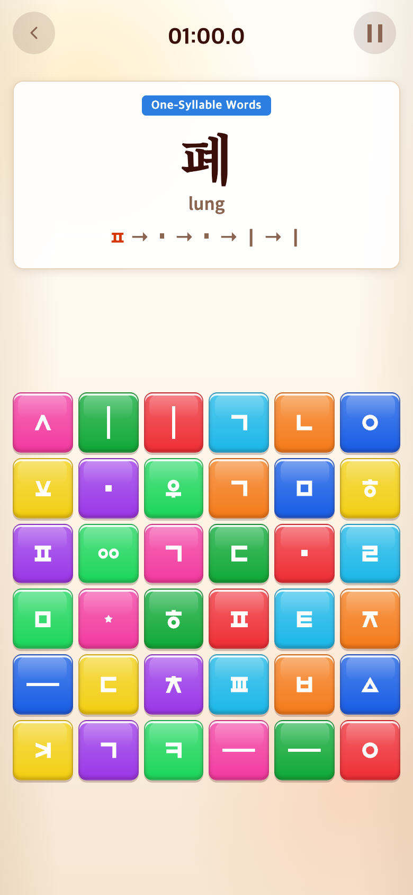
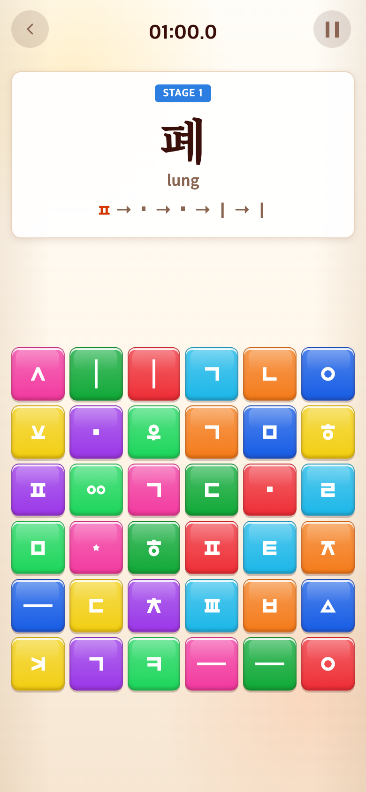

# 2026-09-16 Syllable 본게임 번호

- 적용 커밋: `6fa54ff`
- 비교 커밋: `7d2c6c3`
- 재현: 성공

## 요구·수정·결과

제한시간이 시작되면 본게임이므로 Vocabulary처럼 영어 STAGE 번호를 표시해 달라는 요청. 튜토리얼은 영어 학습명을 유지하고, 본게임은 튜토리얼 판수를 뺀 현재 음절 인덱스+1로 STAGE1부터 증가한다. 라운드나 보드 크기가 바뀌어도 미완성 문제 번호는 유지한다. 시간·점수·출제 규칙은 그대로다.

## 검증

Vitest228개와 build 통과. 브라우저에서 튜토리얼 Letter Combinations 유지, 첫 본게임 STAGE1, 다음 STAGE2, 다음1분 라운드에도 STAGE2 유지 확인.

## 모바일 전후

390×844 CSS px, DPR2, PNG780×1688, Chrome Headless seed123. 과거 `7d2c6c3`을 별도 임시 폴더로 git archive하여 실행한 **과거 커밋 재현 화면**이다. 각 버전 Syllable START 후 테스트 전용 앱 접근으로 인덱스30(첫 본게임)으로 이동하고 실제 시작/렌더 함수를 실행하여 타이머를 정지했다. 연속 플레이 기록이 아닌 체크포인트 미리보기이며 화면 합성은 하지 않았다.

| 수정 전 `7d2c6c3` | 수정 후 `6fa54ff` |
| --- | --- |
|  |  |

[캡처 스크립트](capture.mjs). after는 실행 시 작업 트리 사용.
