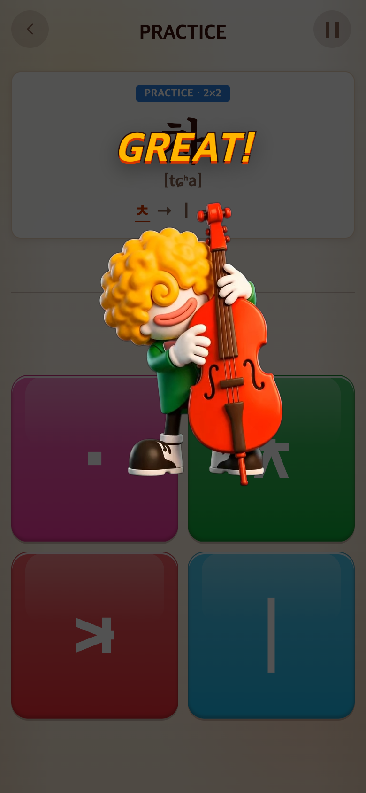
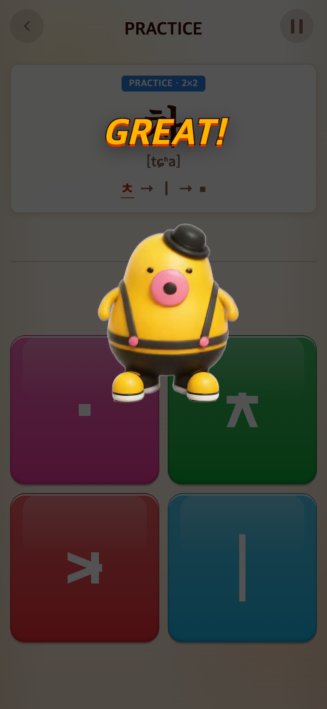
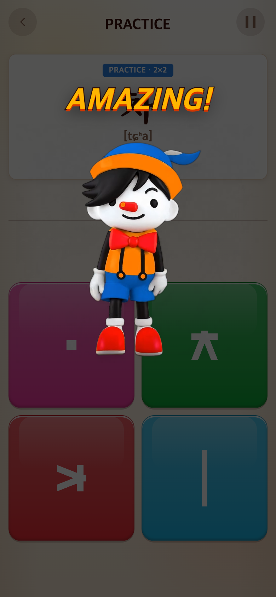
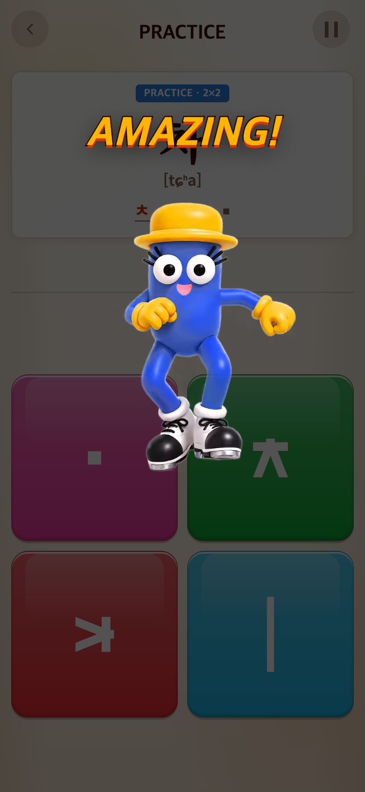

# 2026-09-16 등급 영상을 티피·태피로 통일

- 적용 커밋: `05f1ada`
- 비교 커밋: `144e7b1` (별도 임시 폴더에서 git archive로 실행)

## 문제·개선 요구

새 티피·태피 영상을 추후 추가하기 전까지 낮은 세 등급은 티피, AMAZING 이상 세 등급은 태피로 연결해 달라는 요청.

## 수정 내용·결과

| 점수 | 문구 | 기존 영상 | 변경 영상 |
| --- | --- | --- | --- |
| 0 | NOT BAD | 티피 | 티피 |
| 1–299 | GOOD TRY | 1 | 티피 |
| 300–599 | GREAT | 1 | 티피 |
| 600–999 | AMAZING | 4 | 태피 |
| 1000–1399 | UNBELIEVABLE | 태피/후피 | 태피 |
| 1400 이상 | OH MY GOD | 해피/재피 | 태피 |

튜토리얼 GREAT도 티피다. MP4·WebM·MP3를 함께 연결했다. 문구·점수·레이아웃·음악 설정은 유지했다. 기존 다른 영상 파일은 삭제하지 않았다. 등급별 `clips` 배열을 유지하므로 추후 영상 추가와 교체는 `src/config/app.ts`에서 할 수 있다.

## 검증

30파일221테스트 및 빌드 통과. 모든 등급 경계 점수에서 WebM·iPhone MP4·MP3가 같은 캐릭터로 연결되는지 회귀 테스트한다.

## 전후 모바일 화면

동일 모바일390×844 CSS px, DPR2, PNG780×1688px. 두 버전 모두 같은 Syllable 입문 화면에서 실제 `Cheer.play`를300/600점으로 호출한 **결과 화면 미리보기**다. 실제 점수 획득 플레이를 재현한 것은 아니다. 영상은 동일0.5초 지점에서 멈춰 비교했으며 합성하지 않았다. 캡처 과정과 미디어 경로 검증은 `capture.mjs`에 보존한다.

| 이전 `144e7b1` 재현 | 변경 `05f1ada` |
| --- | --- |
|  |  |
|  |  |
