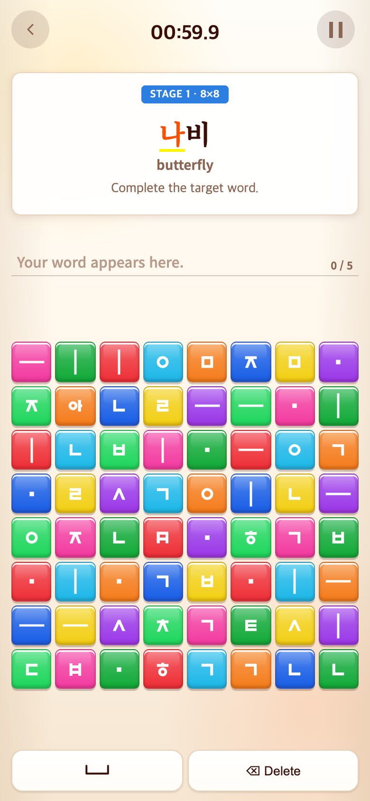
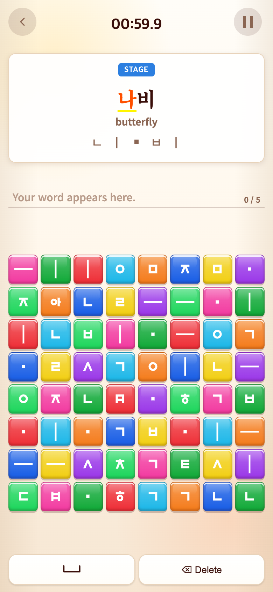
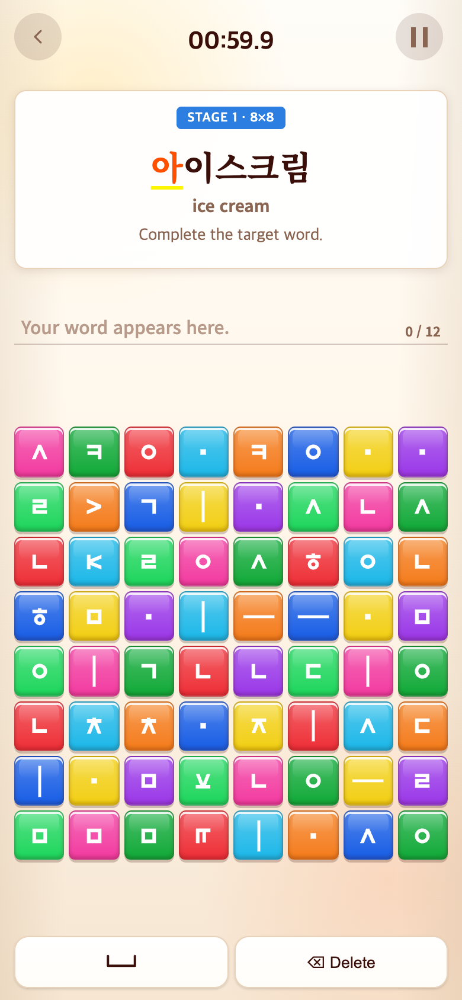
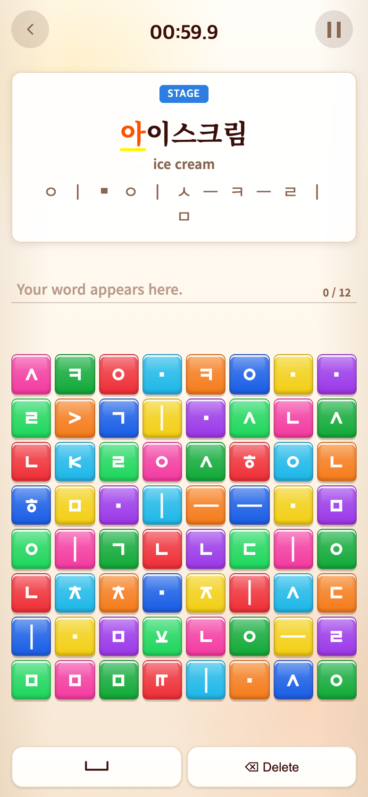

# 2026-09-16 Vocabulary 자소 안내

- 적용 커밋: `d800f25`
- 비교 커밋: `33f0f17`
- 재현 여부: 성공

## 문제·개선 요구

파란 막대의 STAGE 번호와 8×8 숫자를 없애고, 하단 영어 지시문 대신 Syllable처럼 단어를 만드는 자소를 보여 달라는 요청. 예시는 나비 → ㄴ ㅣ ㆍ ㅂ ㅣ.

## 수정 내용과 이유

- Vocabulary의 시작·다음 단어·라운드 재개 모두 파란 막대를 `STAGE`로 통일했다.
- `Complete the target word.` 대신 기존 core의 targetToTokens 분해 결과를 순서대로 표시한다. 중복 자소도 생략하지 않는다.
- 아래아는 Syllable 안내와 같은 CSS 정사각형으로 표시한다. 영어 번역은 그대로 유지한다.
- 안내는 정적인 입력 순서이며 기존 제시어 색상 피드백은 유지한다. 입력 판정·점수·콘텐츠는 변경하지 않았다.
- 긴 순서는 줄바꿈하며 최대 76 CSS px를 넘으면 안내 영역 안에서 세로 스크롤한다. 정사각형 게임판을 유지한다.

## 검증 결과

- Vitest 31개 파일, 224개 테스트 통과. TypeScript 및 production build 통과.
- 브라우저에서 나비 안내가 정확히 ㄴ/ㅣ/ㆍ/ㅂ/ㅣ인지 검사했다.
- 5글자 아이스크림도 중복을 포함한 전체 입력 순서와 게임판 정사각형, 가로 넘침 없음 확인.
- PNG 네 장 모두 780×1688 px 확인.

## 모바일 전후 화면

390×844 CSS px, DPR 2, 로컬 Chrome Headless. 이전 버전은 `git archive 33f0f17`을 별도 임시 폴더에서 실행한 **과거 버전 재현 화면**이다. 이후는 `d800f25` 코드 화면이다. 고정 난수 seed 123, Vocabulary 진입 후 캡처 전용 브라우저 접근으로 각 버전에 실제 존재하는 나비·아이스크림을 선택해 렌더링하고 타이머를 멈춘 체크포인트 미리보기다. 실제 연속 플레이 기록이 아니며 화면 합성이나 과거 UI 재작성은 하지 않았다. 캡처용 앱 접근은 테스트 요청에만 삽입하고 배포 소스에는 넣지 않았다.

| 대상 | 수정 전 — `33f0f17` 재현 | 수정 후 — `d800f25` |
| --- | --- | --- |
| 나비 |  |  |
| 아이스크림 |  |  |

재현 스크립트: [capture.mjs](capture.mjs). after는 실행 시 현재 작업 트리를 사용하므로 다른 코드에서 재실행하면 결과가 달라진다.
