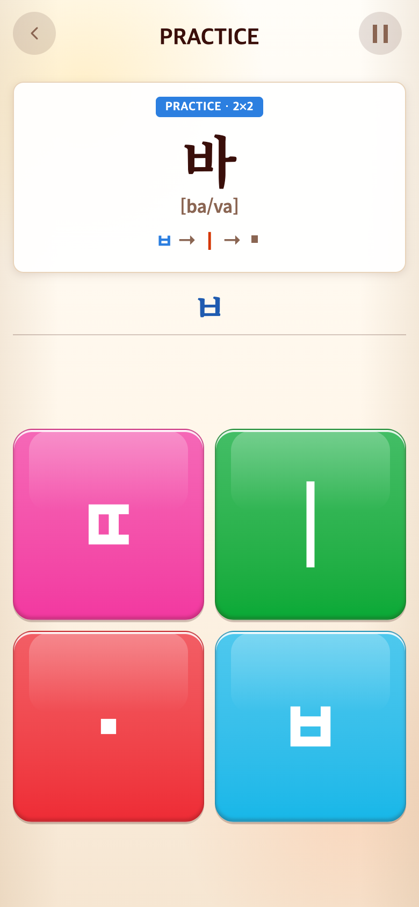
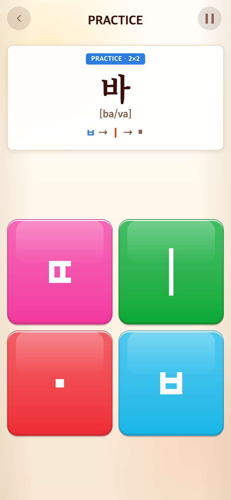
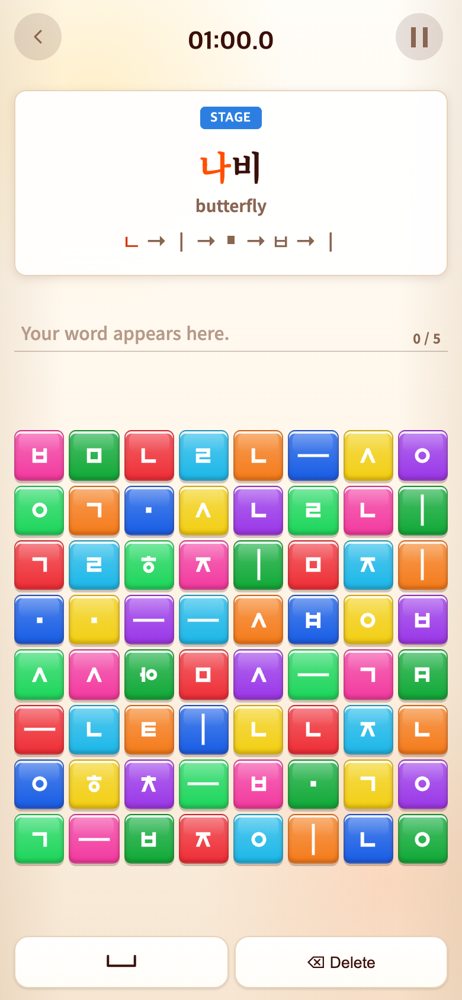
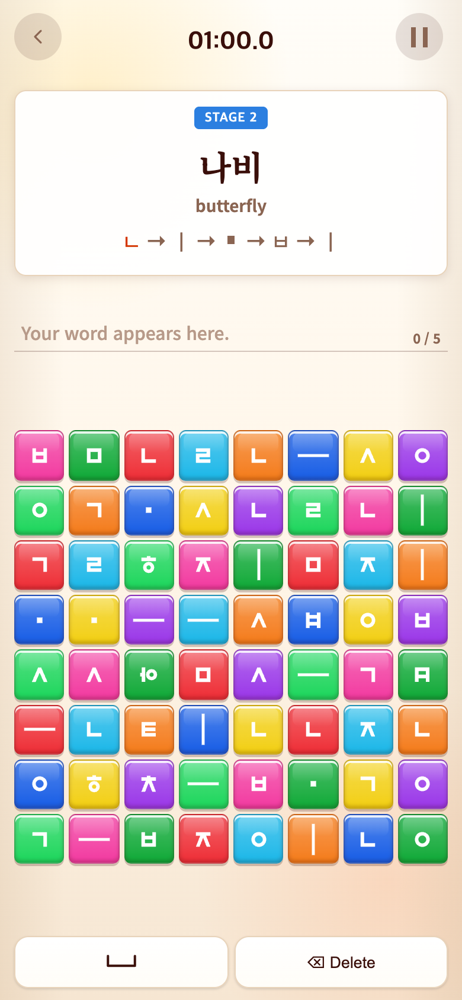

# 2026-09-16 Syllable 작성 칸 제거·Vocabulary 번호 복원

- 적용 커밋: `2b82b01`
- 비교 커밋: `038b7ff`
- 재현 여부: 성공

## 요구·수정 이유

Syllable은 위 자소 순서로 진행을 확인하므로 별도 조합 글자 칸이 중복이다. Vocabulary 상단에서 없애려던 숫자는 판 크기 8×8이며 스테이지 번호는 유지하려던 의도였다.

## 수정 결과

- Syllable만 작성 칸과 아래 선을 숨기고 불필요한 조합 글자 렌더링 제거. 위쪽 화살표·색상 진행 안내 유지.
- Vocabulary 작성 칸은 유지. 파란 표시는 `STAGE 1`, `STAGE 2`…로 복원하고 8×8은 제외.
- 번호는 누적 단어 인덱스+1. 다음 단어에서 증가하고 라운드 번호 변화는 영향을 주지 않는다. 새 START에서는1로 초기화.
- 게임 규칙·시간·점수·영상·게임판 크기는 변경하지 않았다.

## 검증

Vitest224개 및 build 통과. 브라우저에서 Syllable 작성 칸 숨김, Vocabulary 작성 칸 유지, STAGE1→2→3, 라운드 변경 시 번호 유지, 새 시작 시1로 초기화 확인.

## 모바일 전후 화면

390×844 CSS px / DPR2 / PNG780×1688, Chrome Headless, seed123. 수정 전은 `git archive 038b7ff`로 별도 임시 폴더에서 실행한 **과거 커밋 재현 화면**이다. 수정 후는 `2b82b01` 코드다.

Syllable은 실제 바 학습 콘텐츠의 첫 자소 입력 상태를 테스트 접근으로 설정한 체크포인트 미리보기다(게임판 사용 타일은 설정하지 않음). Vocabulary는 시작 함수 후 다음 단어 함수로 나비까지 진행한다. 타이머를 멈추며 실제 연속 플레이 기록은 아니다. 화면 합성·현재 코드로 과거 UI 모방은 하지 않았다. 캡처용 접근은 브라우저 응답에만 삽입하므로 배포에 포함되지 않는다.

| 모드 | 수정 전 `038b7ff` 재현 | 수정 후 `2b82b01` |
| --- | --- | --- |
| Syllable |  |  |
| Vocabulary |  |  |

[재현 스크립트](capture.mjs). after는 실행 시 작업 트리를 사용한다.
